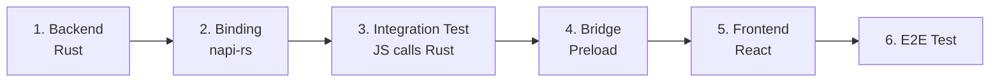

# Contributing to rustation

Thank you for your interest in contributing to **rustation**! This guide will help you get started.

---

## 🚀 Quick Start

```bash
# 1. Clone the repository
git clone https://github.com/chrischeng-c4/rustation.git
cd rustation

# 2. Install dependencies
pnpm install

# 3. Build Rust core
cd packages/core && pnpm build && cd ../..

# 4. Start development server
cd desktop && pnpm dev
```

---

## 📋 Prerequisites

### Required
- **Rust 1.77+** - Backend core and napi-rs bindings
- **Node.js 20+** - Frontend development
- **pnpm 9+** - Package manager
- **Git** - Version control

### Recommended
- **VS Code** with extensions:
  - Rust Analyzer
  - ES7+ React/Redux snippets
  - Prettier

---

## 🏗️ Project Structure

```
rustation/
├── packages/core/        # Rust backend (napi-rs)
├── desktop/              # Electron frontend (React + MUI)
├── openspec/specs/       # Feature specifications
├── dev-docs/             # Engineering handbook
├── docs/                 # User documentation (VitePress)
└── e2e/                  # End-to-end tests
```

---

## 📚 Documentation

Before contributing, please review:

| Documentation | Purpose | Audience |
|--------------|---------|----------|
| **[dev-docs/](dev-docs/)** | Architecture decisions & development guides | Contributors |
| **[openspec/specs/](openspec/specs/)** | Feature specifications (What to build) | PM, QA, Developers |
| **[docs/](docs/)** | User manual & tutorials | End Users |

### Key Documents

- **[State-First Principle](dev-docs/architecture/01-state-first.md)** - Core architecture 🎯
- **[Definition of Done](dev-docs/workflow/definition-of-done.md)** - Feature completion checklist
- **[Testing Guide](dev-docs/workflow/testing-guide.md)** - How to write tests
- **[OpenSpec Workflow](openspec/AGENTS.md)** - Specification-driven development

---

## 🔄 Development Workflow

### 1. Understand the Feature

For **non-trivial features**, check if a spec exists in `openspec/specs/`. If not, create one:

```bash
# Create a new feature proposal
openspec proposal <feature-name>

# View all proposals
openspec status
```

See [OpenSpec Workflow](openspec/AGENTS.md) for details.

### 2. Implementation Order (Mandatory)

Follow this sequence to avoid "fake complete" anti-pattern:



**Critical**: Never skip steps 3-4. Test that JS can call Rust before building UI.

### 3. Code Style

- **Rust**: Follow `rustfmt` and `clippy`. No `unwrap()` in production code.
- **React**: Functional components with Material-UI (MUI v7).
- **TypeScript**: Strict typing mandatory.
- **No business logic in React** - Logic belongs in Rust backend.

### 4. Testing

Every feature **MUST** include:

```rust
// packages/core/src/state/your_feature.rs

#[test]
fn test_state_serialization() {
    // State MUST be JSON serializable
}

#[test]
fn test_state_transitions() {
    // State transitions MUST be tested
}
```

Run tests:
```bash
cargo test              # Rust tests
pnpm test              # Frontend tests (Vitest)
pnpm e2e               # End-to-end tests (Playwright)
```

---

## ✅ Pull Request Checklist

Before submitting a PR, ensure:

- [ ] **Backend tests pass**: `cargo test`
- [ ] **Frontend tests pass**: `pnpm test`
- [ ] **Linting passes**: `cargo clippy && pnpm lint`
- [ ] **No MOCK data** in `desktop/src/renderer/` production code
- [ ] **Preload bridge** connected to `@rstn/core` (not placeholder)
- [ ] **Definition of Done** checklist completed ([DoD](dev-docs/workflow/definition-of-done.md))
- [ ] **Documentation updated** if behavior changes

---

## 🚨 Anti-Patterns to Avoid

❌ **"Fake Complete"**: UI works but uses `MOCK_*` data instead of real backend
❌ **Business logic in React**: All logic must be in Rust backend
❌ **Skip integration tests**: Always test JS→Rust binding before building UI
❌ **Missing state tests**: All features MUST have state serialization tests

See [Definition of Done](dev-docs/workflow/definition-of-done.md) for complete checklist.

---

## 🛠️ Common Commands

| Command | Description |
|---------|-------------|
| `cd desktop && pnpm dev` | Start Electron app in dev mode |
| `cd packages/core && pnpm build` | Build Rust → napi-rs bindings |
| `cargo test` | Run Rust tests |
| `cargo clippy` | Run Rust linter |
| `pnpm test` | Run frontend tests (Vitest) |
| `pnpm lint` | Run ESLint + Prettier |
| `pnpm e2e` | Run E2E tests (Playwright) |

---

## 🤝 Development Principles

### State-First Architecture

**Rust owns all state. React is a pure display layer.**

- State MUST be JSON/YAML serializable
- UI = render(State)
- Test state transitions, not UI coordinates

See [State-First Principle](dev-docs/architecture/01-state-first.md) for details.

### KB-First = Spec-First

**The Knowledge Base is the source of truth.**

1. Check `dev-docs/` for existing patterns
2. Update `dev-docs/` if architecture changes
3. Create specs in `openspec/specs/` for new features
4. Implement code following specifications

### Automated Verification

**Everything MUST be testable without human intervention.**

- Write tests BEFORE implementing features (TDD)
- Never ask humans to "run the app and check"
- Systems MUST provide introspection capabilities

---

## 🆘 Need Help?

- **Questions about architecture?** See [dev-docs/architecture/](dev-docs/architecture/)
- **Questions about workflow?** See [dev-docs/workflow/](dev-docs/workflow/)
- **Questions about features?** See [openspec/specs/](openspec/specs/)
- **Found a bug?** [Open an issue](https://github.com/chrischeng-c4/rustation/issues)

---

## 📄 License

By contributing, you agree that your contributions will be licensed under the same license as the project.

---

**Happy contributing! 🎉**
