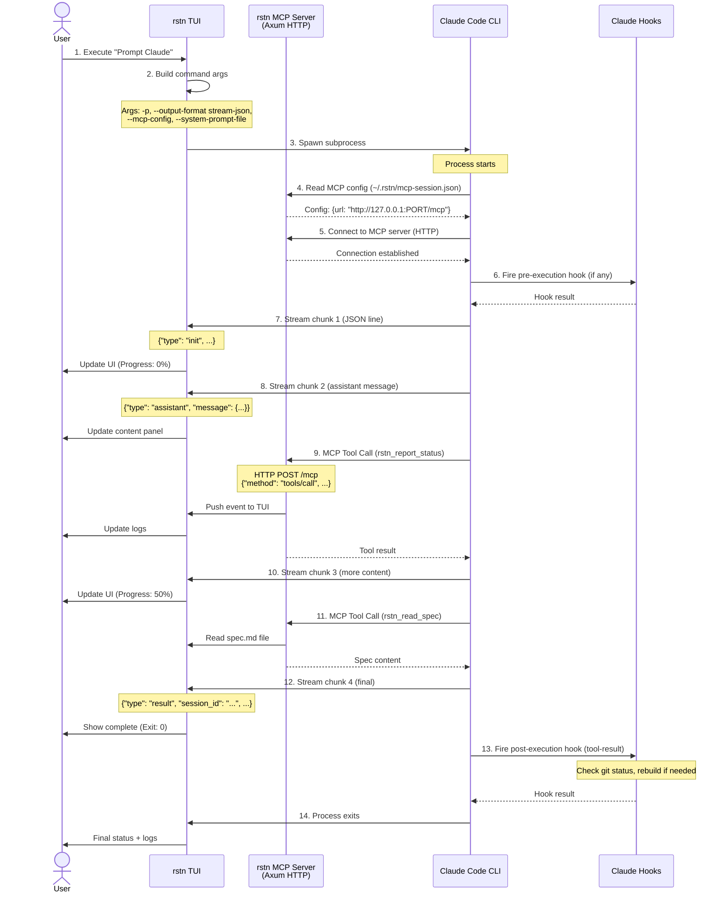
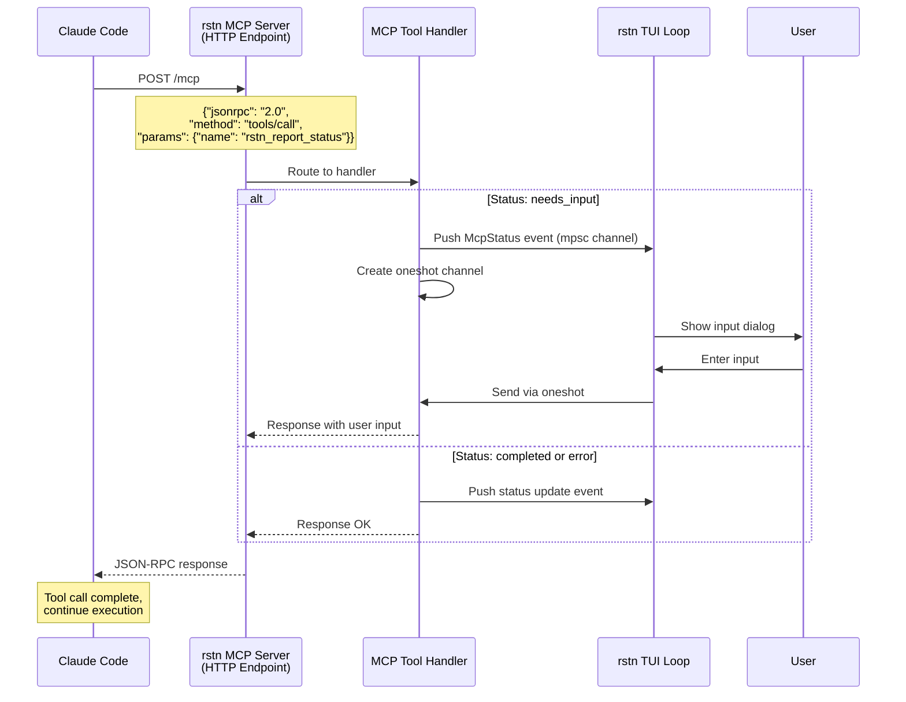
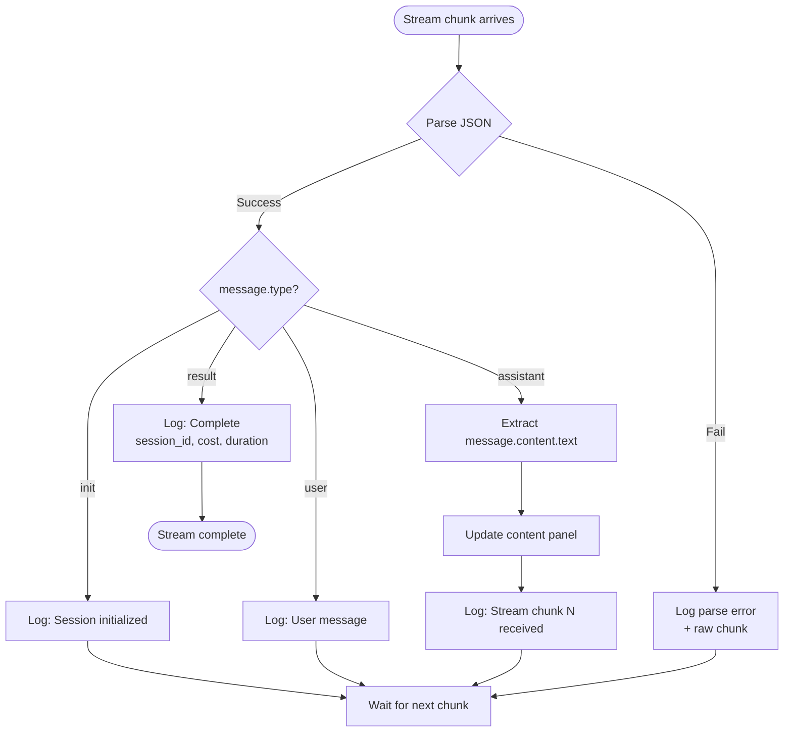
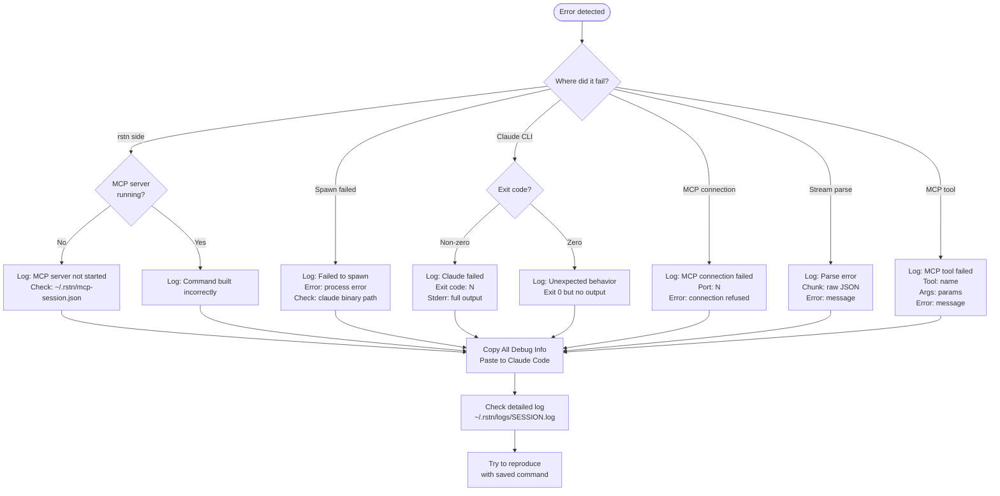

# rstn Integration Flow - Research & Documentation

**Created**: 2025-12-18
**Status**: Research Phase - Mapping Actual Behavior
**Purpose**: Understand how rstn ↔ MCP ↔ Claude Code integration actually works

---

## What We Know (From Codebase)

### Stream JSON Format

From `crates/rstn/src/tui/claude_stream.rs`:

```typescript
{
  type: "init" | "assistant" | "user" | "result",
  message?: {
    role: string,
    content: [{ type: string, text?: string }]
  },
  session_id?: string,
  result?: string,
  total_cost_usd?: number,
  is_error?: boolean
}
```

### Claude CLI Invocation

From `crates/rstn/src/runners/cargo.rs`:

```bash
claude -p "<prompt>" \
  --output-format stream-json \
  --verbose \
  --include-partial-messages \
  --max-turns 10 \
  --dangerously-skip-permissions \
  --mcp-config ~/.rstn/mcp-session.json \
  --system-prompt-file <path> \
  --append-system-prompt "<MCP instructions>"
```

### MCP Tools Available

From `cargo.rs` RSCLI_SYSTEM_PROMPT:

1. **rstn_report_status** - Report task status changes
   - `status`: "needs_input", "completed", "error"
   - `prompt`: (for needs_input)
   - `message`: (for error)

2. **rstn_complete_task** - Mark tasks complete
   - `task_id`: e.g., "T001"

3. **rstn_read_spec** - Read spec artifacts
   - `artifact`: "spec", "plan", "tasks", "checklist", "analysis"

4. **rstn_get_context** - Get feature context
   - (no params, returns current feature info)

### Claude Code Hooks

From `.claude/hooks/tool-result`:
- **tool-result**: Fires after each tool execution
- Auto-rebuilds rstn if files changed
- Can block with error exit code

---

## Sequence Diagrams (Mermaid)

### 1. Full Workflow: User → rstn → Claude → MCP → Back



### 2. MCP Tool Call Detail



### 3. Stream Parsing Flow



### 4. Error Discovery Flow



---

## What We DON'T Know (Need Research)

### 1. Hook Behavior
- ❓ What other hooks exist besides `tool-result`?
- ❓ When exactly do hooks fire? (before/after what events?)
- ❓ Can hooks modify behavior or just observe?
- ❓ What's passed to hooks as input?
- ❓ How do hook errors affect Claude execution?

### 2. Stream Timing
- ❓ How fast do chunks arrive?
- ❓ Are chunks buffered or real-time?
- ❓ What's the chunk size distribution?
- ❓ Do all messages follow the same pattern?

### 3. MCP Tool Call Patterns
- ❓ Which tools are called most frequently?
- ❓ In what order are tools called?
- ❓ Are there retry mechanisms?
- ❓ What happens if a tool call fails?

### 4. Error Cases
- ❓ What are the common failure modes?
- ❓ How are errors propagated?
- ❓ What error messages actually appear?
- ❓ Can we recover from errors?

### 5. Performance
- ❓ How long does a typical workflow take?
- ❓ Where are the bottlenecks?
- ❓ What's the network overhead of MCP?

---

## Research Plan

### Phase 1: Instrumentation (Add Observability)

**Goal**: Add detailed logging before running experiments

**Tasks**:
1. Add session ID to all log entries
2. Add timestamps (millisecond precision)
3. Add checkpoint logging:
   - ✓ MCP server start (port)
   - ✓ Command built (full args)
   - ✓ Process spawned (PID)
   - ✓ MCP connection (from Claude)
   - ✓ Stream chunk received (size, type)
   - ✓ MCP tool called (name, args)
   - ✓ Hook fired (name, exit code)
   - ✓ Process exited (code, duration)

4. Add two-tier logging:
   - Panel log: Human-readable
   - File log: Comprehensive + machine-readable

**Acceptance Criteria**:
- Every event is logged with timestamp + session ID
- Log file is written to `~/.rstn/logs/<session-id>.log`
- Logs include: command, args, PID, exit code, duration, full output

### Phase 2: Controlled Experiments

**Goal**: Run known workflows and observe behavior

**Experiment 1: Simple Prompt**
```bash
Input: "Say hello"
Expected: Claude responds "Hello!"
Observe:
- How many stream chunks?
- Which MCP tools called?
- Any hooks fired?
- Total duration?
```

**Experiment 2: MCP Tool Usage**
```bash
Input: "Read the current spec using MCP"
Expected: Claude calls rstn_read_spec
Observe:
- When is tool called?
- What arguments passed?
- What response sent?
- How does Claude use the result?
```

**Experiment 3: Error Case**
```bash
Input: Invalid prompt or force error
Expected: Error logged and displayed
Observe:
- Where does error occur?
- What's the error message?
- Is it recoverable?
- What's shown in UI?
```

**Experiment 4: Multi-turn Session**
```bash
Session 1: "Start task"
Session 2: --resume <id> "Continue"
Observe:
- Session continuity
- Context preservation
- MCP state
```

### Phase 3: Analysis

**Goal**: Understand patterns from logs

1. **Parse log files**:
   - Extract timestamps, events, durations
   - Build timeline of execution
   - Identify patterns

2. **Measure performance**:
   - Time from spawn to first chunk
   - Time per chunk
   - Total execution time
   - MCP overhead

3. **Document actual flow**:
   - Update sequence diagrams with real data
   - Document error cases discovered
   - Document hook behavior observed

4. **Create debugging guide**:
   - Common failures → how to diagnose
   - Checklist for troubleshooting
   - FAQ based on experiments

---

## Testing Strategy

### Level 1: Unit Tests (`cargo test`)

**What**: Test individual components without TUI

```rust
#[tokio::test]
async fn test_mcp_server_startup() {
    let (tx, _rx) = mpsc::channel(100);
    let state = Arc::new(Mutex::new(McpState::default()));
    let config = McpServerConfig { port: 0 };

    let handle = mcp_server::start_server(config, tx, state).await.unwrap();

    assert!(handle.port() > 0);
    assert!(Path::new("~/.rstn/mcp-session.json").exists());
}

#[test]
fn test_stream_parser() {
    let json = r#"{"type":"assistant","message":{"role":"assistant","content":[{"type":"text","text":"Hello"}]}}"#;
    let msg: ClaudeStreamMessage = serde_json::from_str(json).unwrap();

    assert_eq!(msg.msg_type, "assistant");
    assert_eq!(msg.get_text(), Some("Hello".to_string()));
}

#[test]
fn test_command_builder() {
    let options = ClaudeCliOptions {
        max_turns: Some(10),
        skip_permissions: true,
        ...
    };

    let args = build_claude_args("test prompt", &options);

    assert!(args.contains(&"-p"));
    assert!(args.contains(&"--output-format"));
    assert!(args.contains(&"stream-json"));
}
```

### Level 2: Integration Tests (Mock Claude)

**What**: Test rstn ↔ Claude integration with mocked subprocess

```rust
#[tokio::test]
async fn test_workflow_with_mock_claude() {
    // Mock Claude CLI output
    let mock_output = vec![
        r#"{"type":"init","session_id":"test-123"}"#,
        r#"{"type":"assistant","message":{"role":"assistant","content":[{"type":"text","text":"Hello"}]}}"#,
        r#"{"type":"result","result":"Done","session_id":"test-123"}"#,
    ];

    // Run workflow with mock
    let result = run_claude_command_streaming_mock(
        "Say hello",
        &options,
        mock_output,
    ).await.unwrap();

    assert!(result.success);
    assert_eq!(result.session_id, Some("test-123"));
}
```

### Level 3: E2E Tests (Real Claude - Scripted)

**What**: Run real workflows programmatically

**Proposed Tool**: `rstn-cli` (headless mode)

```bash
#!/bin/bash
# tests/e2e/test_simple_prompt.sh

rstn-cli \
  --session test-simple-001 \
  --command "Prompt Claude" \
  --input "Say hello" \
  --expect-success \
  --expect-output-contains "Hello" \
  --log-file /tmp/rstn-test.log

if [ $? -eq 0 ]; then
    echo "✅ Test passed"
    # Verify log contains expected events
    grep -q "Stream chunk received" /tmp/rstn-test.log
    grep -q "Exit code: 0" /tmp/rstn-test.log
else
    echo "❌ Test failed"
    cat /tmp/rstn-test.log
    exit 1
fi
```

**Required**: Build `rstn-cli` binary or add headless mode to `rstn`

### Level 4: TUI Tests (via tui-tester)

**What**: Test UI rendering and interaction

```rust
// Dispatch to tui-tester agent for TUI-specific tests

test_worktree_three_column_layout() {
    // Render to TestBackend
    // Verify 3 columns visible
    // Verify widths: 20/40/40
}

test_log_panel_updates() {
    // Execute command
    // Verify logs update in real-time
    // Verify auto-scroll works
}

test_copy_function() {
    // Focus on log column
    // Press 'y'
    // Verify clipboard contains logs
}
```

---

## Observable Checkpoints

When running experiments, verify these checkpoints:

### Checkpoint 1: rstn Startup
```
✓ MCP server started (port: 54321)
✓ Config written (~/.rstn/mcp-session.json)
✓ TUI ready
✓ Session ID: 2025-12-18-142345-a3f9
```

### Checkpoint 2: Command Execution Start
```
✓ User selected: "Prompt Claude"
✓ Input collected: "Say hello"
✓ Command built: claude -p "Say hello" --output-format stream-json ...
✓ Full args: ["-p", "Say hello", "--output-format", "stream-json", ...]
✓ Process spawned: PID 12345
```

### Checkpoint 3: Claude CLI Running
```
✓ MCP config read (~/.rstn/mcp-session.json)
✓ Connected to MCP server (port 54321)
✓ Hook fired (if any): tool-result
✓ Stream started
```

### Checkpoint 4: Stream Processing
```
✓ Chunk 1 received (235 bytes, type: init)
✓ JSON parsed successfully
✓ UI updated (progress: 0%)
✓ Chunk 2 received (512 bytes, type: assistant)
✓ Content extracted: "Hello..."
✓ UI updated (progress: 50%)
```

### Checkpoint 5: MCP Tool Call (if any)
```
✓ MCP tool called: rstn_report_status
✓ Args: {"status": "completed"}
✓ Handler executed
✓ Response sent to Claude
✓ Log updated
```

### Checkpoint 6: Completion
```
✓ Stream ended (type: result)
✓ Session ID: abc-123
✓ Exit code: 0
✓ Duration: 5.2s
✓ Cost: $0.003
✓ Hook fired: tool-result (rebuild)
✓ Logs written: ~/.rstn/logs/2025-12-18-142345-a3f9.log
```

**If ANY checkpoint fails → Log exact state + error → Enable debugging**

---

## Next Steps

1. **Add Instrumentation** (Phase 1)
   - Implement two-tier logging
   - Add checkpoint logging
   - Add session ID tracking

2. **Run Experiments** (Phase 2)
   - Execute 4 controlled experiments
   - Collect detailed logs
   - Observe behavior

3. **Analyze Results** (Phase 3)
   - Parse logs
   - Measure timings
   - Document findings

4. **Update Documentation**
   - Refine sequence diagrams with real data
   - Document error cases
   - Create debugging guide

5. **Build Testing Infrastructure** (as needed)
   - Implement `rstn-cli` if useful
   - Write integration tests
   - Set up E2E test suite

---

## Success Criteria

**We understand the integration when:**
- ✅ We can trace every event from user input to final output
- ✅ We know which hooks fire and when
- ✅ We can reproduce and debug any error
- ✅ We have logs detailed enough to answer "what happened?"
- ✅ We can test workflows without manual interaction

---

## Related Documents

- [Worktree View Redesign](worktree-view-redesign.md) - UI design for observability
- [MCP Tools Reference](../02-api-reference/mcp-tools.md) - MCP tool schemas
- [Claude CLI Reference](../02-api-reference/claude-cli-reference.md) - CLI options
- [Claude Headless Mode](../02-api-reference/claude-headless-mode.md) - Headless patterns

---

## Changelog

- 2025-12-18: Initial research plan created
