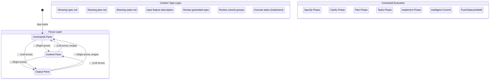
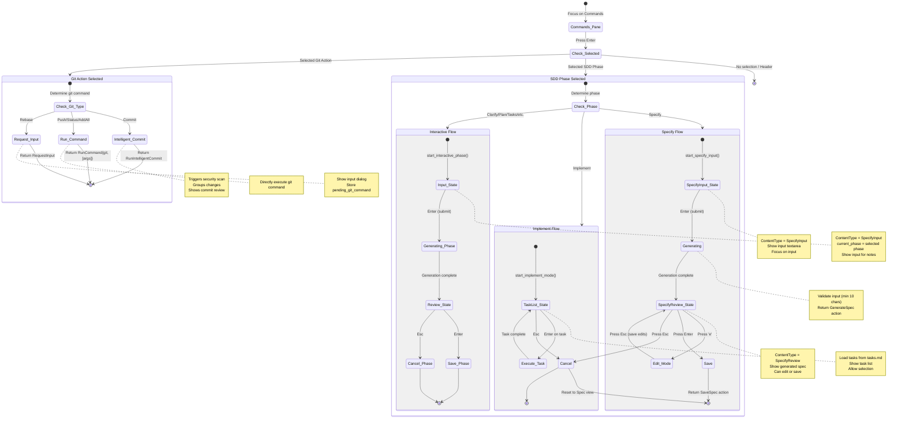
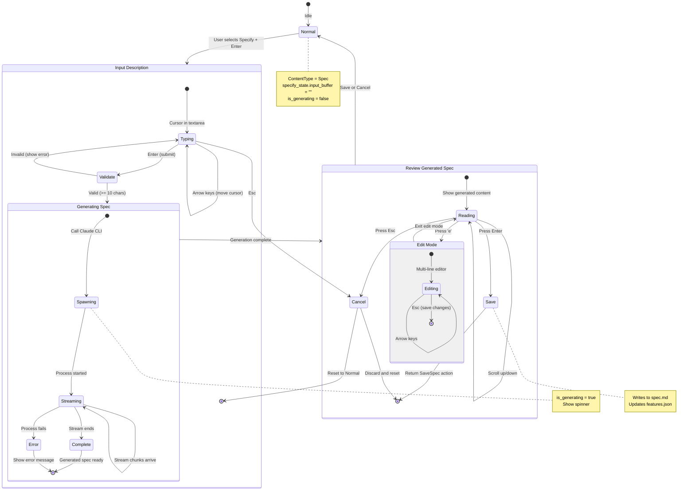
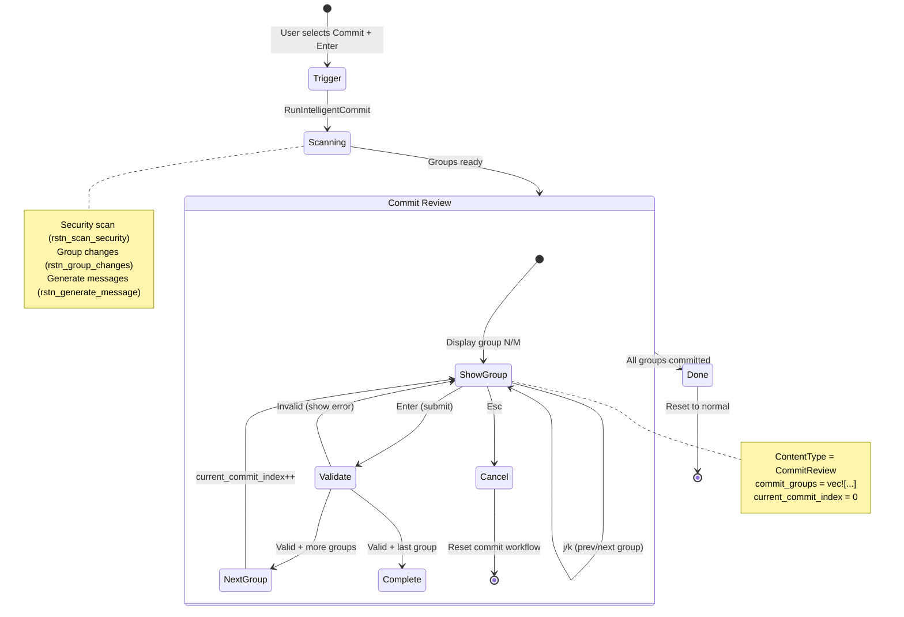
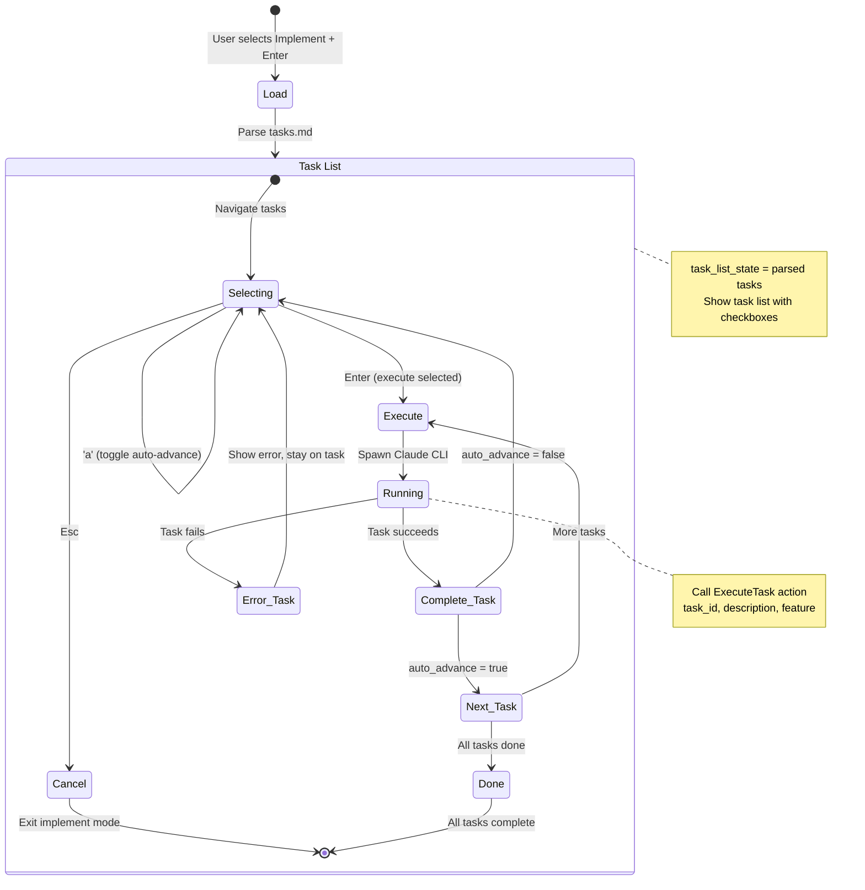
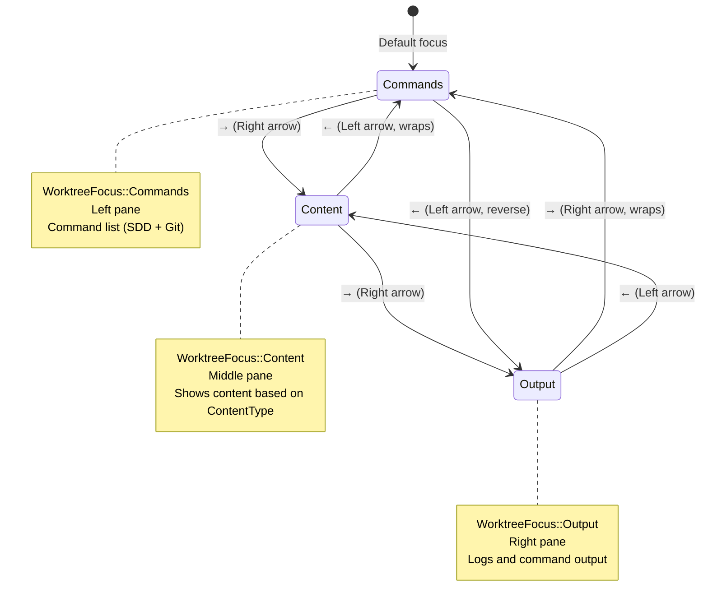

# Worktree View State Machine

**Created**: 2025-12-18
**Status**: Current Implementation (Before Redesign)
**Purpose**: Document how the state machine works today

---

## State Hierarchy

The WorktreeView has **3 levels** of state:

1. **Focus State** - Which pane has focus (Commands / Content / Output)
2. **Content State** - What's shown in content pane
3. **Sub-state** - Workflow-specific states (Specify/Implement/Commit)

---

## State Diagram: Full State Machine



---

## Enter Key State Transitions

### When Focus = Commands Pane



---

## Detailed State: Specify Workflow



---

## Detailed State: Commit Review Workflow



---

## Detailed State: Implement (Task Execution)



---

## Focus Navigation



---

## Key State Variables

### WorktreeView State Fields

```rust
pub struct WorktreeView {
    // Focus state
    pub focus: WorktreeFocus,  // Commands | Content | Output

    // Content state
    pub content_type: ContentType,  // Spec | Plan | Tasks | SpecifyInput | SpecifyReview | CommitReview

    // Specify workflow state
    pub specify_state: SpecifyState {
        input_buffer: String,           // User's input
        input_cursor: usize,            // Cursor position
        is_generating: bool,            // Is Claude generating?
        generated_spec: Option<String>, // Generated content
        current_phase: SpecPhase,       // Which phase (Specify/Clarify/etc.)
        validation_error: Option<String>,
        auto_advance: bool,             // Auto-execute next task?
        edit_text_input: Option<TextInput>, // Edit mode state
        task_list_state: Option<TaskListState>, // Implement mode
    },

    // Commit workflow state
    pub commit_groups: Option<Vec<CommitGroup>>,
    pub current_commit_index: usize,
    pub commit_message_input: String,
    pub commit_message_cursor: usize,
    pub commit_validation_error: Option<String>,

    // Command state
    pub commands: Vec<Command>,     // SDD phases + Git actions
    pub command_state: ListState,   // Selected index

    // Output state
    pub log_buffer: LogBuffer,
    pub is_running: bool,
    pub running_phase: Option<String>,
}
```

---

## State Transition Table

| Current State | Key Press | Condition | Next State | Action |
|--------------|-----------|-----------|------------|--------|
| Commands Focus | Enter | SDD: Specify selected | SpecifyInput | start_specify_input() |
| Commands Focus | Enter | SDD: Implement selected | TaskList | start_implement_mode() |
| Commands Focus | Enter | SDD: Other selected | Interactive Input | start_interactive_phase() |
| Commands Focus | Enter | Git: Commit selected | (no state change) | RunIntelligentCommit |
| Commands Focus | Enter | Git: Push selected | (no state change) | RunCommand |
| Commands Focus | Enter | Git: Rebase selected | (no state change) | RequestInput |
| Commands Focus | → | Any | Content Focus | focus_right() |
| Commands Focus | ← | Any | Output Focus | focus_left() |
| SpecifyInput | Enter | Valid input | Generating | Return GenerateSpec |
| SpecifyInput | Enter | Invalid input | SpecifyInput | Show validation error |
| SpecifyInput | Esc | Any | Normal | cancel_specify() |
| SpecifyReview | Enter | Any | Normal | Return SaveSpec |
| SpecifyReview | 'e' | Any | Edit Mode | toggle_specify_edit_mode() |
| SpecifyReview | Esc | Any | Normal | cancel_specify() |
| Edit Mode | Esc | Any | SpecifyReview | Save edits |
| TaskList | Enter | Task selected | Running | Return ExecuteTask |
| TaskList | j/k | Any | TaskList | Navigate tasks |
| TaskList | Esc | Any | Normal | cancel_specify() |
| CommitReview | Enter | Valid message | Next/Done | SubmitCommitGroup |
| CommitReview | Enter | Invalid message | CommitReview | Show error |
| CommitReview | Esc | Any | Normal | cancel_commit_review() |

---

## Problems with Current State Machine

### 1. **State Explosion**
- 54+ fields in WorktreeView to track all states
- Hard to understand which fields affect which states
- Risk of inconsistent state

### 2. **Nested Sub-states**
- SpecifyState has 8+ fields
- Commit workflow has 7+ fields
- Each workflow adds more fields

### 3. **Complex State Checking**
```rust
// Current code has many conditionals:
if self.content_type == ContentType::SpecifyInput && !self.specify_state.is_generating {
    // Handle input
} else if self.specify_state.edit_text_input.is_some() {
    // Handle edit mode
} else if self.specify_state.task_list_state.is_some() {
    // Handle task list
}
```

### 4. **Unclear State Ownership**
- Who can modify specify_state? (multiple methods)
- When is commit_groups set/cleared? (multiple places)
- Hard to trace state mutations

---

## Proposed Improvements (For Redesign)

### 1. **Explicit State Enum**
```rust
enum WorktreeState {
    Idle {
        focus: Focus,
        content: ViewContent,
    },
    PromptInput {
        buffer: String,
        cursor: usize,
    },
    CommandRunning {
        command: String,
        progress: f32,
    },
    ShowingResult {
        content: String,
    },
}
```

### 2. **State Machine Pattern**
```rust
impl WorktreeView {
    fn transition(&mut self, event: Event) -> Action {
        match (&self.state, event) {
            (State::Idle, Event::SelectCommand(cmd)) => {
                self.state = State::PromptInput::default();
                Action::None
            }
            (State::PromptInput, Event::Submit(text)) => {
                self.state = State::CommandRunning { ... };
                Action::RunCommand(text)
            }
            _ => Action::None
        }
    }
}
```

### 3. **Reduce Field Count**
- Target: <20 fields in WorktreeView
- Group related state into sub-structs
- Make state transitions explicit

---

## Related Documents

- [Worktree View Redesign](worktree-view-redesign.md) - New three-column design
- [Integration Flow](rstn-integration-flow.md) - rstn ↔ Claude ↔ MCP flow
- [Technical Debt](../03-complexity-analysis/technical-debt.md) - Current issues

---

## Changelog

- 2025-12-18: Initial state machine documentation created
