# 🎯 State Serializability - Core Architecture Principle

**Status**: 🎯 Core Principle (Feature 079)
**Created**: 2025-12-18
**Last Updated**: 2025-12-19

---

## TL;DR - For Claude Code

**Core Principle:** At any time, rstn's entire state MUST be JSON/YAML serializable.

**Why:**
- **Testability**: State-based tests are observable, deterministic, and stable
- **Reproducibility**: Save state → load state → exact bug reproduction
- **Clarity**: State is the single source of truth, UI is derived

**Testing Requirements (MANDATORY):**
1. Every feature MUST include state serialization round-trip test
2. Every feature MUST include state transition tests
3. State structs MUST derive `Serialize + Deserialize + Debug + Clone`
4. NO hidden state (closures, thread-locals, unserializable fields)

**Enforcement:**
- CI checks: All state structs derive required traits
- Code review: State tests required for PR approval
- Test coverage: State tests are NOT optional

**Quick Example:**
```rust
#[derive(Debug, Clone, Serialize, Deserialize, PartialEq)]
pub struct AppState {
    pub version: String,
    pub worktree_view: WorktreeViewState,
    pub dashboard_view: DashboardState,
    pub settings_view: SettingsState,
}

#[test]
fn test_state_round_trip() {
    let state = AppState::default();
    let json = serde_json::to_string(&state).unwrap();
    let loaded: AppState = serde_json::from_str(&json).unwrap();
    assert_eq!(state, loaded); // MUST pass
}
```

---

## Core Principle

> **At any time, at any moment, rstn's entire state MUST be representable as JSON/YAML.**

This means:
- Every piece of application state can be serialized
- State can be saved, loaded, and restored exactly
- UI is a pure function of state: `UI = render(State)`
- No hidden state, no implicit assumptions
- All mutations go through explicit state transitions

---

## Why State Serializability?

### 1. **Testability**
State-based testing is **observable** and **deterministic**:

```rust
#[test]
fn test_prompt_workflow() {
    // Load known initial state
    let state = AppState::from_json(r#"{
        "input_mode": false,
        "session_id": null
    }"#);

    let mut app = App::from_state(state).unwrap();

    // Trigger action
    app.handle_view_action(ViewAction::RunPromptClaude {
        prompt: "test".into()
    });

    // Assert state transition
    let final_state = app.to_state();
    assert!(final_state.session_id.is_some());
    assert_eq!(final_state.input_mode, false);
}
```

**vs. UI testing** (hard to observe):
```rust
// ❌ Fragile: depends on rendering coordinates
let buffer = terminal.backend().buffer();
assert_eq!(buffer.get(10, 5).symbol, "│");
```

### 2. **Reproducible Bugs**
Users can save state when bugs occur:

```bash
# User hits bug
rstn --save-state bug-report.json

# Developer loads exact state
rstn --load-state bug-report.json
# → Perfect reproduction
```

### 3. **Session Persistence**
Save on exit, restore on startup:

```yaml
# ~/.rstn/session.yaml
version: "0.1.0"
current_view: Worktree
input_mode: false
worktree_view:
  focus: GitStatus
  current_branch: "feature/042"
  session_id: "abc123-def456"
  claude_output:
    - type: assistant
      text: "Previous conversation..."
```

### 4. **Time-Travel Debugging**
Record all state transitions:

```rust
let mut history: Vec<AppState> = vec![];

loop {
    history.push(app.to_state()); // Snapshot
    app.handle_event(event);
}

// When bug occurs:
save_history("debug-trace.json", &history);
// → Replay state transitions to find exact failure point
```

### 5. **Clear Single Source of Truth**
State is **explicit** and **centralized**:
- No scattered state across components
- No "magic" hidden state
- No implicit dependencies
- Easy to reason about

---

## Architecture

### State-Driven Design

```
┌─────────────────────────────────────────┐
│           Single State Tree             │
│         (Serializable to JSON)          │
│                                         │
│  AppState {                             │
│    version: String,                     │
│    current_view: ViewType,              │
│    input_mode: bool,                    │
│    worktree_view: WorktreeViewState,    │
│    settings_view: SettingsViewState,    │
│    dashboard_view: DashboardState,      │
│    mcp_server: McpServerState,          │
│  }                                      │
│                                         │
│  All derives: Serialize + Deserialize   │
└────────────┬────────────────────────────┘
             │
             │ Pure function
             │ UI = render(state)
             ▼
┌─────────────────────────────────────────┐
│          UI Layer (TUI/CLI)             │
│      Derived from state, no logic       │
│                                         │
│  - Tabs (from current_view)             │
│  - Input dialog (from input_mode)       │
│  - Git status (from worktree_view)      │
│  - All widgets = views of state         │
└─────────────────────────────────────────┘
```

### State Transition Pattern

All mutations go through explicit state transitions:

```rust
impl App {
    pub fn handle_action(&mut self, action: ViewAction) -> Result<()> {
        // 1. Log old state (for debugging)
        let old_state = self.to_state();
        tracing::debug!(state = ?old_state, "Before action");

        // 2. Perform state transition
        match action {
            ViewAction::RunPromptClaude { prompt } => {
                // Explicit state mutations
                self.worktree_view.session_id = Some(generate_id());
                self.worktree_view.pending_response = true;
                self.worktree_view.last_prompt = Some(prompt);
            }
            ViewAction::SwitchView(view) => {
                self.current_view = view;
            }
            // ...
        }

        // 3. Log new state
        let new_state = self.to_state();
        tracing::debug!(
            old = ?old_state,
            new = ?new_state,
            "State transition"
        );

        Ok(())
    }
}
```

### State Transition Diagram

```mermaid
stateDiagram-v2
    [*] --> Idle: App starts

    Idle --> LoadingState: --load-state flag
    LoadingState --> Idle: State loaded
    LoadingState --> Error: Load failed

    Idle --> Running: User action

    state Running {
        [*] --> Processing: handle_action()
        Processing --> ValidateAction: Check preconditions
        ValidateAction --> MutateState: Valid
        ValidateAction --> Error: Invalid
        MutateState --> LogTransition: State changed
        LogTransition --> [*]: Done
    }

    Running --> Idle: Action complete

    Idle --> SavingState: --save-state flag / Exit
    SavingState --> [*]: State saved
    SavingState --> Error: Save failed

    Error --> Idle: Error handled

    note right of Running
        All state mutations happen here
        Old state → Action → New state
        Logged for debugging
    end note

    note right of SavingState
        Serialize to JSON/YAML
        Can be loaded later
        Perfect reproduction
    end note
```



---

## State Persistence

This section covers practical implementation details of state persistence in rstn, answering common questions about how state is stored, loaded, validated, and rendered.

### State File Locations

**Primary Location** (automatic session persistence):
```bash
~/.rstn/session.yaml
```
- Saved automatically on app exit
- Loaded automatically on app start
- YAML format for readability

**CLI Flags** (manual state management):
```bash
rstn --save-state <file>    # Save to custom location (JSON)
rstn --load-state <file>    # Load from custom location (JSON/YAML)
```

**Related Paths**:
- `~/.rstn/sessions/{feature}.session` - Claude session IDs
- `~/.rstn/settings.json` - Application settings
- `~/.rstn/logs/` - Log files
- `~/.rstn/mcp-session.json` - MCP server config

**Legacy Migration**:
The system auto-migrates from old paths:
- `~/.rustation/` → `~/.rstn/` (priority 2)
- `~/.rust-station/` → `~/.rstn/` (priority 3)

**Files**: `crates/rstn/src/domain/paths.rs`, `crates/rstn/src/tui/app.rs:2290`

---

### File Format and Schema

**Supported Formats**: YAML (preferred) or JSON

**Auto-Detection**:
```rust
pub fn load_from_file(path: &Path) -> Result<Self, Box<dyn Error>> {
    let content = std::fs::read_to_string(path)?;

    // Try JSON first
    if let Ok(state) = serde_json::from_str::<AppState>(&content) {
        Self::check_version(&state.version)?;
        return Ok(state);
    }

    // Fall back to YAML
    if let Ok(state) = serde_yaml::from_str::<AppState>(&content) {
        Self::check_version(&state.version)?;
        return Ok(state);
    }

    Err("Failed to parse state file as JSON or YAML".into())
}
```

**Schema Structure**:

Top-level state (4 views, 52 total fields):
```rust
#[derive(Debug, Clone, PartialEq, Serialize, Deserialize)]
pub struct AppState {
    pub version: String,                    // "0.3.0"
    pub worktree_view: WorktreeViewState,   // 36 fields
    pub dashboard_view: DashboardState,     // 12 fields
    pub settings_view: SettingsState,       // 4 fields
}
```

WorktreeViewState breakdown (36 fields organized by phase):
- **P1 - Feature Context** (2): feature_info, worktree_type
- **P1 - Content Cache** (3): spec_content, plan_content, tasks_content
- **P1 - Phase Tracking** (2): phases, current_phase
- **P1 - UI State** (3): focus, content_type, content_scroll
- **P2 - Commands** (2): commands, command_state_index
- **P2 - Logging/Output** (7): log_entries, output_scroll, is_running, running_phase, pending_git_command, active_session_id, pending_follow_up
- **P3 - Input** (3): pending_input_phase, prompt_input, inline_input
- **P3 - Progress** (3): progress_step, progress_total, progress_message
- **P4 - Commit Workflow** (8): commit fields
- **P5 - Specify/Prompt** (3): specify_state, prompt_edit_mode, prompt_output

**Files**: `crates/rstn/src/tui/state/*.rs`

---

### Default State Initialization

**Behavior**: Missing file or load failure → uses `Default::default()`

**Session Load**:
```rust
fn load_session() -> Option<AppState> {
    let session_path = get_data_dir().join("session.yaml");

    if !session_path.exists() {
        debug!("No session file, using defaults");
        return None;  // ← Caller uses Default
    }

    match AppState::load_from_file(&session_path) {
        Ok(state) => Some(state),
        Err(e) => {
            eprintln!("Failed to load: {}, using defaults", e);
            None  // ← Caller uses Default
        }
    }
}
```

**Default Implementations**:

All state structs implement `Default` with sensible values:
```rust
impl Default for DashboardState {
    fn default() -> Self {
        Self {
            focused_panel: DashboardPanel::QuickActions,
            git_branch: "main".to_string(),
            worktree_count: 1,  // ← Satisfies invariant (> 0)
            // ... all fields have defaults
        }
    }
}
```

**Defensive Deserialization**:

Settings use `#[serde(default)]` for missing fields:
```rust
pub struct Settings {
    #[serde(default = "default_auto_run")]
    pub auto_run: bool,

    #[serde(default = "default_max_turns")]
    pub max_turns: u32,

    // All fields protected
}
```

**Result**: App always starts with valid state, never panics on missing file.

**Files**: `crates/rstn/src/tui/state/*.rs`, `crates/rstn/src/tui/app.rs:109`

---

### Error Handling

**Error Scenarios**:

| Scenario | Behavior | Result |
|----------|----------|--------|
| Missing file | `read_to_string` fails | Returns `Err(io::Error)` |
| Corrupted JSON | JSON parser fails | Tries YAML fallback |
| Corrupted YAML | YAML parser fails | Returns `Err("Failed to parse...")` |
| Missing fields | Uses `#[serde(default)]` | Fills with defaults, succeeds |
| Wrong types | Serde fails | Returns `Err(serde error)` |
| Invalid invariants | `assert_invariants()` | Panics with message |
| Version mismatch | Logs warning | Returns `Ok()` (Phase 2) |

**Version Checking** (currently lenient):
```rust
fn check_version(state_version: &str) -> Result<(), Box<dyn Error>> {
    let current_version = env!("CARGO_PKG_VERSION");

    if state_version != current_version {
        eprintln!(
            "Warning: Version mismatch. State: {}, Current: {}",
            state_version, current_version
        );
        // Phase 2: Allow with warning
        // Phase 5 will implement strict migration
    }

    Ok(())  // ← Returns Ok even on mismatch!
}
```

**Post-Load Validation**:
```rust
// In main.rs
if let Some(load_path) = &args.load_state {
    let state = AppState::load_from_file(load_path)?;
    state.assert_invariants();  // ← Validates constraints!
}
```

**Test Coverage**:
- Corrupted file handling: `test_load_corrupted_session()`
- Invalid invariants: `test_invalid_state_panics()`
- Missing fields: `test_missing_fields_use_defaults()`

**Files**: `crates/rstn/src/tui/state/mod.rs:127`, `crates/rstn/tests/*_test.rs`

---

### State Validation (StateInvariants)

**Trait Definition**:
```rust
pub trait StateInvariants {
    fn assert_invariants(&self);
}
```

**Invariant Implementations**:

WorktreeViewState:
```rust
impl StateInvariants for WorktreeViewState {
    fn assert_invariants(&self) {
        // Feature info required for feature worktrees
        if matches!(self.worktree_type, WorktreeType::FeatureWorktree { .. }) {
            assert!(self.feature_info.is_some());
        }

        // Scroll positions reasonable
        assert!(self.content_scroll < 100000);

        // Command index in bounds
        if let Some(idx) = self.command_state_index {
            assert!(idx < self.commands.len());
        }

        // Running phase consistency
        if self.running_phase.is_some() {
            assert!(self.is_running);
        }
    }
}
```

DashboardState:
```rust
impl StateInvariants for DashboardState {
    fn assert_invariants(&self) {
        assert!(self.worktree_count > 0);
    }
}
```

SettingsState:
```rust
impl StateInvariants for SettingsState {
    fn assert_invariants(&self) {
        assert!(self.selected_index < 5);
    }
}
```

AppState (delegates to all views):
```rust
impl StateInvariants for AppState {
    fn assert_invariants(&self) {
        self.worktree_view.assert_invariants();
        self.dashboard_view.assert_invariants();
        self.settings_view.assert_invariants();
    }
}
```

**When Invariants Are Checked**:
1. After loading state (`main.rs:93`)
2. In all tests (mandatory)
3. Before saving (defensive)

**Files**: `crates/rstn/src/tui/state/mod.rs`, `crates/rstn/tests/app_state_test.rs`

---

### State-to-UI Flow

**Architecture**: `UI = render(State)` (pure function)

**Bidirectional Conversion**:

Extract state from view:
```rust
pub fn to_state(&self) -> WorktreeViewState {
    WorktreeViewState {
        // Persistent fields
        feature_info: self.feature_info.clone(),
        spec_content: self.spec_content.clone(),
        focus: self.focus,
        content_scroll: self.content_scroll,

        // Extract from ephemeral types
        command_state_index: self.command_state.selected(),
        log_entries: self.log_buffer.entries().cloned().collect(),

        // ... 28 more fields
    }
}
```

Reconstruct view from state:
```rust
pub fn from_state(state: WorktreeViewState) -> Result<Self> {
    // Reconstruct ephemeral types
    let mut command_state = ListState::default();
    command_state.select(state.command_state_index);

    let log_buffer = LogBuffer::from_entries(state.log_entries);

    Ok(Self {
        // Restore persistent fields
        feature_info: state.feature_info,
        focus: state.focus,
        content_scroll: state.content_scroll,

        // Reconstructed ephemeral
        command_state,
        log_buffer,

        // Fresh ephemeral (not serialized)
        tick_count: 0,
        auto_flow: AutoFlowState::new(),
    })
}
```

**Rendering Flow**:
```rust
pub fn render(&mut self, frame: &mut Frame) {
    // Read state to determine view
    match self.current_view {
        ViewType::Worktree => {
            self.worktree_view.render(frame, area);
        }
        // ...
    }
}

fn render_content(&self, frame: &mut Frame, area: Rect) {
    // All rendering reads from state
    let selected_idx = match self.content_type {
        ContentType::Spec => 0,
        ContentType::Plan => 1,
        ContentType::Tasks => 2,
    };

    let content_lines = self.spec_content
        .lines()
        .skip(self.content_scroll)  // ← From state
        .take(height)
        .collect();

    frame.render_widget(Paragraph::new(content_lines), area);
}
```

**State Update Flow**:
```
Event → handle_key() → State Mutation → render() → Frame
```

**Persistent vs Ephemeral**:
- **Persistent** (serialized): content, scroll positions, logs, phase tracking
- **Ephemeral** (reconstructed): ListState, LogBuffer, tick counters, file tracker

**Files**: `crates/rstn/src/tui/app.rs:2821`, `crates/rstn/src/tui/views/worktree/view.rs:3058,3134`

---

### Logging Management (State + Logs = Observability)

**Core Principle**: State snapshots + Event logs = Complete observability

**Why Logging Matters**:
- **With state alone**: You see WHAT the app's state is at a point in time
- **With logs alone**: You see WHEN events happened
- **With state + logs**: You see HOW the app transitioned from state A to state B

**Two-Tier Logging Architecture**:

#### Tier 1: File Logging (Tracing Framework)

**Location**: `~/.rustation/logs/rstn.<session-id>.log`

**Format**:
```
[2025-12-19 10:23:45.123] INFO [rstn::tui::app] 📍 Session started session_id=2025-12-19-102345-a3f9 (src/main.rs:59)
[2025-12-19 10:24:01.456] INFO [rstn::tui::app] Starting spec generation for: new feature (src/tui/app.rs:841)
[2025-12-19 10:24:15.789] WARN [rstn::tui::app] Commit blocked: 3 warnings, 1 sensitive (src/tui/app.rs:670)
```

**What Gets Logged**:
- Session lifecycle (start, end, duration)
- State transitions (with context fields)
- Command execution (with exit codes)
- Errors (with full context)
- Performance metrics (duration_secs)

**Log Levels**:
```rust
TRACE  // Verbose debugging (disabled in release)
DEBUG  // Development debugging
INFO   // Normal operations (default)
WARN   // Warnings (commit blocked, version mismatch)
ERROR  // Errors (with full context)
```

**Structured Logging Examples**:
```rust
// Session start with context
tracing::info!(
    session_id = %session_id,
    version = version::FULL_VERSION,
    "📍 Session started"
);

// Commit workflow with counts
tracing::info!(
    groups = groups.len(),
    warnings = warnings.len(),
    sensitive = sensitive_files.len(),
    "Commit groups ready"
);

// Error with full context
tracing::error!(
    error = %e,
    duration_secs = duration.as_secs_f64(),
    "❌ Session ended with error"
);
```

**Configuration**:
```bash
# Environment variable (overrides settings)
export RSTN_LOG=debug
rstn

# Or use settings
# ~/.rstn/settings.json:
{
  "logging_enabled": true,
  "log_level": "info",
  "log_to_console": false
}
```

#### Tier 2: TUI Event Logging (In-App Buffer)

**Purpose**: User-visible event stream in TUI

**LogEntry Structure**:
```rust
#[derive(Debug, Clone, PartialEq, Serialize, Deserialize)]
pub struct LogEntry {
    pub timestamp: SystemTime,      // Serialized as UNIX epoch
    pub category: LogCategory,      // User, Command, ClaudeStream, etc.
    pub content: String,
}
```

**Categories** (with UI colors):
- 🧑 **User** (Blue): User actions (key press, focus change)
- ⚡ **Command** (Cyan): Command execution
- 🤖 **ClaudeStream** (White): Claude Code output
- 🔌 **Mcp** (Magenta): MCP tool calls
- 🔧 **Hook** (Yellow): Shell hooks
- 📝 **FileChange** (Green): File operations
- ❌ **Error** (Red): Errors
- ℹ️ **System** (Gray): System messages

**Circular Buffer**:
- Max 1000 entries (oldest evicted)
- Persisted in WorktreeViewState.log_entries
- Survives app restarts (serialized to session.yaml)

**Logging Methods** (in WorktreeView):
```rust
self.log(LogCategory::User, "Switched to Settings view".into());
self.log(LogCategory::Command, "/speckit.specify".into());
self.log(LogCategory::FileChange, "File updated: spec.md".into());
self.log(LogCategory::Error, "Failed to load state".into());
```

**TUI Visibility**:
- Displayed in output panel (right side, 40% width)
- Auto-scrolls on new entries
- Color-coded by category
- User can scroll through history

#### State + Logs = Debugging Power

**Scenario**: User reports "commit didn't work"

**Without logs**:
```bash
# Load state
rstn --load-state bug.json

# State shows: pending_git_command = None, is_running = false
# BUT: Why did it fail? No clue.
```

**With logs**:
```bash
# Check file log
grep -i "commit" ~/.rustation/logs/rstn.2025-12-19-*.log

# Output:
[10:24:15.789] WARN Commit blocked: 3 warnings, 1 sensitive file
[10:24:16.123] INFO User cancelled commit in review dialog

# Now we know: Security scan blocked commit, user cancelled
```

**With state + logs**:
```bash
# Load state
rstn --load-state bug.json

# State shows:
# - commit_review.scan_result: Some(ScanResult { warnings: 3, sensitive: 1 })
# - commit_review.user_cancelled: true

# Logs show:
# - [10:24:15] WARN Commit blocked: 3 warnings
# - [10:24:16] INFO User cancelled

# Result: Complete picture of what happened and why
```

#### Correlation Pattern

**In code**:
```rust
// Before state transition
tracing::debug!(old_state = ?self.to_state(), "Before action");

// Perform action
self.handle_action(action);

// After state transition
tracing::debug!(new_state = ?self.to_state(), "After action");

// TUI log
self.log(LogCategory::User, format!("Action: {:?}", action));
```

**Result**: Every TUI event has corresponding file log entry with full state context

#### Viewing Logs

**File logs**:
```bash
# Live tail
tail -f ~/.rustation/logs/rstn.log

# Search by keyword
grep -i "error\|warn" ~/.rustation/logs/rstn.*.log

# View session log
cat ~/.rustation/logs/rstn.2025-12-19-102345-a3f9.log

# Compressed old logs
ls ~/.rustation/logs/*.gz
```

**TUI logs**:
- Visible in output panel during session
- Persisted in state (log_entries field)
- Restored on session load

#### Log Management

**Automatic cleanup**:
- Old logs (>7 days) deleted
- Background thread handles rotation
- Compression for historical logs

**Manual cleanup**:
```bash
# Remove all logs
rm -rf ~/.rustation/logs/

# Remove specific session
rm ~/.rustation/logs/rstn.2025-12-19-*.log
```

**Files**:
- Log initialization: `crates/rstn/src/logging.rs`
- TUI logging: `crates/rstn/src/tui/logging/{entry.rs,buffer.rs}`
- State persistence: `crates/rstn/src/tui/state/worktree.rs` (log_entries field)
- Examples: `crates/rstn/src/tui/app.rs` (search for `tracing::info!`)

---

## Common Pitfalls

### ❌ Antipattern: Hidden State

**Problem**: State not in the state tree
```rust
// ❌ BAD: State in closure (not serializable)
let counter = Rc::new(RefCell::new(0));
button.on_click(move || {
    *counter.borrow_mut() += 1; // Hidden state!
});

// ✅ GOOD: State in AppState
pub struct AppState {
    pub click_count: usize, // Serializable
}
app.handle_action(ViewAction::ButtonClick); // Explicit transition
```

### ❌ Antipattern: Non-Serializable Types

**Problem**: Fields that can't be serialized
```rust
// ❌ BAD: Function pointer (not serializable)
pub struct AppState {
    pub callback: fn() -> (), // Can't serialize!
}

// ❌ BAD: Thread handle (not serializable)
pub struct AppState {
    pub worker: JoinHandle<()>, // Can't serialize!
}

// ✅ GOOD: Only data, no behavior
pub struct AppState {
    pub callback_name: String, // Serializable ID
    pub worker_id: Option<String>, // Serializable reference
}
```

### ❌ Antipattern: Implicit State

**Problem**: State derived but not stored
```rust
// ❌ BAD: Computed on-the-fly (inconsistent)
impl App {
    pub fn is_ready(&self) -> bool {
        self.feature.is_some() && !self.is_running // Not stored!
    }
}

// ✅ GOOD: Explicit state field
pub struct AppState {
    pub is_ready: bool, // Stored in state
}

impl App {
    pub fn compute_ready(&mut self) {
        self.is_ready = self.feature.is_some() && !self.is_running;
    }
}
```

### ❌ Antipattern: Mutable Global State

**Problem**: State outside the state tree
```rust
// ❌ BAD: Global mutable state
static mut CURRENT_SESSION: Option<String> = None;

// ✅ GOOD: State in AppState
pub struct AppState {
    pub current_session: Option<String>,
}
```

### ✅ Best Practices

1. **Everything in the state tree**: If it affects behavior, it's in `AppState`
2. **Derive required traits**: `Serialize + Deserialize + Debug + Clone + PartialEq`
3. **Use `#[serde(skip)]` sparingly**: Only for true caches (recomputable from other state)
4. **Store IDs, not objects**: `session_id: String`, not `session: Session`
5. **Test round-trips**: Every state struct has a serialization test

---

## Implementation Requirements

### 1. State Structs Must Be Serializable

All state structs **MUST** derive:
- `Serialize` (serde)
- `Deserialize` (serde)
- `Debug` (for logging)
- `Clone` (for snapshotting)

```rust
use serde::{Serialize, Deserialize};

#[derive(Debug, Clone, Serialize, Deserialize)]
pub struct AppState {
    pub version: String,
    pub current_view: ViewType,
    pub input_mode: bool,
    pub worktree_view: WorktreeViewState,
    // ... all app state
}

#[derive(Debug, Clone, Serialize, Deserialize)]
pub struct WorktreeViewState {
    pub focus: WorktreeFocus,
    pub current_branch: Option<String>,
    pub git_status: Vec<GitStatusEntry>,
    pub session_id: Option<String>,
    pub claude_output: Vec<OutputLine>,
    // ... all view state
}
```

### 2. Bidirectional Conversion

Apps/Views must implement `to_state()` and `from_state()`:

```rust
impl App {
    /// Convert app to serializable state
    pub fn to_state(&self) -> AppState {
        AppState {
            version: env!("CARGO_PKG_VERSION").to_string(),
            current_view: self.current_view,
            input_mode: self.input_mode,
            worktree_view: self.worktree_view.to_state(),
            settings_view: self.settings_view.to_state(),
            mcp_server: self.mcp_state.lock().unwrap().to_state(),
        }
    }

    /// Reconstruct app from state
    pub fn from_state(state: AppState) -> Result<Self> {
        Ok(App {
            current_view: state.current_view,
            input_mode: state.input_mode,
            worktree_view: WorktreeView::from_state(state.worktree_view)?,
            settings_view: SettingsView::from_state(state.settings_view)?,
            mcp_state: Arc::new(Mutex::new(McpState::from_state(state.mcp_server)?)),
            // ...
        })
    }
}
```

### 3. No Hidden State

**Forbidden**:
- State in `Rc<RefCell<T>>` that's not serialized
- State in closures
- State in thread-local storage
- Implicit state in external systems (without serializing references)

**Required**:
- All state in the state tree
- External references stored as IDs (e.g., `session_id: String`)
- Transient state marked clearly (e.g., `#[serde(skip)]` for caches)

---

## Testing Requirements

### Mandatory Tests for All Features

Every feature **MUST** include:

#### 1. State Serialization Round-Trip Test
```rust
#[test]
fn test_state_serialization_round_trip() {
    let app = App::new_for_test();

    // Serialize
    let state = app.to_state();
    let json = serde_json::to_string(&state).unwrap();

    // Deserialize
    let loaded_state: AppState = serde_json::from_str(&json).unwrap();
    let loaded_app = App::from_state(loaded_state).unwrap();

    // Must be identical
    assert_eq!(app.to_state(), loaded_app.to_state());
}
```

#### 2. State Transition Tests
```rust
#[test]
fn test_feature_state_transitions() {
    // Load initial state
    let initial = AppState {
        input_mode: false,
        session_id: None,
        // ...
    };
    let mut app = App::from_state(initial).unwrap();

    // Trigger action
    app.handle_view_action(ViewAction::RunPromptClaude {
        prompt: "test".into()
    });

    // Assert state changed correctly
    let final_state = app.to_state();
    assert!(final_state.session_id.is_some());
    assert_eq!(final_state.input_mode, false);
    assert!(final_state.worktree_view.pending_response);
}
```

#### 3. State Invariant Tests
```rust
#[test]
fn test_state_invariants() {
    let state = app.to_state();

    // Invariants that must always hold:

    // Example: input_dialog is Some iff input_mode is true
    if state.input_mode {
        assert!(state.input_dialog.is_some());
    } else {
        assert!(state.input_dialog.is_none());
    }

    // Example: session_id exists iff claude_output is non-empty
    if !state.worktree_view.claude_output.is_empty() {
        assert!(state.worktree_view.session_id.is_some());
    }
}
```

---

## Comparison: State Testing vs UI Testing

| Aspect | State Testing | UI Testing |
|--------|---------------|------------|
| **Observability** | ✅ Direct field access | ❌ Parse TestBackend buffer |
| **Stability** | ✅ Stable APIs | ❌ Breaks on layout changes |
| **Speed** | ✅ Fast (no rendering) | ❌ Slow (full render cycle) |
| **Clarity** | ✅ `assert_eq!(app.input_mode, true)` | ❌ `buffer.get(10, 5).symbol == "│"` |
| **Maintainability** | ✅ Refactor-safe | ❌ Brittle coordinate checks |
| **Determinism** | ✅ Pure state transitions | ❌ Depends on terminal size |

**When to use each**:
- **State testing**: Business logic, workflows, state transitions (95% of tests)
- **UI testing**: Layout bugs, visual regressions, widget rendering (5% of tests)

---

## CLI vs TUI: Same Core, Different Interfaces

Both CLI and TUI are **interfaces** over the same **state**:

```
┌────────────────────────────────────────────┐
│         Presentation Layer                 │
│  ┌──────────────┐    ┌──────────────┐     │
│  │ CLI Interface│    │ TUI Interface│     │
│  │              │    │              │     │
│  │ - Parse args │    │ - Events     │     │
│  │ - Print stdout│   │ - Rendering  │     │
│  └──────┬───────┘    └──────┬───────┘     │
└─────────┼────────────────────┼─────────────┘
          │                    │
          └─────────┬──────────┘
                    │
        ┌───────────▼────────────┐
        │    Core State Logic    │
        │  (runners/cargo.rs)    │
        │                        │
        │  - Business logic      │
        │  - State transitions   │
        │  - Side effects        │
        └────────────────────────┘
```

**Testing Strategy**:
1. **Test state via CLI first** (easy: input → output)
2. **Then test TUI** (only UI behavior, core already validated)
3. **Result**: If CLI passes, TUI issues are UI/UX only

---

## File Structure

```
crates/rstn/src/
├── tui/
│   ├── state.rs           # ← NEW: AppState, WorktreeViewState, etc.
│   ├── app.rs             # App::to_state(), App::from_state()
│   └── views/
│       ├── worktree/
│       │   ├── view.rs    # WorktreeView::to_state()
│       │   └── state.rs   # ← NEW: WorktreeViewState
│       └── ...
└── commands/
    └── state.rs           # ← NEW: CLI for --save-state, --load-state
```

---

## Enforcement

### CI Checks
- All state structs derive `Serialize + Deserialize`
- Round-trip tests pass for all views
- State coverage > 80% (all fields tested)

### Code Review Checklist
- [ ] New features include state tests
- [ ] State structs are serializable
- [ ] `to_state()` and `from_state()` implemented
- [ ] No hidden state introduced
- [ ] State invariants documented and tested

### SDD Workflow
When creating plan.md for new features:
- **Task N**: Define state structs
- **Task N+1**: Implement state tests
- **Task N+2**: Implement feature logic

State tests come **before** implementation.

---

## Future Enhancements

### Phase 1 (Feature 079)
- [x] Document principle in KB
- [ ] Create `tui/state.rs` with AppState
- [ ] Implement `App::to_state()` / `from_state()`
- [ ] Add state tests for existing features
- [ ] Update CLAUDE.md with testing requirements

### Phase 2 (Feature 080)
- [ ] Session persistence (`~/.rstn/session.yaml`)
- [ ] `--save-state` / `--load-state` CLI flags
- [ ] State changelog for version migrations

### Phase 3 (Future)
- [ ] Time-travel debugging (record all transitions)
- [ ] State diff viewer (before/after comparisons)
- [ ] State replay for bug reproduction

---

## References

- **Similar Architectures**:
  - Elm Architecture (Model is serializable)
  - Redux (State tree is plain JSON)
  - Jupyter Notebooks (Serialize execution state)
  - Emacs (Save/restore sessions)

- **Related KB Docs**:
  - `kb/01-architecture/rstn-tui-architecture.md` - TUI design
  - `kb/04-sdd-workflow/when-to-use-which.md` - Testing strategy
  - `CLAUDE.md` - CLI/TUI Architecture Pattern

---

**Key Takeaway**: State is the single source of truth. UI is derived. Tests assert state, not UI.

---

## Changelog

- **2025-12-19**: Added comprehensive "State Persistence" section with 7 subsections answering practical implementation questions:
  1. State file locations (automatic session.yaml + CLI flags)
  2. File format and schema (YAML/JSON auto-detection, 52-field AppState structure)
  3. Default state initialization (Default trait implementations, defensive deserialization)
  4. Error handling (corrupted files, version checking, post-load validation)
  5. State validation (StateInvariants trait with assert_invariants())
  6. State-to-UI flow (bidirectional conversion, pure rendering)
  7. Logging management (two-tier architecture: file logging + TUI event buffer, State + Logs = Observability principle)
