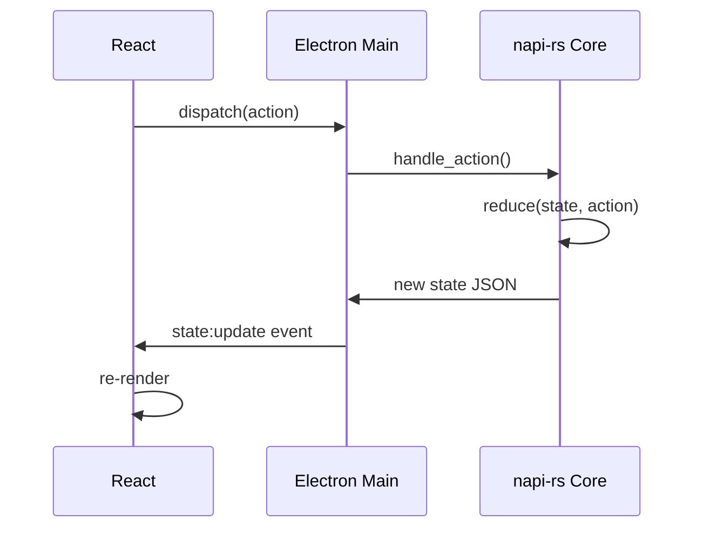

# rustation v3 Architecture

## Technology Stack

```
┌─────────────────────────────────────────────────────────────┐
│                    Electron App                              │
├─────────────────────────────────────────────────────────────┤
│  ┌─────────────────┐   ┌──────────────────────────────────┐ │
│  │  Main Process   │   │      Renderer (React)            │ │
│  │  (Node.js)      │   │  ┌────────────────────────────┐  │ │
│  │                 │   │  │  MUI Components            │  │ │
│  │  ┌───────────┐  │   │  │  Emotion Styling           │  │ │
│  │  │ IPC       │◄─┼───┼──│  useAppState hooks         │  │ │
│  │  │ Handler   │  │   │  └────────────────────────────┘  │ │
│  │  └─────┬─────┘  │   └──────────────────────────────────┘ │
│  │        │        │                                        │
│  │  ┌─────▼─────┐  │                                        │
│  │  │  napi-rs  │  │   ← Native Rust binding                │
│  │  │  Core     │  │                                        │
│  │  └───────────┘  │                                        │
│  └─────────────────┘                                        │
└─────────────────────────────────────────────────────────────┘
```

### Components

| Layer | Technology | Purpose |
|-------|------------|---------|
| **Desktop Shell** | Electron | Window management, native dialogs, IPC |
| **Frontend** | React 19 + Vite | UI components, state display |
| **Styling** | MUI (Material UI) + Emotion | Material Design 3 system |
| **Native Core** | napi-rs (Rust) | Business logic, Docker API, state |
| **State** | Rust AppState | Single source of truth |

---

## Three Pillars

### 1. State-First Architecture

**Rust owns all state. React displays it.**



**Key Rules**:
- All state structs derive `Serialize + Deserialize + Debug + Clone`
- No business logic in React (only display logic)
- UI = render(State) - pure function

### 2. Frontend/Backend Separation

**Explicit boundary via IPC:**

| Direction | Channel | Purpose |
|-----------|---------|---------|
| React → Rust | `state:dispatch` | Send actions |
| React → Rust | `state:get` | Get current state |
| Rust → React | `state:update` | Push state changes |

### 3. Workflow-Driven UI

**Three-tab structure:**

1. **Tasks Tab** - Run justfile commands
2. **Docker Tab** - Manage containers
3. **Settings Tab** - Configure app

---

## Directory Structure

```
rustation/
├── packages/core/          # Rust napi-rs module
│   └── src/
│       ├── app_state.rs    # State definition
│       ├── actions.rs      # Action enum
│       ├── reducer.rs      # State reducer
│       ├── docker.rs       # Docker management
│       ├── justfile.rs     # Justfile parser
│       ├── worktree.rs     # Git worktree
│       ├── persistence.rs  # Save/load state
│       └── lib.rs          # napi exports
│
├── apps/desktop/           # Electron app
│   └── src/
│       ├── main/           # Electron main process
│       ├── preload/        # IPC bridge
│       └── renderer/       # React frontend
│           └── src/
│               ├── components/   # Shared components
│               │   └── shared/   # Cross-feature composites
│               ├── features/     # Feature modules (Domain logic)
│               ├── hooks/        # useAppState, etc.
│               ├── theme/        # MUI theme configuration
│               └── types/        # TypeScript types
│
└── kb/                     # This documentation
```

---

## Anti-Patterns

| Avoid | Do Instead |
|-------|------------|
| Business logic in React | Calculate in Rust, send result |
| Direct state mutation in UI | Dispatch action to Rust |
| Storing state in React useState | Subscribe to Rust state |
| File handles in state | Store paths only |

---

## References

- [State-First Principle](01-state-first.md)
- [State Topology](02-state-topology.md)
- [Project Management](../features/project-management.md)
