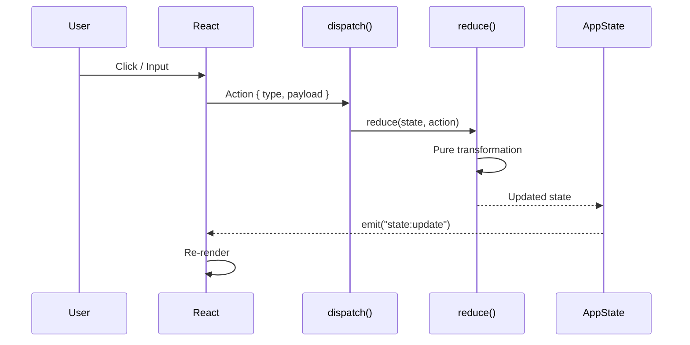

# State-First Principle

## Core Rule

> **At any time, rstn's entire state MUST be JSON serializable.**

This means:
- Every piece of state can be serialized with `serde_json`
- State can be saved, loaded, and restored exactly
- UI is a pure function of state: `UI = render(State)`
- All mutations go through explicit actions

---

## Requirements

### All State Structs MUST Derive:

```rust
#[derive(Debug, Clone, Serialize, Deserialize, PartialEq)]
pub struct AppState {
    pub version: String,
    pub projects: Vec<ProjectState>,
    pub active_project_index: usize,
    pub global_settings: GlobalSettings,
    // ...
}
```

### Valid State Types

| Allowed | Not Allowed |
|---------|-------------|
| Primitives (String, i32, bool) | Closures |
| Structs with `Serialize` | Thread handles |
| Enums with `Serialize` | File handles |
| `Vec<T>`, `HashMap<K,V>`, `Option<T>` | Non-Send types |

---

## State Flow



---

## Testing Requirements (MANDATORY)

Every feature MUST include these tests:

### 1. Round-Trip Test

```rust
#[test]
fn test_state_round_trip() {
    let state = AppState::default();
    let json = serde_json::to_string(&state).unwrap();
    let loaded: AppState = serde_json::from_str(&json).unwrap();
    assert_eq!(state, loaded);
}
```

### 2. State Transition Test

```rust
#[test]
fn test_open_project() {
    let mut state = AppState::default();
    reduce(&mut state, Action::OpenProject {
        path: "/path/to/project".into()
    });
    assert_eq!(state.projects.len(), 1);
}
```

### 3. State Invariant Test

```rust
#[test]
fn test_active_index_valid() {
    let state = AppState::default();
    if !state.projects.is_empty() {
        assert!(state.active_project_index < state.projects.len());
    }
}
```

---

## Benefits

1. **Testability** - State-based tests are deterministic
2. **Bug Reproduction** - Save state → load state → exact reproduction
3. **Session Persistence** - Restore state on app restart
4. **Time-Travel Debugging** - Record state history for replay

---

## References

- [Architecture Overview](00-overview.md)
- [State Topology](02-state-topology.md)
