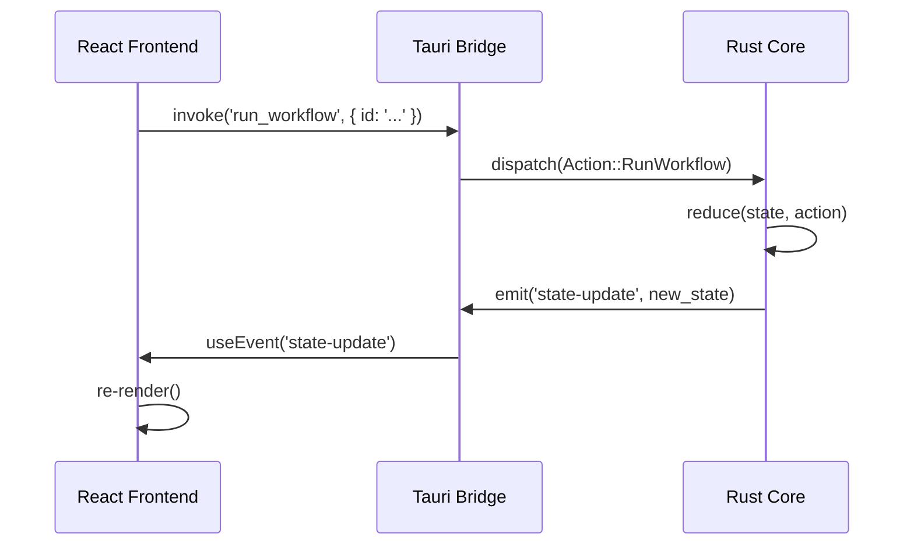

# Rustation v3: Tauri System Specification

## 1. Executive Summary

**Rustation v3** is a native desktop application for developer workflows, rewritten from the v2 TUI to **Tauri v2**. This shift enables richer visualizations, embedded media, and a modern GUI experience while retaining the robust Rust business logic.

### Core Value Proposition
- **Hybrid Power**: Performance of Rust + Flexibility of Web UI.
- **Workflow Centric**: Optimized for "Prompt-to-Code" and container management.
- **Local First**: Full offline capability, local Docker/Git management.

---

## 2. Technology Stack

### 2.1 Backend (Host)
- **Runtime**: [Tauri v2](https://v2.tauri.app/)
- **Language**: Rust (Edition 2021)
- **Database**: SQLite (via `sqlx`) for persistent history.
- **Docker**: `bollard` (Rust Docker client) or CLI wrapper.
- **State**: `parking_lot::RwLock<AppState>` (In-memory, serialized).

### 2.2 Frontend (Webview)
- **Framework**: [React 19](https://react.dev/)
- **Build Tool**: [Vite](https://vitejs.dev/)
- **Language**: TypeScript
- **Styling**: [Tailwind CSS](https://tailwindcss.com/)
- **Components**: [shadcn/ui](https://ui.shadcn.com/) (Radix UI based)
- **State Management**: `tanstack-query` (Server state) + `zustand` (Client state).
- **Icons**: `lucide-react`.

---

## 3. Architecture Patterns

### 3.1 The "Backend-Driven UI" Model

The frontend is a **visual projection** of the backend state.
- **Source of Truth**: Rust `AppState`.
- **Sync**: Backend pushes full or delta state updates to Frontend via Events.
- **Action**: Frontend invokes Commands to mutate Backend state.



### 3.2 Directory Structure

```
rustation/
├── src-tauri/           # Rust Backend
│   ├── src/
│   │   ├── domain/      # Business Logic (Ported from v2)
│   │   ├── commands/    # Tauri Commands
│   │   ├── state/       # AppState Definition
│   │   └── main.rs      # Entry Point
│   ├── capabilities/    # Security Config
│   └── tauri.conf.json  # App Config
│
├── src/                 # React Frontend
│   ├── components/      # UI Components (shadcn)
│   ├── features/        # Feature Modules (Workflows, Docker)
│   ├── hooks/           # Custom Hooks (useBackend)
│   ├── lib/             # Utilities
│   └── main.tsx         # Entry Point
```

---

## 4. Feature Specifications

### 4.1 Layout & Navigation
**Requirement**: 3-Tab Structure (Fixed Sidebar or Top Bar).

*   **Window**: 1200x800 default, min 800x600.
*   **Theme**: System preference default, toggleable Dark/Light.
*   **Navigation**:
    1.  **Workflows** (Home/Dev)
    2.  **Dockers** (Container Ops)
    3.  **Settings** (Config)

### 4.2 Tab 1: Workflows
The core development interface.
- **Left Panel (List)**: Available workflows (Prompt Claude, Git Commit, Spec Gen).
- **Right Panel (Detail)**:
    - **Prompt Input**: Rich text editor (Markdown support).
    - **Chat Stream**: Virtualized list of messages (User/Assistant).
    - **Artifacts**: Collapsible panels for file diffs, specs.

### 4.3 Tab 2: Dockers
Container management dashboard.
- **Service Grid**: Cards for PostgreSQL, Redis, etc.
- **Status Indicators**: Real-time traffic light (Green/Red/Grey).
- **Controls**: Play/Stop/Restart buttons per card.
- **Logs**: Drawer/Modal with streaming logs (xterm.js or virtual list).

### 4.4 Tab 3: Settings
Configuration management.
- **Form**: API Keys, Paths, Theme, Defaults.
- **Validation**: Immediate feedback via Zod schemas.

---

## 5. Implementation Details

### 5.1 Communication Protocol

**Commands (Frontend -> Backend)**:
- `get_app_state() -> AppState`
- `run_workflow(workflow_id: str, params: json)`
- `docker_action(service: str, action: str)`
- `set_setting(key: str, value: json)`

**Events (Backend -> Frontend)**:
- `state:update`: Full state payload (throttled).
- `stream:chunk`: Token stream for LLM responses.
- `docker:status`: Real-time container status change.

### 5.2 Security (Tauri v2)
- **Permissions**: Explicitly allow shell commands (docker, git, claude).
- **Scope**: Restrict file system access to Project Root + `~/.rstn`.
- **CSP**: Strict Content Security Policy.

---

## 6. Migration Roadmap

### Phase 1: Foundation (Days 1-2)
- [ ] `npm create tauri-app` (React/TS).
- [ ] Port `rstn/domain` logic to `src-tauri`.
- [ ] Set up `AppState` and Basic Command/Event loop.

### Phase 2: Core UI (Days 3-5)
- [ ] Install `shadcn/ui`.
- [ ] Implement Layout and Router.
- [ ] Implement Settings View (Proof of State Sync).

### Phase 3: Workflows (Days 6-10)
- [ ] Port Claude CLI integration.
- [ ] Implement Streaming UI.
- [ ] Implement Markdown rendering.

### Phase 4: Dockers (Days 11-13)
- [ ] Port Docker client logic.
- [ ] Implement Service Grid and Logs.

---

## 7. Testing Strategy

1.  **Backend (Rust)**:
    - Unit tests for `domain/` (Business Logic).
    - Integration tests for State Reducers.
2.  **Frontend (React)**:
    - Component tests (Vitest + React Testing Library).
    - Logic tests (hooks).
3.  **E2E**:
    - Playwright (if possible) or manual verification of IPC.

---

## 8. Development Workflow

**Command**: `npm run tauri dev`
- Starts Vite Dev Server (HMR).
- Compiles Rust Backend.
- Launches Native Window.

**Logging**:
- Frontend: Browser Console (`F12`).
- Backend: Terminal Stdout (`tracing` subscribers).
