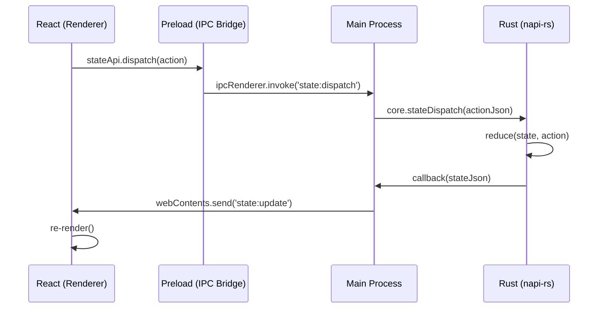

# Rustation v3: System Specification

## 1. Executive Summary

**Rustation v3** is a native desktop application for developer workflows, built with **Electron + React + napi-rs**. This architecture enables rich UI with native Rust performance for business logic.

### Core Value Proposition
- **Hybrid Power**: Performance of Rust (napi-rs) + Flexibility of Web UI (React).
- **Multi-Project**: Open and manage multiple projects in tabs.
- **Workflow Centric**: Optimized for task running and container management.
- **Local First**: Full offline capability, local Docker/Git management.

---

## 2. Technology Stack

### 2.1 Backend (Native Module)
- **Runtime**: [Electron](https://www.electronjs.org/) (Node.js)
- **Native Binding**: [napi-rs](https://napi.rs/) (Rust → Node.js)
- **Language**: Rust (Edition 2021)
- **Docker**: `bollard` (Rust Docker client) or CLI wrapper.
- **State**: `tokio::sync::RwLock<AppState>` (In-memory, serialized).

### 2.2 Frontend (Renderer)
- **Framework**: [React 19](https://react.dev/)
- **Build Tool**: [Vite](https://vitejs.dev/) via [electron-vite](https://electron-vite.org/)
- **Language**: TypeScript
- **Styling**: [Tailwind CSS](https://tailwindcss.com/)
- **Components**: [shadcn/ui](https://ui.shadcn.com/) (Radix UI based)
- **State Management**: State-first (Rust owns state, React subscribes)
- **Icons**: `lucide-react`.

---

## 3. Architecture Patterns

### 3.1 The "State-First" Model

The frontend is a **visual projection** of the backend state.
- **Source of Truth**: Rust `AppState` (owned by napi-rs module).
- **Sync**: Backend pushes state updates to Frontend via IPC events.
- **Action**: Frontend dispatches actions via IPC to mutate Backend state.



### 3.2 Directory Structure

```
rustation/
├── packages/
│   └── core/                # Rust napi-rs module
│       ├── src/
│       │   ├── app_state.rs # AppState definition
│       │   ├── actions.rs   # Action enum
│       │   ├── reducer.rs   # State reducer
│       │   ├── docker/      # Docker management
│       │   ├── justfile.rs  # Justfile parser
│       │   └── lib.rs       # napi exports
│       └── Cargo.toml
│
├── apps/
│   └── desktop/             # Electron app
│       ├── src/
│       │   ├── main/        # Electron main process
│       │   ├── preload/     # IPC bridge
│       │   └── renderer/    # React frontend
│       │       ├── src/
│       │       │   ├── components/  # shadcn/ui
│       │       │   ├── features/    # Feature modules
│       │       │   ├── hooks/       # useAppState, etc.
│       │       │   └── types/       # TypeScript types
│       └── electron.vite.config.ts
│
├── kb/                      # Knowledge Base (Architecture docs)
└── package.json             # Monorepo root
```

---

## 4. Feature Specifications

### 4.1 Layout & Navigation

```
┌─────────────────────────────────────────────────────────────────┐
│  [*proj-1] [proj-2] [proj-3] [+]            ← Project Tabs     │
├──────────┬──────────────────────────────────────────────────────┤
│ [Task]   │  cmd1  │  填空 arg                [exe]             │
│ [Docker] │  cmd2  │─────────────────────────────────────────── │
│[Settings]│  ...   │  log output                                │
│          │        │                                            │
└──────────┴────────┴────────────────────────────────────────────┘
   Sidebar   Commands        Right Panel (Args + Log)
```

*   **Window**: 1200x800 default, min 800x600.
*   **Theme**: System preference default, toggleable Dark/Light.
*   **Project Tabs** (Top): Multiple projects open simultaneously.
*   **Feature Tabs** (Sidebar):
    1.  **Task** - Justfile commands
    2.  **Docker** - Container management
    3.  **Settings** - Configuration

### 4.2 Task Tab
Justfile command runner with argument support.
- **Left Panel**: List of commands from `justfile`
- **Right Panel (Top)**: Argument input form + Execute button
- **Right Panel (Bottom)**: Command output log

### 4.3 Docker Tab
Container management dashboard.
- **Left Panel**: Service cards (PostgreSQL, Redis, etc.)
- **Right Panel**: Logs for selected service
- **Controls**: Start/Stop/Restart buttons per card.

### 4.4 Settings Tab
Configuration management.
- **Form**: Theme, Default paths.
- **Validation**: Immediate feedback.

---

## 5. Implementation Details

### 5.1 Communication Protocol

**IPC Channels (Renderer -> Main -> Rust)**:
- `state:dispatch` - Dispatch an action to mutate state
- `state:get` - Get current state snapshot

**IPC Events (Rust -> Main -> Renderer)**:
- `state:update` - Full state JSON pushed on every change

**napi-rs Exports**:
- `stateInit(callback)` - Initialize state with update listener
- `stateDispatch(actionJson)` - Apply action to state
- `stateGet()` - Get current state as JSON

### 5.2 Security (Electron)
- **Context Isolation**: Enabled (preload script bridges IPC)
- **Node Integration**: Disabled in renderer
- **Sandbox**: Enabled for renderer process

---

## 6. Implementation Roadmap

### Phase 1: State-First Foundation (Complete)
- [x] Set up Electron + React + napi-rs
- [x] Implement `AppState`, `Action`, `Reducer` in Rust
- [x] IPC bridge (main/preload/renderer)
- [x] React hooks (`useAppState`, `useDockersState`)

### Phase 2: Multi-Project Support (Current)
- [ ] Update `AppState` with `projects: Vec<ProjectState>`
- [ ] Project management actions (Open, Close, Switch)
- [ ] Project tabs UI at top
- [ ] Per-project justfile resolution

### Phase 3: Enhanced Tasks
- [ ] Parse justfile arguments `{{arg}}`
- [ ] Argument input form
- [ ] Task execution history

### Phase 4: Session Persistence
- [ ] Save/restore open projects
- [ ] Recent projects menu

---

## 7. Testing Strategy

1.  **Backend (Rust)**:
    - Unit tests for `domain/` (Business Logic).
    - Integration tests for State Reducers.
2.  **Frontend (React)**:
    - Component tests (Vitest + React Testing Library).
    - Logic tests (hooks).
3.  **E2E**:
    - Playwright (if possible) or manual verification of IPC.

---

## 8. Development Workflow

**Commands**:
- `pnpm dev` - Start Electron dev server (from `apps/desktop`)
- `pnpm build` - Build for production
- `cargo test` - Run Rust tests (from `packages/core`)

**Hot Reload**:
- React: Vite HMR (instant)
- Rust: Requires `pnpm build` in `packages/core`, then restart Electron

**Logging**:
- Frontend: Browser DevTools (`Cmd+Shift+I`)
- Backend: Terminal stdout (Electron main process)
