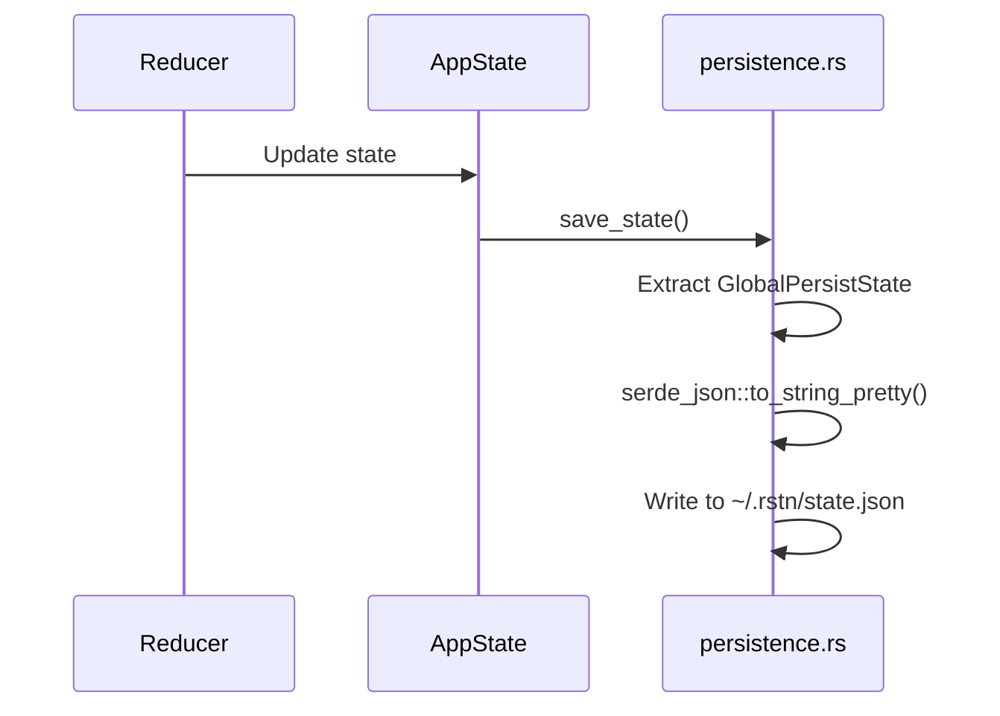
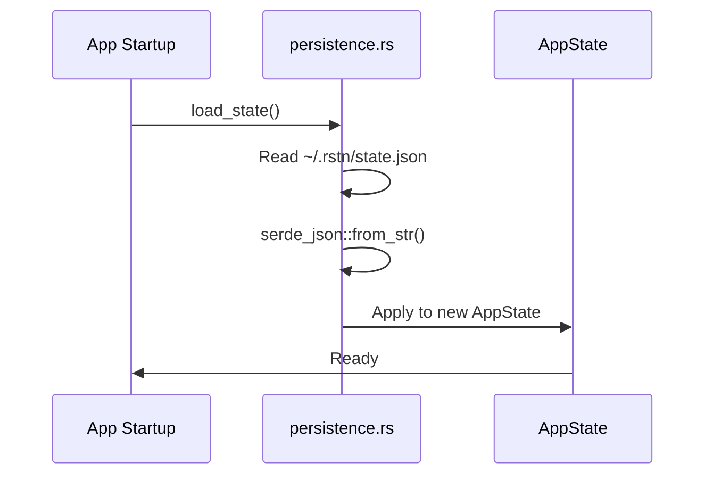

# State Persistence

## Overview

rustation persists state to disk automatically:
- **Location**: `~/.rstn/state.json`
- **Format**: JSON (human-readable, debuggable)
- **Trigger**: On every state change

---

## What Gets Persisted

### Persisted (GlobalPersistState)

```rust
pub struct GlobalPersistState {
    pub recent_projects: Vec<RecentProject>,
    pub global_settings: GlobalSettings,
}
```

| Field | Description |
|-------|-------------|
| `recent_projects` | Last opened projects (path, name, timestamp) |
| `global_settings.theme` | Light/Dark/System |
| `global_settings.default_project_path` | Default folder for new projects |

### NOT Persisted

| Field | Reason |
|-------|--------|
| `projects` | Re-opened from recent_projects on startup |
| `docker.services` | Re-fetched from Docker daemon |
| `tasks.output` | Ephemeral task output |

---

## File Structure

```
~/.rstn/
├── state.json      # Persisted state
└── logs/           # Application logs
```

### state.json Example

```json
{
  "recent_projects": [
    {
      "path": "/Users/chris/projects/rustation",
      "name": "rustation",
      "last_opened": "2025-12-26T10:30:00Z"
    }
  ],
  "global_settings": {
    "theme": "system",
    "default_project_path": null
  }
}
```

---

## Implementation

### Save Flow



### Load Flow (Startup)



---

## Recent Projects

### Maximum Items
- **Limit**: 10 most recent projects
- **Order**: Most recent first
- **Deduplication**: By path (case-sensitive)

### Update Trigger
- When opening a project (`OpenProject` action)
- Entry moved to top if already exists

---

## Error Handling

| Scenario | Behavior |
|----------|----------|
| File doesn't exist | Use default state |
| JSON parse error | Log warning, use default state |
| Permission denied | Log error, continue without persistence |

---

## References

- [State-First Principle](01-state-first.md)
- [State Topology](02-state-topology.md)
