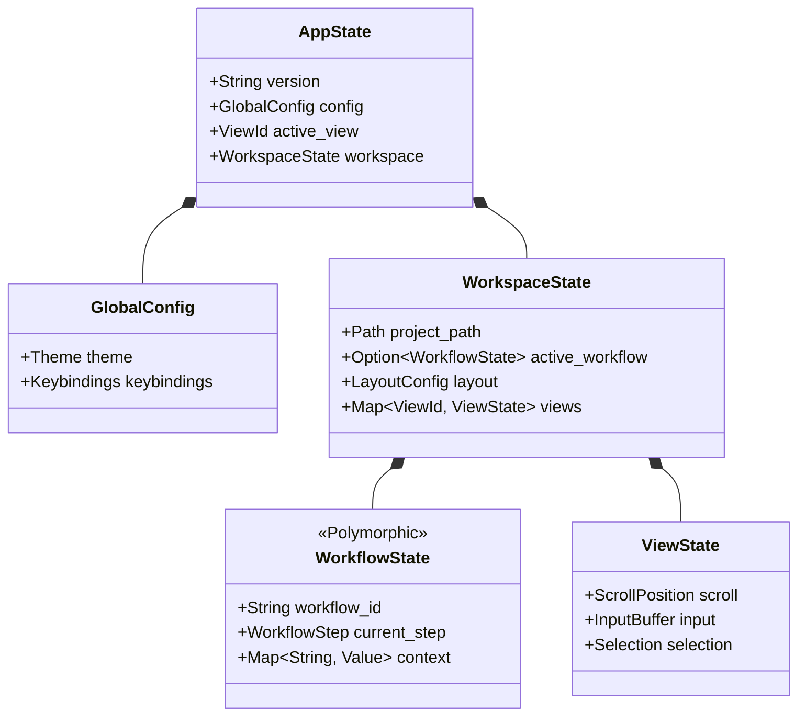

# State Topology

This document defines the structure and hierarchy of the `AppState` tree. It answers "Where should this variable live?" and "How is it persisted?".

## Core Principles

1.  **Single Tree**: There is only one root `AppState`.
2.  **Explicit Ownership**: Every piece of data has a clear owner.
3.  **Separation of Concerns**: State is divided by **Lifecycle** (Persistent vs Transient) and **Scope** (Global vs View).

---

## State Tree Structure

The state tree is organized into four distinct layers.

### Hierarchy Diagram

---

## State Categories

### 1. Persistent State (The "Document")
Data that **MUST** survive a restart. It represents the user's valuable work.
*   **Examples**: Workflow history, Project configuration, User preferences.
*   **Storage**: `~/.rstn/session.yaml` or `project.rstn`
*   **Requirement**: Must be fully serializable.

### 2. Transient State (The "UI Context")
Data that is convenient to restore but not critical. It represents the user's immediate context.
*   **Examples**: Scroll position, Input cursor, Active tab.
*   **Handling**: Can be discarded on version mismatch or error.

### 3. Derived State (The "Cache")
Data computed from other state for performance or rendering ease. **NEVER serialized.**
*   **Examples**: Filtered list items, Layout Rects, Syntax highlighted spans.
*   **Handling**: Recomputed on startup or on demand.

### 4. Runtime State (The "System")
Handles to system resources. **NEVER serialized.**
*   **Examples**: Channel senders, Thread handles, DB connections.
*   **Handling**: Re-initialized on startup.

---

## Detailed Topology

### Root Level (`AppState`)
The entry point. Holds metadata and the highest-level containers.

### Workspace Level (`WorkspaceState`)
This is where the "Workflow-Driven UI" lives. It isolates state per-project.
- **Identity**: Which project is open?
- **Active Workflow**: What is the user doing right now?
- **Layout**: How is the screen arranged?

### Workflow Level (`WorkflowState`)
A polymorphic container for the specific task at hand.
- **PromptClaude**: Holds chat history, streaming buffer.
- **GitCommit**: Holds staged files, commit message buffer.

---

## Data Flow Rules

1.  **Top-Down Props**: Parent state passes data down to children during render.
2.  **Bottom-Up Events**: Children emit `AppMsg` to request changes.
3.  **No Siblings**: Sibling components never talk directly. They communicate via the parent (Reducer).

---

## Migration Strategy

When the State Schema changes (e.g., v1 -> v2), we use **Defensive Deserialization**:

1.  **Attempt Load**: Try loading exact schema.
2.  **Fallback**: If fail, try loading "Previous Version" schema and convert.
3.  **Partial Recovery**: If fail, discard Transient State and try recovering Persistent State only.
4.  **Nuclear Option**: If all fails, backup corrupted file and start fresh.