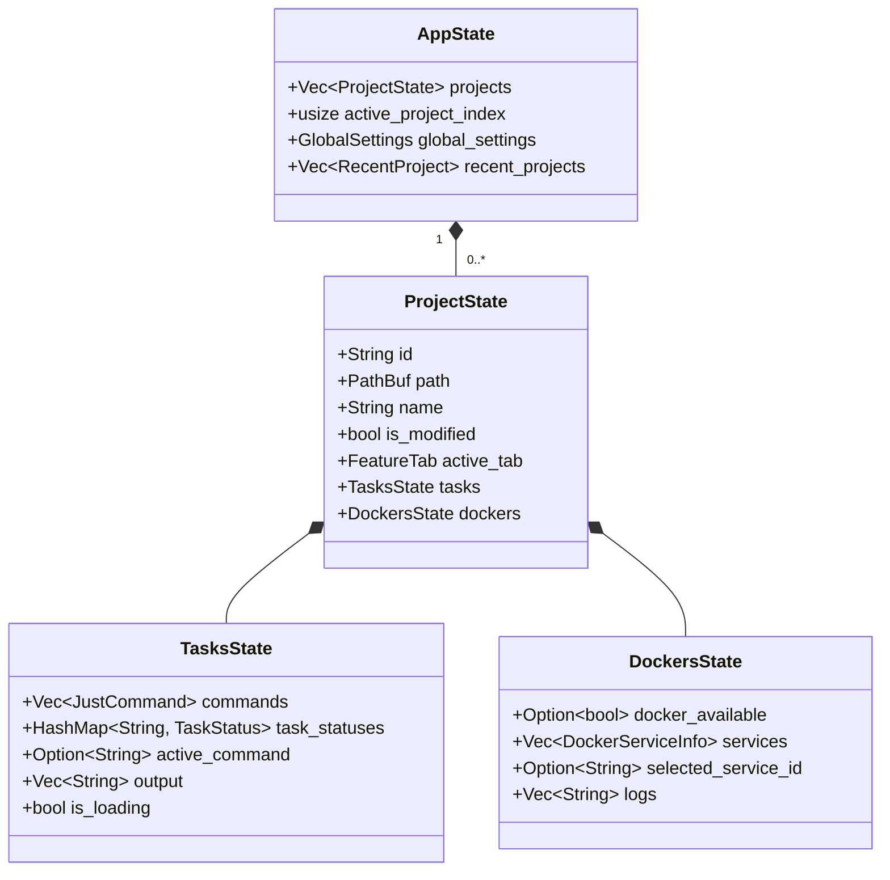
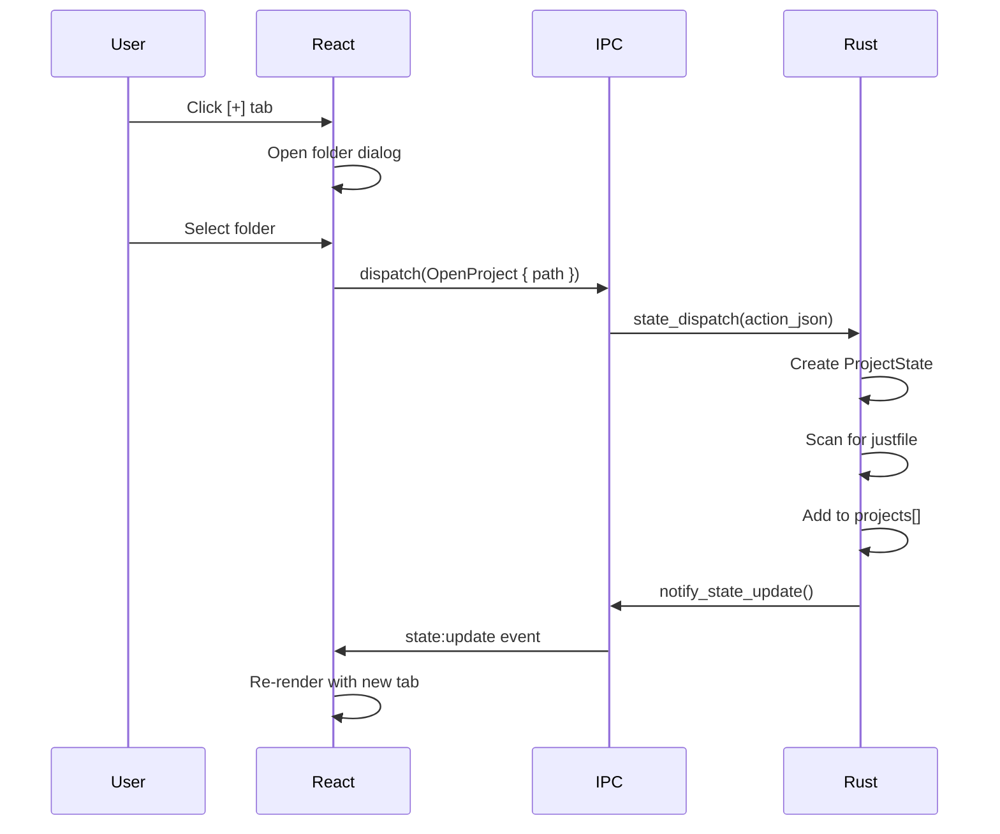
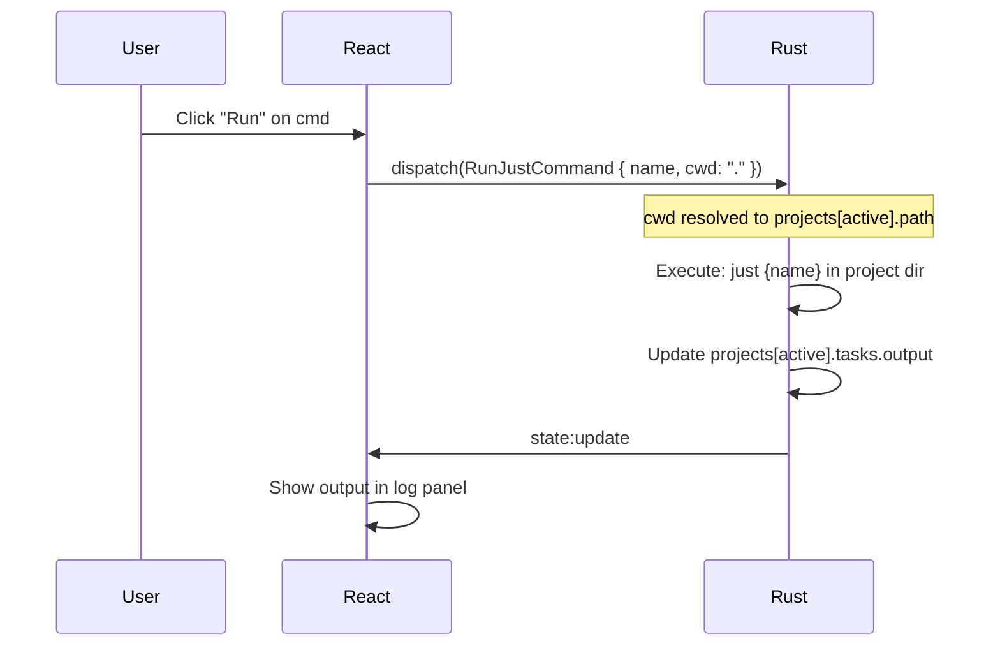

# Multi-Project Architecture

This document defines how rstn supports multiple projects simultaneously.

## 1. Overview

rstn supports opening multiple projects in tabs, similar to browser tabs or VS Code workspaces.

### UI Layout

```
┌─────────────────────────────────────────────────────────────────┐
│  [*proj-1] [proj-2] [proj-3] [+]            ← Project Tabs     │
├──────────┬──────────────────────────────────────────────────────┤
│ [Task]   │  cmd1  │  填空 arg                [exe]             │
│ [Docker] │  cmd2  │─────────────────────────────────────────── │
│[Settings]│  ...   │  log output                                │
│          │        │                                            │
└──────────┴────────┴────────────────────────────────────────────┘
   Sidebar   Commands        Right Panel (Args + Log)
```

### Key Concepts

| Concept | Description |
|---------|-------------|
| **Project** | A folder with project files (justfile, docker-compose, etc.) |
| **Project Tab** | Top-level tab representing an open project |
| **Feature Tab** | Sidebar tab within a project (Task, Docker, Settings) |
| **Active Project** | Currently focused project (receives keyboard input) |

---

## 2. State Structure

### AppState (Root)

```
AppState
├── projects: Vec<ProjectState>     # All open projects
├── active_project_index: usize     # Which project is focused
├── global_settings: GlobalSettings # App-wide settings
└── recent_projects: Vec<RecentProject>  # For "Open Recent"
```

### ProjectState (Per-Project)

```
ProjectState
├── id: String                      # Unique identifier
├── path: PathBuf                   # "/Users/chris/my-project"
├── name: String                    # "my-project" (folder name)
├── is_modified: bool               # Show "*" indicator
├── active_tab: FeatureTab          # Task | Docker | Settings
├── tasks: TasksState               # Justfile commands & output
└── dockers: DockersState           # Docker services for this project
```

### Hierarchy Diagram



---

## 3. Actions

### Project Management Actions

| Action | Payload | Description |
|--------|---------|-------------|
| `OpenProject` | `{ path: String }` | Open a folder as project |
| `CloseProject` | `{ index: usize }` | Close a project tab |
| `SwitchProject` | `{ index: usize }` | Focus a different project |
| `ScanProject` | `{ index: usize }` | Re-scan justfile, docker-compose |

### Per-Project Actions

All existing actions (e.g., `RefreshDockerServices`, `RunJustCommand`) now operate on the **active project**.

```
dispatch({ type: 'RunJustCommand', payload: { name: 'test', cwd: '.' } })
// Runs in: projects[active_project_index].path
```

---

## 4. UI Behavior

### Project Tabs

- **Click tab**: Switch to that project
- **Click [+]**: Open folder dialog to add project
- **Middle-click / Click X**: Close project tab
- **Asterisk (*)**: Indicates unsaved changes or running tasks

### Opening Projects

1. **Menu**: File > Open Folder
2. **Drag & Drop**: Drag folder onto window
3. **Recent**: File > Open Recent

### Project Detection

When opening a folder, rstn scans for:

| File | Creates |
|------|---------|
| `justfile` or `Justfile` | TasksState with parsed commands |
| `docker-compose.yml` | (Future) Project-specific Docker config |

---

## 5. Data Flow

### Opening a Project



### Running a Task



---

## 6. Persistence

### Session State

On app close, save to `~/.rstn/session.json`:

```json
{
  "open_projects": [
    "/Users/chris/project-a",
    "/Users/chris/project-b"
  ],
  "active_project_index": 0,
  "recent_projects": [
    { "path": "/Users/chris/old-project", "last_opened": "2025-12-20" }
  ]
}
```

### On Startup

1. Load `session.json`
2. Re-open previously open projects
3. Restore active project index

---

## 7. Implementation Phases

### Phase 1: Core Multi-Project (Current)

- [ ] Update `AppState` with `projects: Vec<ProjectState>`
- [ ] Add project management actions
- [ ] UI: Project tabs at top
- [ ] Justfile path resolved per-project

### Phase 2: Enhanced Tasks

- [ ] Parse justfile arguments `{{arg}}`
- [ ] Argument form before execution
- [ ] Task history per project

### Phase 3: Project-Specific Docker (Future)

- [ ] Detect `docker-compose.yml` in project
- [ ] Show project's containers vs global containers

### Phase 4: Session Persistence (Future)

- [ ] Save/restore open projects
- [ ] Recent projects menu
