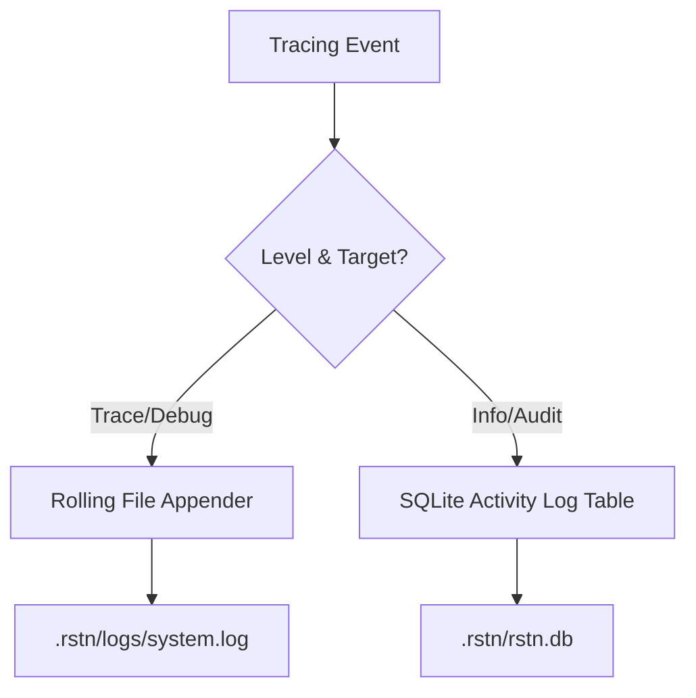

# SQLite Database Design

## 1. Overview

Rustation uses **SQLite** as the primary engine for structured, high-value data that requires complex querying or concurrency. This complements the existing JSON persistence for simple global settings.

### Design Principles
- **Local-First**: Each project has its own database file located in `.rstn/rstn.db`.
- **Async I/O**: Database operations are handled in a dedicated thread pool or via non-blocking channels to prevent UI freezing.
- **Hybrid Logging**: 
    - **System Logs**: Plain text/JSONL files (high volume, low value).
    - **Activity/Audit Logs**: SQLite (low volume, high value for UI).

---

## 2. Schema Specification

### 2.1 File Comments
Used by the File Explorer to store user/AI notes on specific files.

| Column | Type | Description |
|--------|------|-------------|
| `id` | UUID | Primary Key |
| `file_path` | TEXT | Relative path from worktree root |
| `content` | TEXT | Comment markdown content |
| `author` | TEXT | "User" or "AI" |
| `created_at` | DATETIME | ISO 8601 |
| `updated_at` | DATETIME | ISO 8601 |

**Index**: `idx_file_comments_path` ON `file_path`.

### 2.2 Activity Logs
Used to display "Action History" in the UI.

| Column | Type | Description |
|--------|------|-------------|
| `id` | INTEGER | Auto-increment PK |
| `category` | TEXT | e.g., "docker", "git", "task" |
| `level` | TEXT | "INFO", "WARN", "ERROR" |
| `summary` | TEXT | Short description |
| `detail_json` | TEXT | Structured metadata |
| `timestamp` | DATETIME | ISO 8601 |

---

## 3. Implementation Details (Rust)

### Library: `rusqlite`
We use `rusqlite` with the `bundled` feature for zero-dependency deployment.

### Connection Management
- **WAL Mode**: Enabled via `PRAGMA journal_mode=WAL;` to allow concurrent reads and writes.
- **Project Scope**: When a project is opened, the backend initializes/migrates the database in `.rstn/rstn.db`.

### Migration Strategy
Simple embedded SQL scripts executed on startup to ensure table consistency.

---

## 4. Hybrid Logging Strategy

## 5. References
- [State-First Principle](01-state-first.md)
- [File Explorer Feature](../features/file-explorer.md)
