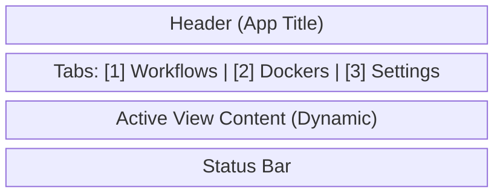

# Tab Management

## 1. Overview

Tabs provide the highest level of navigation in `rstn`. They represent distinct "modes" of operation that partition the application's state and UI.

### Core Principles
1.  **Global Visibility**: The Tab Bar is always visible at the top of the screen (Row 1, below Header).
2.  **State Partitioning**: Each tab corresponds to a top-level field in `AppState`.
3.  **Persistence**: Tab selection and state are preserved during the session.

---

## 2. Standard Tabs

To align with the **Workflow-Driven** focus and **Docker** management needs, the canonical tab set is:

| Index | ID | Label | Purpose | Keybinding |
| :--- | :--- | :--- | :--- | :--- |
| **1** | `WORKFLOWS` | `[1] Workflows` | Primary dev interface (Prompts, Flows, Code) | `1` |
| **2** | `DOCKERS` | `[2] Dockers` | Container & Service management | `2` |
| **3** | `SETTINGS` | `[3] Settings` | Configuration & Environment | `3` |

> **Note**: This replaces the legacy `Worktree | Dashboard | Settings` structure.
> - "Worktree" is renamed to **Workflows**.
> - "Dashboard" is deprecated (merged into Workflows or removed).
> - "Dockers" is a new primary view.

---

## 3. State Model

### 3.1 View Enum

```python
class ViewType(str, Enum):
    WORKFLOWS = "workflows"
    DOCKERS = "dockers"
    SETTINGS = "settings"
```

### 3.2 AppState Integration

```python
class AppState(BaseModel):
    # Active View
    current_view: ViewType = ViewType.WORKFLOWS
    
    # View States
    workflows: WorkflowState    # Was worktree_state
    dockers: DockerState        # New
    settings: SettingsState     # Existing
```

---

## 4. Interaction Model

### 4.1 Switching Logic

The `TabManager` (conceptual) handles view switching.

*   **Keyboard**:
    *   `Tab`: Cycle Forward (Workflows -> Dockers -> Settings -> Workflows)
    *   `Shift+Tab`: Cycle Backward
    *   `1`, `2`, `3`: Direct Jump (Global hotkeys)
*   **Mouse**:
    *   Click on Tab Label: Jump to View

### 4.2 Focus Management

When switching tabs:
1.  **Persist**: The previous tab's internal state (scroll, selection) is preserved.
2.  **Restore**: The new tab's last known state is restored.
3.  **Focus**: Keyboard focus is reset to the primary widget of the new view.

---

## 5. Layout Integration

The Tab Bar consumes a fixed height at the top.



### Rendering

*   **Active Tab**: Highlighted style (e.g., Bold, Yellow/Blue background).
*   **Inactive Tab**: Dimmed style.
*   **Hotkeys**: Numbers `[1]`, `[2]` displayed to indicate shortcuts.

---

## 6. Migration Strategy

### From v1/Legacy (Worktree/Dashboard)
1.  **Rename**: `WorktreeView` -> `WorkflowView`.
2.  **Add**: `DockerView`.
3.  **Remove**: `DashboardView` (migrate useful widgets to Workflow or Dockers).
4.  **Update**: `ViewType` enum and `render_tab_bar` logic.

### Consistency Check
*   Ensure `kb/architecture/12-docker-management.md` reflects this 3-tab structure (it currently says "only two").
*   Update `kb/architecture/07-layout-management.md` to reflect `Workflows` instead of `Worktree`.
