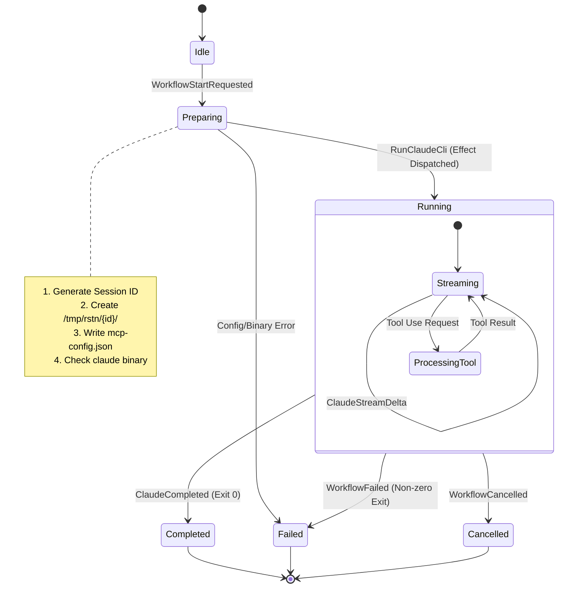

# Design: Prompt to Claude Workflow

## 1. Overview

The "Prompt to Claude" workflow is the foundational capability of `rstn`. It allows a user to:
1.  Input a text prompt in the TUI.
2.  Send that prompt to the **Claude Code CLI** (`claude`).
3.  Receive and render the **streaming response** in real-time.
4.  Maintain **session context** (MCP) for tools and memory.

## 2. Architecture

We utilize the **State-First MVI** pattern.

### 2.1 State Model

We use the generic `WorkflowState[T]` container with a specific data payload.

```python
# rstn/state/workflow.py (Existing generic)
class WorkflowState(BaseModel, Generic[T]):
    id: str
    status: WorkflowStatus
    data: T
    progress: float

# New: rstn/state/workflows/prompt.py
class PromptClaudeData(BaseModel):
    """State specific to the Prompt Claude workflow."""
    prompt: str
    # The accumulated response text
    output: str = ""
    # The active Claude Code session ID (for continuity)
    claude_session_id: str | None = None
    # Token usage / Cost tracking
    cost_usd: float = 0.0
    # Path to the session-specific MCP config
    mcp_config_path: str | None = None
```

### 2.2 Message Protocol (`AppMsg`)

The workflow is driven by specific messages in `rstn/msg/__init__.py`:

| Message | Payload | Direction | Purpose |
| :--- | :--- | :--- | :--- |
| `WorkflowStartRequested` | `type="prompt-claude", params={prompt}` | UI → Reducer | User hits Enter on prompt |
| `ClaudeStreamDelta` | `workflow_id, delta` | Executor → Reducer | Real-time text chunk |
| `ClaudeCompleted` | `workflow_id, output, session_id` | Executor → Reducer | Stream finished |
| `WorkflowFailed` | `workflow_id, error` | Executor → Reducer | Process error / timeout |

### 2.3 Effect: `RunClaudeCli`

This `AppEffect` wraps the execution of the `claude` binary.

**MCP Configuration Strategy:**
To support multiple sessions and avoid conflicts, the MCP configuration is **session-scoped** (per user request):
1.  **Location**: `/tmp/rstn/{session_id}/mcp-config.json` (or OS temp equivalent).
    *   *Alternative*: We can store metadata in `~/.rstn/sessions.db` (SQLite) but the config file itself needs to be on disk for the CLI to read.
2.  **Lifecycle**: Created when the workflow starts; cleaned up when the session ends.
**Command Construction:**
```bash
claude -p "{prompt}" \
  --output-format stream-json \
  --mcp-config /tmp/rstn/{session_id}/mcp-config.json \
  --print \
  --verbose \
  --tools "default" \
  --max-turns 10 \
  --permission-mode ask
```

**Logging Requirement:**
The Executor MUST log **all raw JSONL lines** from `stdout` and `stderr` to the `rstn.log` file (at DEBUG or TRACE level). This is critical for debugging permission flows and protocol errors.

## 3. State Machine

The workflow logic is governed by a strict state machine to manage the lifecycle of the external `claude` process.



## 4. Implementation Plan

### Phase 1: Typing & State (Python)
1.  Define `PromptClaudeData` in `rstn/state/workflows/prompt.py`.
2.  Register it in `AppState`.

### Phase 2: Domain Logic (Runners)
1.  Implement `SessionConfigGenerator` to create the `/tmp` structure and JSON file.
2.  Update `RunClaudeCli` effect to accept `mcp_config_path`.

### Phase 3: Effect Execution
1.  Update handler in `rstn/effect/executor.py` to use the dynamic config path.
2.  Implement JSONL stream parsing.

### Phase 4: Reducer Logic
1.  Update `rstn/reduce/workflow.py` to handle the transitions defined in the State Machine.
```