# Design: Prompt to Claude Workflow (GUI)

## 1. Overview
The "Prompt to Claude" workflow is the core developer interaction loop. In the GUI version, we move from terminal-based scrolling to a rich, threaded chat interface.

**User Experience**:
1.  User enters a prompt in a multi-line auto-expanding text area.
2.  Response streams into a Markdown-rendered message bubble.
3.  Code blocks include "Copy" and "Apply" buttons.
4.  Tool use (MCP) is visualized with status badges (e.g., "🔍 Searching codebase...").

---

## 2. Workflow Diagrams

### 2.1 Sequence Diagram: Send Prompt Flow


### 2.2 State Machine: Streaming State


### 2.3 Tool Use Flow (MCP)

```mermaid
sequenceDiagram
    participant Claude as Claude CLI
    participant Rust as Rust Backend
    participant MCP as MCP Server
    participant React as React (Frontend)

    Claude->>Rust: tool_use event (e.g., read_file)
    Rust-->>React: emit("state:update") with tool status
    React->>React: Show "🔍 Reading file..."

    Rust->>MCP: Forward tool request
    MCP-->>Rust: Tool result
    Rust->>Claude: Send tool result

    Claude->>Rust: Continue with response
    Rust-->>React: emit("stream:delta")
```



---

## 3. Architecture (Backend-Driven)

### 3.1 Backend State (Rust)
The `PromptClaudeState` remains in Rust to ensure session persistence and reliability.

```rust
#[derive(Serialize, Deserialize, Clone, Debug)]
pub struct PromptClaudeState {
    pub session_id: String,
    pub messages: Vec<Message>,
    pub is_streaming: bool,
    pub current_streaming_text: String,
    pub token_usage: TokenUsage,
}

#[derive(Serialize, Deserialize, Clone, Debug)]
pub struct Message {
    pub role: Role, // User, Assistant, System, Tool
    pub content: String,
    pub timestamp: DateTime<Utc>,
    pub tool_calls: Option<Vec<ToolCall>>,
}
```

### 3.2 Frontend State (React)
The frontend consumes the state via a `useSyncExternalStore` or a global `Zustand` store synced via Tauri events.

```typescript
interface MessageBubbleProps {
  message: Message;
}

const ChatView = () => {
  const { messages, isStreaming } = useWorkflowState('prompt-claude');
  // Auto-scroll logic using IntersectionObserver or scrollIntoView
  return (
    <ScrollArea>
      {messages.map(m => <MessageBubble key={m.id} message={m} />)}
      {isStreaming && <StreamingIndicator />}
    </ScrollArea>
  );
};
```

---

## 4. Communication

### 4.1 Command: `send_prompt`
Invoked when the user clicks "Send" or presses `Cmd+Enter`.

```rust
#[tauri::command]
async fn send_prompt(
    window: Window,
    state: State<'_, AppState>,
    prompt: String
) -> Result<(), Error> {
    // 1. Update state: add User message
    // 2. Dispatch Effect: RunClaudeCli
    // 3. Backend emits 'state:update'
}
```

### 4.2 Event: `stream:delta`
For performance, we emit high-frequency text chunks as lightweight events rather than full state updates.

```rust
// Backend (Rust)
window.emit("stream:delta", Payload { delta: chunk })?;

// Frontend (React)
useEffect(() => {
  const unlisten = listen("stream:delta", (event) => {
    setLocalStreamingText(prev => prev + event.payload.delta);
  });
  return () => unlisten.then(f => f());
}, []);
```

---

## 5. UI Components (Feature-Specific)

### 5.1 Message Bubble
- **Markdown**: Rendered via `react-markdown` with `remark-gfm`.
- **Syntax Highlighting**: `react-syntax-highlighter` using `prism` or `shiki`.
- **Copy-to-Clipboard**: Integrated into code block headers.

### 5.2 Prompt Input
- **Type**: `TextareaAutosize`.
- **Hotkeys**:
    - `Enter`: New line.
    - `Cmd/Ctrl + Enter`: Submit.
    - `Up Arrow`: Edit last message (if input is empty).

---

## 6. Session & MCP
- **Persistent Storage**: Sessions are stored in SQLite (`~/.rstn/history.db`).
- **MCP Config**: Managed by the Backend, same as v2, but the path is handled internally by the Tauri Backend service.

---

## 7. Implementation Plan (GUI)

1.  **Backend**: Port the `claude` CLI execution logic (JSONL parsing).
2.  **Frontend**: Create the `ChatContainer` and `MessageBubble` components using `shadcn/ui`.
3.  **Bridge**: Implement the `stream:delta` event listener in React.
4.  **Polish**: Add smooth scrolling and transition animations (Framer Motion).
