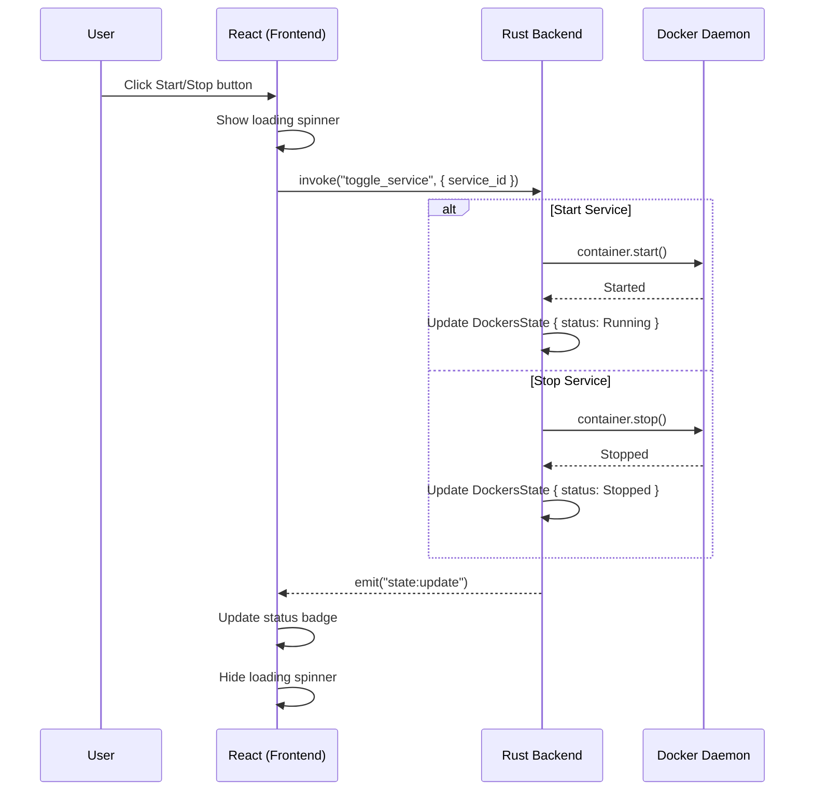
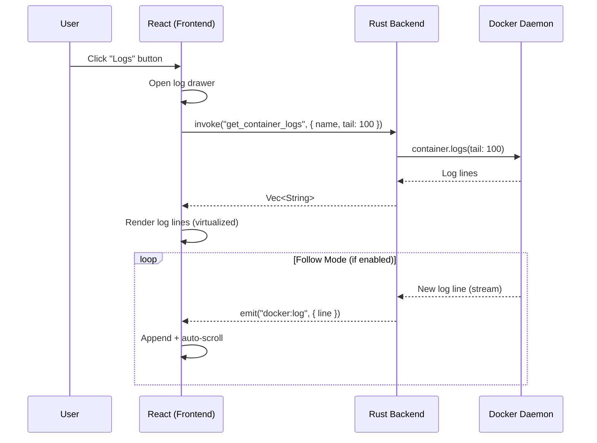
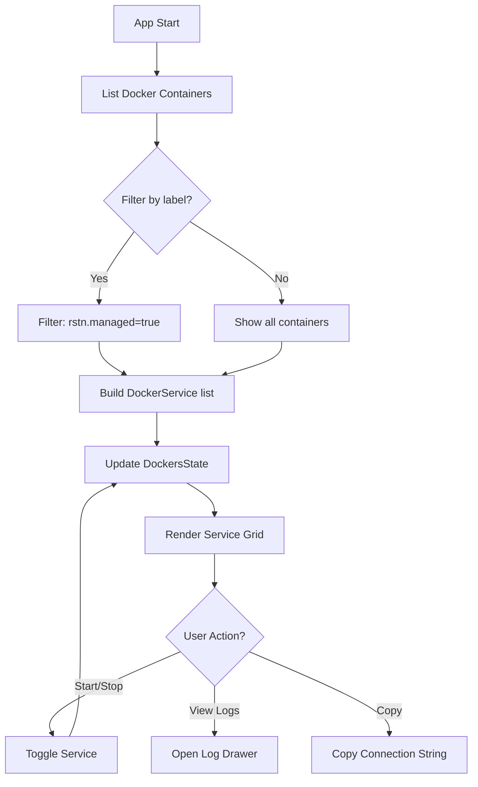

# Docker Container Management (GUI)

## 1. Overview
The Dockers tab in the GUI provides a visual dashboard for managing development infrastructure. It moves from a text-based list to a **Service Grid** with real-time feedback.

---

## 2. Visual Specification (GUI)

### 2.1 Service Grid
- **Card View**: Each service (Postgres, Redis, etc.) is represented by a Card.
- **Header**: Service Name + Icon + Status Badge (Green/Red/Yellow).
- **Body**: Current port, connection string (truncated), volume path.
- **Actions**: Floating or bottom-aligned buttons (Start, Stop, Config, Logs).

### 2.2 Log Console (Slide-over)
- Clicking "Logs" opens a side panel or a bottom sheet.
- Uses a virtualized list for performance with 10k+ log lines.
- Feature: "Tail" mode (auto-scroll) with a toggle.

### 2.3 Connection Helper
- One-click "Copy Connection String".
- Tooltip showing the full URI.

---

## 3. Workflow Diagrams

### 3.1 Container Lifecycle FSM

```mermaid
stateDiagram-v2
    [*] --> Unknown: App starts

    Unknown --> Stopped: Container exists (not running)
    Unknown --> Running: Container exists (running)
    Unknown --> NotFound: Container doesn't exist

    NotFound --> Creating: CreateService
    Creating --> Stopped: Created successfully
    Creating --> Error: Creation failed

    Stopped --> Starting: StartService
    Starting --> Running: Started successfully
    Starting --> Error: Start failed

    Running --> Stopping: StopService
    Stopping --> Stopped: Stopped successfully
    Stopping --> Error: Stop failed

    Running --> Restarting: RestartService
    Restarting --> Running: Restarted successfully
    Restarting --> Error: Restart failed

    Stopped --> Removing: RemoveService
    Removing --> NotFound: Removed successfully

    Error --> Stopped: Retry / Clear

    note right of Running: Status badge: 🟢
    note right of Stopped: Status badge: 🔴
    note right of Starting: Status badge: 🟡
    note right of Error: Show error toast
```

### 3.2 Toggle Service Sequence



### 3.3 Log Streaming Sequence



### 3.4 Service Discovery Flow



---

## 4. Backend Integration (Rust)

### 4.1 Docker Client
Uses the `bollard` library for native async communication with the Docker socket (Unix) or Named Pipe (Windows).

### 4.2 Command Interface
```rust
#[tauri::command]
async fn toggle_service(service: DockerServiceType, state: State<'_, AppState>) -> Result<ServiceStatus, Error>;

#[tauri::command]
async fn get_container_logs(name: String, tail: usize) -> Result<Vec<String>, Error>;
```

### 4.3 Event Streaming
Status changes are emitted globally.
```rust
// Emitted whenever a container changes state (e.g., via external CLI)
window.emit("docker:status-change", Payload { name: "rstn-postgres", status: "running" });
```

---

## 5. State Model (Sync)

### 5.1 Data Structure
```typescript
interface DockerService {
  id: string;
  name: string;
  image: string;
  status: 'running' | 'stopped' | 'starting' | 'error';
  port: number;
  connectionString: string;
}
```

---

## 6. UI Components (React)

### 6.1 `DockerServiceCard`
- **Visuals**: Uses `shadcn/ui` Card component.
- **Interactions**:
    - Hover: Show advanced actions (Add User, Add DB).
    - Click: Open log view.

### 6.2 `DockerLogViewer`
- **Engine**: Virtualized list.
- **Controls**: Search/Filter logs, Clear, Follow toggle.

---

## 7. Implementation Reference (GUI)

- **Frontend**: `src/features/docker/`
    - `DockerDashboard.tsx` (Main container)
    - `components/ServiceCard.tsx`
    - `components/LogDrawer.tsx`
- **Backend**: `src-tauri/src/docker/`
    - `manager.rs` (Bollard wrapper)
    - `commands.rs` (Tauri Command handlers)