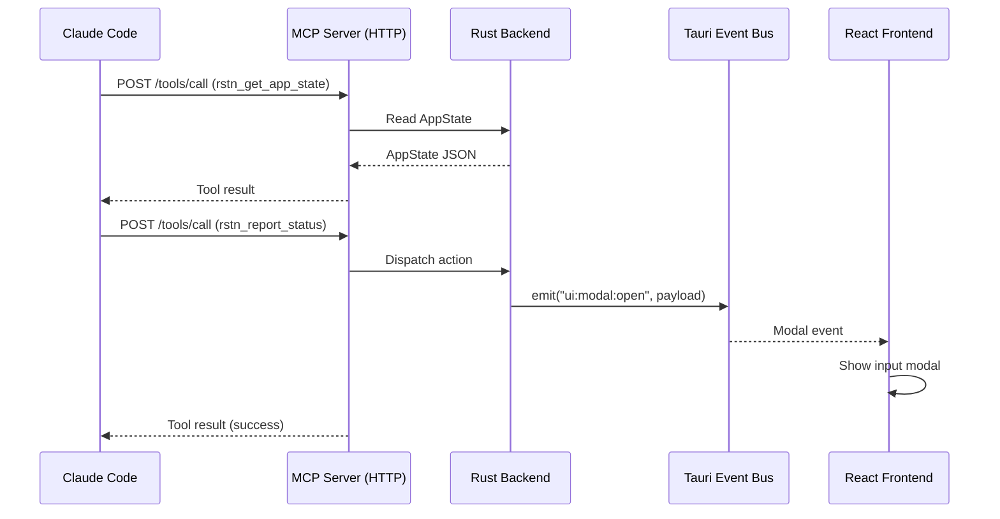
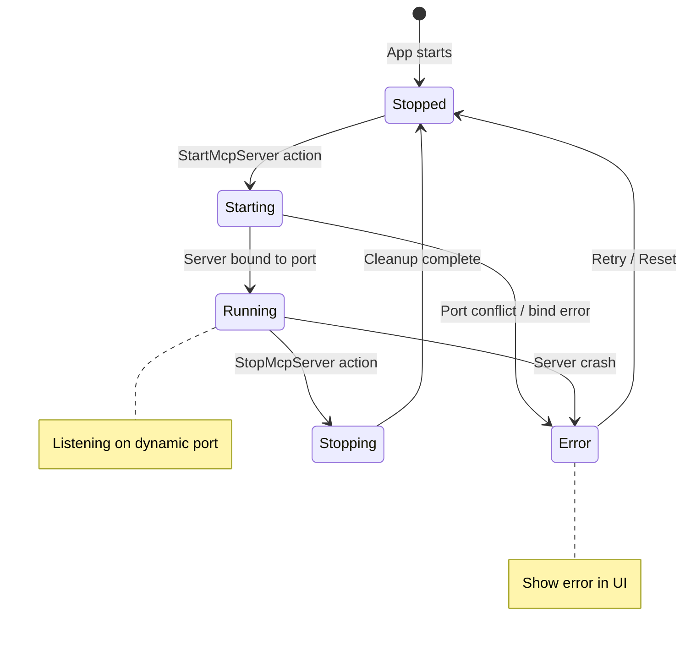
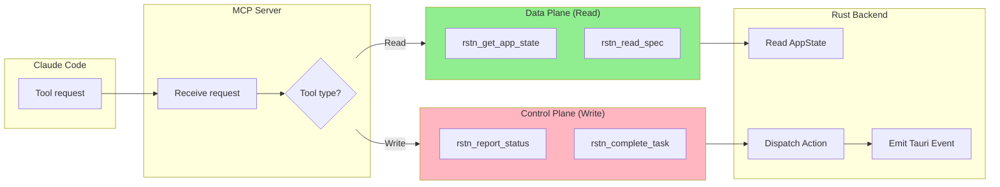

# MCP Server Architecture (GUI)

## 1. Overview
In the GUI version, the MCP (Model Context Protocol) server remains a critical bridge between Claude Code and the application. It is embedded within the **Tauri Backend (Rust/Python)** process.

### Key Changes for GUI:
1.  **Backend Integration**: The server is started and managed by the Tauri Rust backend.
2.  **State Access**: Instead of accessing TUI-specific view state, it accesses the unified `AppState` in Rust.
3.  **Unified Control**: Tools like `rstn_report_status` trigger Tauri Events that the React frontend listens to (e.g., showing an input modal).

---

## 2. Architecture

```
┌─────────────────────────────────────────────────────────┐
│                 Tauri Backend (Rust/Python)              │
├─────────────────────────────────────────────────────────┤
│  ┌──────────────┐    ┌──────────────────┐              │
│  │ Claude Code  │───▶│  MCP HTTP Server │              │
│  │   (client)   │    │   (FastAPI)      │              │
│  └──────────────┘    └────────┬─────────┘              │
│                               │                         │
│              ┌────────────────┴────────────────┐       │
│              ▼                                 ▼       │
│     ┌─────────────────┐            ┌──────────────┐   │
│     │ Read-only Tools │            │ Action Tools │   │
│     │ (AppState)      │            │ (Commands)   │   │
│     └─────────────────┘            └──────┬───────┘   │
│                                           ▼           │
│                              ┌─────────────────────┐  │
│                              │ Tauri Event Emit    │  │
│                              │   → React UI        │  │
│                              └─────────────────────┘  │
└─────────────────────────────────────────────────────────┘
```

---

## 3. Tool Categories (GUI)

### Data Plane (Read-Only)
- `rstn_get_app_state`: Returns the `AppState` currently synced between Rust and React.
- `rstn_read_spec`: Unchanged (reads from file system).

### Control Plane (Actions)
- `rstn_report_status`:
    - **TUI**: Opened a dialog in terminal.
    - **GUI**: Emits a `ui:modal:open` event with the prompt. React shows a beautiful Shadcn modal.
- `rstn_complete_task`:
    - **TUI**: Updated terminal text.
    - **GUI**: Updates `AppState`. React re-renders with a progress bar animation.

---

## 4. Message Flow Diagrams

### 4.1 MCP Tool Invocation Sequence



### 4.2 MCP Server Lifecycle FSM



### 4.3 Tool Categories Flow



### Summary Flow
1.  **Claude Code** calls an MCP tool (e.g., `rstn_report_status`).
2.  **MCP Server** (FastAPI) receives the call.
3.  **MCP Server** dispatches a message to the Rust core or directly emits a Tauri event.
4.  **Tauri Event Bus** broadcasts the change.
5.  **React Frontend** receives the event and updates the view (e.g., "User Input Required").

---

## 5. Implementation Reference (GUI)

- **Backend Logic**: `src-tauri/src/mcp/` (Python/FastAPI remains, managed by Rust `Command`).
- **Communication**: Tauri `Window::emit` for broadcasting tool side-effects to the frontend.
- **Config**: Same dynamic `mcp-session.json` approach.