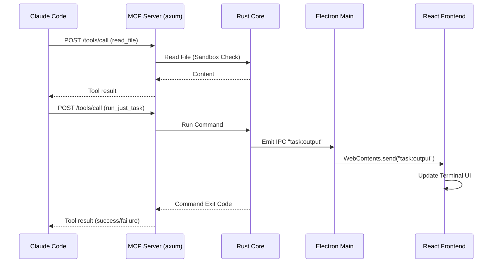
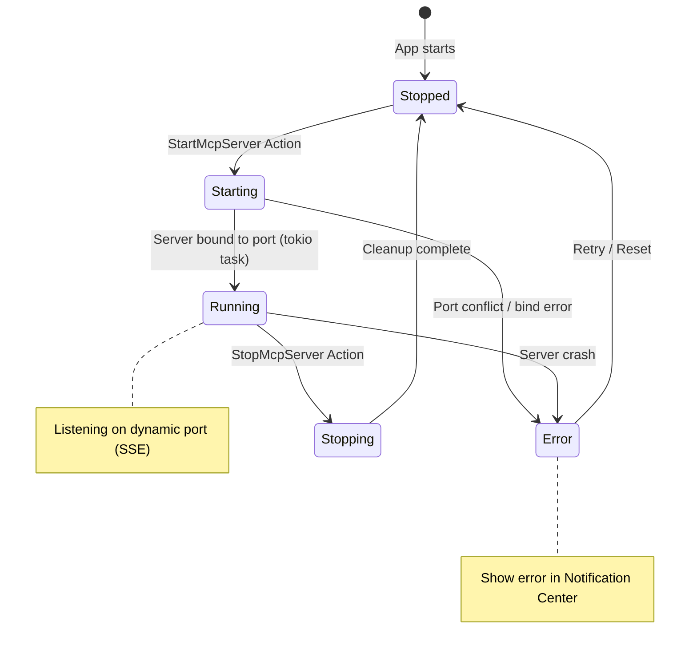

# MCP Server Architecture (Electron)

## 1. Overview
The MCP (Model Context Protocol) server is a critical bridge between Claude Code (or other AI clients) and the application. It is embedded within the **Rust Backend (napi-rs)** process.

### Architecture Shift (v3)
- **Backend Integration**: The server is started and managed by the Rust napi-rs module.
- **State Access**: Accesses the unified `AppState` in Rust (`Arc<RwLock<AppState>>`).
- **Unified Control**: Tools like `run_just_task` trigger actions within the Rust core, and results are broadcast to the Electron Frontend via IPC.

---

## 2. Architecture

```
┌─────────────────────────────────────────────────────────┐
│                 Electron Main Process                    │
│   ┌─────────────────────────────────────────────────┐   │
│   │             napi-rs Module (Rust)               │   │
│   │  ┌──────────────┐    ┌──────────────────┐       │   │
│   │  │ Claude Code  │───▶│  MCP HTTP Server │       │   │
│   │  │   (client)   │    │      (axum)      │       │   │
│   │  └──────────────┘    └────────┬─────────┘       │   │
│   │                               │                 │   │
│   │              ┌────────────────┴────────────────┐│   │
│   │              ▼                                 ▼│   │
│   │     ┌─────────────────┐            ┌──────────────┐ │
│   │     │ Read-only Tools │            │ Action Tools │ │
│   │     │ (AppState)      │            │ (Commands)   │ │
│   │     └─────────────────┘            └──────┬───────┘ │
│   │                                           ▼         │
│   │                              ┌─────────────────────┐│   │
│   │                              │ IPC Event Emit      ││   │
│   │                              │   → React UI        ││   │
│   │                              └─────────────────────┘│   │
│   └─────────────────────────────────────────────────┘   │
└─────────────────────────────────────────────────────────┘
```

---

## 3. Tool Categories

### Data Plane (Read-Only)
- `read_file`: Reads file content from the active worktree (sandboxed).
- `list_directory`: Lists files/folders respecting `.gitignore`.
- `get_project_context`: Returns high-level summary (open tabs, active tasks, docker status).

### Control Plane (Actions)
- `run_just_task`: Executes a Just task and returns output.
- `report_status`: Emits a status update event to the frontend.

---

## 4. Message Flow Diagrams

### 4.1 MCP Tool Invocation Sequence



### 4.2 MCP Server Lifecycle FSM



---

## 5. Implementation Reference

- **Library**: `axum` (for HTTP/SSE) or `mcp-sdk-rs`.
- **Location**: `packages/core/src/mcp/`
- **Async Runtime**: `tokio` (shared with napi-rs async runtime).
- **Communication**:
    - **Frontend**: Via `notify_state_update` (existing) and dedicated events.
    - **Claude**: Via SSE (Server-Sent Events) transport.
