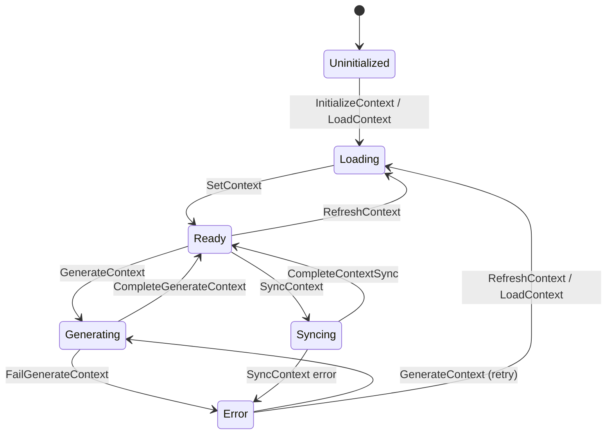

# CESDD Architecture: Three-Layer Context System

**Status**: Implementation Complete (Phase 1-5)
**Last Updated**: 2025-12-30
**Related**: `10-constitution-system.md`, `11-workflow-system.md`
**Capability**: rstn can now self-iterate - full CESDD workflow from intent to implementation

---

## 1. Overview

CESDD (Context-Enhanced Spec-Driven Development) organizes project context into three concentric layers with different lifecycles and control mechanisms.

### Core Principle: rstn Controls, LLM Executes

```
                    ┌─────────────────────────────────────┐
                    │           rstn (State Machine)       │
                    │                                      │
                    │   ┌─────────────────────────────┐   │
                    │   │      Workflow Engine        │   │
                    │   │   (Rust State Machine)      │   │
                    │   └──────────┬──────────────────┘   │
                    │              │                       │
                    │   ┌──────────▼──────────────────┐   │
                    │   │      Node Dispatcher        │   │
                    │   │   - SystemCheckNode         │   │
                    │   │   - FileWriteNode           │   │
                    │   │   - UserInputNode           │   │
                    │   │   - ClaudeCodeNode  ────────┼───┼──► Claude CLI
                    │   └─────────────────────────────┘   │
                    │                                      │
                    └─────────────────────────────────────┘

❌ WRONG: LLM decides workflow → Unreliable, non-deterministic
✅ RIGHT: rstn state machine controls flow → LLM is node capability
```

**Key Insight**: The LLM does NOT remember or control the workflow. rstn maintains all state, decides transitions, and invokes LLM only when a specific node requires it.

---

## 2. Three-Layer Architecture

```
                    ┌─────────────────────────────────────┐
                    │                                     │
                    │         CONSTITUTION LAYER          │
                    │         (Immutable Rules)           │
                    │         .rstn/constitutions/        │
                    │                                     │
                    │    ┌───────────────────────────┐    │
                    │    │                           │    │
                    │    │    LIVING CONTEXT LAYER   │    │
                    │    │    (Current State)        │    │
                    │    │    .rstn/context/         │    │
                    │    │                           │    │
                    │    │   ┌───────────────────┐   │    │
                    │    │   │                   │   │    │
                    │    │   │  TRANSACTIONAL    │   │    │
                    │    │   │     LAYER         │   │    │
                    │    │   │  .rstn/changes/   │   │    │
                    │    │   │                   │   │    │
                    │    │   └───────────────────┘   │    │
                    │    │                           │    │
                    │    └───────────────────────────┘    │
                    │                                     │
                    └─────────────────────────────────────┘
```

### Layer Comparison

| Aspect | Constitution Layer | Living Context Layer | Transactional Layer |
|--------|-------------------|---------------------|---------------------|
| **Content** | Immutable rules | Current system state | Work-in-progress changes |
| **Lifecycle** | Long-lived | Auto-updated | Temporary |
| **Controller** | Human only | rstn (auto-curated) | rstn + Human |
| **LLM Access** | Read-only | Read-only | Read + Write |
| **Directory** | `.rstn/constitutions/` | `.rstn/context/` | `.rstn/changes/` |

---

## 3. Layer 1: Constitution Layer (Anchoring)

**Source**: GitHub Spec Kit pattern
**See**: `kb/architecture/10-constitution-system.md` for full details

### Purpose

Defines immutable constraints that the LLM must never violate:
- Technology choices ("Must use TypeScript strict mode")
- Security policies ("All APIs must validate tokens")
- Architecture principles ("No business logic in React components")

### Directory Structure

```
.rstn/constitutions/
├── global.md           # Always loaded (type: global)
├── rust.md             # Language-specific (type: language)
├── typescript.md       # Language-specific
├── react.md            # Framework patterns
└── security.md         # Security policies (required: true)
```

### Control Model

```
┌─────────────┐     ┌─────────────────┐     ┌─────────────┐
│   Human     │────▶│  Constitution   │────▶│    LLM      │
│  (Author)   │     │     Files       │     │ (Read-only) │
└─────────────┘     └─────────────────┘     └─────────────┘
        │
        │ ONLY human can modify
        ▼
   Git commit
```

---

## 4. Layer 2: Living Context Layer (Memory)

**Source**: CDD (Context-Driven Development) pattern
**Status**: NEW - To be implemented

### Purpose

Maintains the system's "current state" - what the system IS and WHY it was designed that way. This layer acts as the project's long-term memory.

### Directory Structure

```
.rstn/context/
├── product.md              # What the product does, target users
├── tech-stack.md           # Technology decisions + rationale
├── system-architecture.md  # High-level architecture overview
├── api-contracts.md        # API boundaries and contracts
├── data-models.md          # Core data structures
└── recent-changes.md       # Summary of recent significant changes
```

### File Schema

Each context file follows this structure:

```markdown
---
name: "Tech Stack"
type: context
last_updated: "2025-12-30"
auto_curated: true
token_estimate: 800
---

# Tech Stack

## Current State

[What technologies are used and why]

## Key Decisions

| Decision | Rationale | Date |
|----------|-----------|------|
| Use napi-rs for Rust bindings | Performance + type safety | 2025-01 |
| JWT for authentication | Stateless, scalable | 2025-03 |

## Change History

- 2025-12-28: Added Redis for session caching
- 2025-12-15: Migrated from REST to GraphQL for mobile API
```

### Control Model: rstn Auto-Curation

```
                              ┌────────────────────┐
                              │   rstn Workflow    │
                              │   (State Machine)  │
                              └─────────┬──────────┘
                                        │
                    ┌───────────────────┼───────────────────┐
                    │                   │                   │
                    ▼                   ▼                   ▼
            ┌───────────────┐   ┌───────────────┐   ┌───────────────┐
            │ Context Sync  │   │ Archive       │   │ Periodic      │
            │ Node          │   │ Node          │   │ Refresh Node  │
            └───────┬───────┘   └───────┬───────┘   └───────┬───────┘
                    │                   │                   │
                    │   May invoke      │                   │
                    ▼   Claude CLI      ▼                   ▼
            ┌───────────────────────────────────────────────────────┐
            │              .rstn/context/*.md                        │
            │              (Auto-updated by rstn)                    │
            └───────────────────────────────────────────────────────┘
```

**Important**: Human CAN edit these files, but rstn will also update them automatically via Context Sync workflow.

### Living Context State Machine



**Flags**: `is_loading`, `is_syncing`, and `is_generating` encode the active state; `sync_error` and `generation_error` store failures.

### When Context Updates

| Trigger | Action | Node Type |
|---------|--------|-----------|
| Change archived | Extract valuable info → update context | ContextSyncNode |
| Periodic refresh | Scan codebase → update architecture docs | PeriodicRefreshNode |
| Manual request | User triggers refresh | UserInputNode → ClaudeCodeNode |

---

## 5. Layer 3: Transactional Layer (Working Memory)

**Source**: OpenSpec pattern
**See**: `kb/architecture/11-workflow-system.md` for workflow details

### Purpose

Holds the current "work unit" - what is being changed RIGHT NOW. This is temporary and will be archived once the change is complete.

### Directory Structure

```
.rstn/changes/
└── <change-name>/
    ├── proposal.md     # What to change (generated by Claude)
    ├── plan.md         # How to implement (generated by Claude)
    └── tasks.md        # Detailed task breakdown (optional)
```

### Change Lifecycle (State Machine)

```
                                    rstn State Machine
    ┌─────────────────────────────────────────────────────────────────┐
    │                                                                  │
    │   ┌──────────┐    ┌──────────┐    ┌──────────┐    ┌──────────┐  │
    │   │ Proposed │───▶│ Planning │───▶│ Planned  │───▶│Implementing│ │
    │   └────┬─────┘    └────┬─────┘    └────┬─────┘    └─────┬─────┘  │
    │        │               │               │                │        │
    │        │ User input    │ Claude CLI    │ User approve   │ Claude │
    │        │ (intent)      │ (proposal)    │                │ (code) │
    │        │               │               │                │        │
    │        ▼               ▼               ▼                ▼        │
    │   ┌──────────┐    ┌──────────┐    ┌──────────┐    ┌──────────┐  │
    │   │Cancelled │    │ Failed   │    │ Revision │    │   Done   │  │
    │   └──────────┘    └──────────┘    └──────────┘    └────┬─────┘  │
    │                                                        │        │
    │                                                        ▼        │
    │                                                   ┌──────────┐  │
    │                                                   │ Archived │  │
    │                                                   └──────────┘  │
    └─────────────────────────────────────────────────────────────────┘

Note: rstn controls ALL transitions. Claude CLI is invoked at specific nodes.
```

### Control Model

```
┌─────────────┐     ┌─────────────────┐     ┌─────────────┐
│    User     │────▶│   rstn State    │────▶│   Change    │
│  (Intent)   │     │    Machine      │     │   Files     │
└─────────────┘     └────────┬────────┘     └─────────────┘
                             │
                             │ At specific nodes
                             ▼
                    ┌─────────────────┐
                    │   Claude CLI    │
                    │  (Generate)     │
                    └─────────────────┘
```

---

## 6. CESDD Workflow (State Machine)

### Complete Flow Diagram

```
┌─────────────────────────────────────────────────────────────────────────────┐
│                         CESDD STANDARD WORKFLOW                              │
│                       (Controlled by rstn State Machine)                     │
├─────────────────────────────────────────────────────────────────────────────┤
│                                                                              │
│  ┌──────────────────────────────────────────────────────────────────────┐   │
│  │ PHASE 1: INITIATE                                                     │   │
│  │ ════════════════                                                      │   │
│  │                                                                       │   │
│  │  User Input ──▶ [UserInputNode] ──▶ Create Change                    │   │
│  │  "Add login"     rstn stores        .rstn/changes/add-login/         │   │
│  │                  intent in state                                      │   │
│  └──────────────────────────────────────────────────────────────────────┘   │
│                              │                                               │
│                              ▼                                               │
│  ┌──────────────────────────────────────────────────────────────────────┐   │
│  │ PHASE 2: PROPOSE                                                      │   │
│  │ ═══════════════                                                       │   │
│  │                                                                       │   │
│  │  [SystemCheckNode] ──▶ [ClaudeCodeNode] ──▶ [FileWriteNode]          │   │
│  │   Read:                  Generate           Write:                    │   │
│  │   - constitutions/       proposal.md        proposal.md               │   │
│  │   - context/             (streaming)                                  │   │
│  │                                                                       │   │
│  │  Prompt template:                                                     │   │
│  │  "Given constitution + context, generate proposal for: {intent}"     │   │
│  └──────────────────────────────────────────────────────────────────────┘   │
│                              │                                               │
│                              ▼                                               │
│  ┌──────────────────────────────────────────────────────────────────────┐   │
│  │ PHASE 3: REVIEW (Human Gate)                                          │   │
│  │ ═══════════════════════════                                           │   │
│  │                                                                       │   │
│  │  [UserInputNode] ──▶ User reviews proposal.md                        │   │
│  │   - Approve ──▶ Continue to PLAN                                     │   │
│  │   - Reject ──▶ Cancel or Revise                                      │   │
│  │                                                                       │   │
│  │  Validation: rstn checks proposal against constitution rules         │   │
│  └──────────────────────────────────────────────────────────────────────┘   │
│                              │                                               │
│                              ▼                                               │
│  ┌──────────────────────────────────────────────────────────────────────┐   │
│  │ PHASE 4: PLAN                                                         │   │
│  │ ═══════════                                                           │   │
│  │                                                                       │   │
│  │  [ClaudeCodeNode] ──▶ [FileWriteNode]                                │   │
│  │   Read:                  Write:                                       │   │
│  │   - proposal.md          plan.md                                      │   │
│  │   - constitutions/                                                    │   │
│  │   - context/                                                          │   │
│  │                                                                       │   │
│  │  Prompt template:                                                     │   │
│  │  "Given proposal + constitution + context, generate implementation   │   │
│  │   plan with file changes, dependencies, and test requirements"       │   │
│  └──────────────────────────────────────────────────────────────────────┘   │
│                              │                                               │
│                              ▼                                               │
│  ┌──────────────────────────────────────────────────────────────────────┐   │
│  │ PHASE 5: IMPLEMENT                                                    │   │
│  │ ════════════════                                                      │   │
│  │                                                                       │   │
│  │  [ClaudeCodeNode] ──▶ Execute plan.md steps                          │   │
│  │   - Write code                                                        │   │
│  │   - Run tests                                                         │   │
│  │   - Iterate until tests pass                                          │   │
│  └──────────────────────────────────────────────────────────────────────┘   │
│                              │                                               │
│                              ▼                                               │
│  ┌──────────────────────────────────────────────────────────────────────┐   │
│  │ PHASE 6: CONTEXT SYNC (Critical!)                                     │   │
│  │ ═══════════════════════════════                                       │   │
│  │                                                                       │   │
│  │  [ContextSyncNode]                                                    │   │
│  │   1. Extract valuable info from proposal.md                          │   │
│  │      - Key decisions (e.g., "Use JWT for auth")                       │   │
│  │      - New architecture patterns                                      │   │
│  │                                                                       │   │
│  │   2. Update .rstn/context/ files                                     │   │
│  │      - tech-stack.md += "JWT for authentication"                     │   │
│  │      - system-architecture.md += new component                       │   │
│  │                                                                       │   │
│  │   3. Archive .rstn/changes/<name>/ to .rstn/archive/<name>/          │   │
│  │                                                                       │   │
│  │  This step may use ClaudeCodeNode to extract/summarize info          │   │
│  └──────────────────────────────────────────────────────────────────────┘   │
│                              │                                               │
│                              ▼                                               │
│                        ┌──────────┐                                          │
│                        │   DONE   │                                          │
│                        └──────────┘                                          │
│                                                                              │
└─────────────────────────────────────────────────────────────────────────────┘
```

---

## 7. Node Types for CESDD

| Node Type | Purpose | Invokes LLM? |
|-----------|---------|--------------|
| `UserInputNode` | Collect intent, approve/reject | No |
| `SystemCheckNode` | Read files, check state | No |
| `FileWriteNode` | Write proposal.md, plan.md | No |
| `ClaudeCodeNode` | Generate content, write code | **Yes** |
| `ContextSyncNode` | Extract info, update context | Optional |
| `ArchiveNode` | Move change to archive | No |
| `BranchNode` | Conditional routing | No |

**Key Point**: Most nodes do NOT invoke LLM. rstn handles file I/O, state transitions, and orchestration. LLM is only called for generation tasks.

---

## 8. State Structure (Rust)

```rust
// Layer tracking in app state
pub struct CesddState {
    // Layer 1: Constitution (read from files, cached)
    pub constitution_loaded: bool,
    pub constitution_content: String,

    // Layer 2: Living Context (read from files, cached)
    pub context_loaded: bool,
    pub context_files: Vec<ContextFile>,

    // Layer 3: Transactional (active changes)
    pub changes: ChangesState,
}

pub struct ContextFile {
    pub name: String,           // e.g., "tech-stack"
    pub path: PathBuf,          // .rstn/context/tech-stack.md
    pub content: String,
    pub last_updated: String,
    pub token_estimate: u32,
}

pub struct ChangesState {
    pub changes: Vec<Change>,
    pub selected_change_id: Option<String>,
}

pub struct Change {
    pub id: String,
    pub name: String,
    pub status: ChangeStatus,
    pub intent: String,
    pub proposal: Option<String>,
    pub plan: Option<String>,
    pub created_at: String,
}

pub enum ChangeStatus {
    Proposed,       // Intent captured
    Planning,       // Generating proposal
    Planned,        // Proposal approved, generating plan
    Implementing,   // Plan approved, coding
    Done,           // Implementation complete
    Archived,       // Context synced, change archived
    Cancelled,
    Failed,
}
```

---

## 9. Implementation Roadmap

### Phase 1: Constitution Layer (DONE)
- [x] `.rstn/constitutions/` directory structure
- [x] Modular rule files with frontmatter
- [x] Language detection
- [x] Default template generation
- [x] `read_constitution()` function

### Phase 2: Transactional Layer (DONE)
- [x] `.rstn/changes/` directory structure
- [x] Change state machine
- [x] `CreateChange` action
- [x] `GenerateProposal` with Claude CLI streaming
- [x] `GeneratePlan` with Claude CLI streaming
- [x] `ApprovePlan` action
- [ ] UI for change management

### Phase 3: Living Context Layer (DONE)
- [x] `.rstn/context/` directory structure
- [x] Context file schema (YAML frontmatter)
- [x] `LoadContext`, `RefreshContext`, `InitializeContext` actions
- [x] `read_context()`, `read_context_combined()` functions
- [x] Default templates (product, tech-stack, architecture, recent-changes)
- [ ] UI for context viewing

### Phase 4: Context Sync Workflow (DONE)
- [x] `ContextSyncNode` implementation (context_sync.rs)
- [x] Extract valuable info from proposal/plan via Claude CLI
- [x] Update context files (recent-changes.md)
- [x] `ArchiveNode` implementation (archive.rs)
- [x] `ArchiveChange` action - archive to `.rstn/archive/`
- [x] `SyncContext` action - sync info to Living Context

### Phase 5: Implementation (DONE)
- [x] `ExecutePlan` action - trigger implementation with Claude CLI
- [x] `AppendImplementationOutput` action - stream implementation output
- [x] `CompleteImplementation` action - mark implementation as done
- [x] `FailImplementation` action - handle implementation failures
- [x] Async handler with Claude CLI streaming
- [x] State transitions: Planned → Implementing → Done/Failed
- [x] UI: Implementation tab with Execute button
- [x] TypeScript types for Phase 5 actions

---

## 10. References

- `kb/architecture/10-constitution-system.md` - Constitution Layer details
- `kb/architecture/11-workflow-system.md` - Workflow State Machine
- `kb/architecture/02-state-first-principle.md` - State-First Architecture
- External: GitHub Spec Kit, CDD (Context-Driven Development), OpenSpec

---

## 11. Changelog

| Date | Change | Author |
|------|--------|--------|
| 2025-12-30 | Complete Phase 5 (Implementation) - rstn can now self-iterate | Claude Opus 4.5 |
| 2025-12-30 | Complete Phase 3 (Living Context) + Phase 4 (Context Sync) | Claude Opus 4.5 |
| 2025-12-30 | Initial CESDD architecture document | Claude Opus 4.5 |

---

**End of Document**
