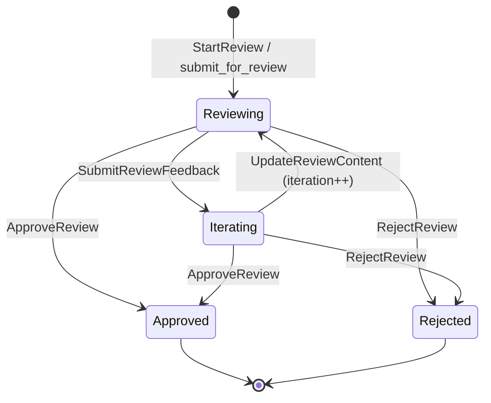

# ReviewGate Architecture

## Overview

ReviewGate 是 rstn workflow 系統的核心元件，提供 Human-in-the-loop 審核機制。當 workflow 節點需要使用 Claude Code CLI 產出內容時，ReviewGate 作為中介層，讓使用者在內容落地前進行審核、留言、迭代。

## Design Principles

### 參考來源

基於 [Google Antigravity](https://developers.googleblog.com/en/build-with-google-antigravity-our-new-agentic-development-platform/) 的設計：

- **Plan before Execute** - 先展示計畫，獲得批准後才執行
- **File/Section Level Review** - 不是逐行審核，而是檔案/區塊層級
- **Configurable Review Policy** - 可配置的審核策略
- **Async Feedback Loop** - 異步回饋，不阻塞 Agent 運行

### 核心理念

```
Workflow Node
    │
    ▼
┌──────────────────────────────────────┐
│  ReviewGate (CC output 必經之路)      │
│                                       │
│  • 接收 CC output (plan/proposal)     │
│  • 顯示 Review UI                     │
│  • 收集 section-level comments        │
│  • 處理 approve/reject/iterate        │
│                                       │
└──────────────────────────────────────┘
    │
    ▼
Next Node (or save to file)
```

## Interface Definition

### ReviewPolicy

可配置的審核策略，決定何時需要人工審核。

```
ReviewPolicy
  • AutoApprove    - 自動通過，不停頓（低風險操作）
  • AgentDecides   - Agent 決定是否需要 review（預設）
  • AlwaysReview   - 每次都要人工審核（高風險操作）
```

**使用場景：**

| 策略 | 適用場景 |
|------|----------|
| AutoApprove | 讀取操作、查詢、格式化 |
| AgentDecides | 一般程式碼變更 |
| AlwaysReview | 架構變更、刪除操作、安全相關 |

### ReviewContent

待審核的內容結構。

```
ReviewContent
  • content_type: ContentType
      - Plan        // 實作計畫
      - Proposal    // 變更提案
      - Code        // 程式碼產出
      - Artifact    // 其他產物（截圖、文件等）

  • content: String
      // Markdown 格式的內容

  • file_changes: Vec<FileChange>
      // 預計要變更的檔案清單
      └─ FileChange
          • path: String           // 檔案路徑
          • action: FileAction     // Create | Modify | Delete
          • summary: String        // 變更摘要
```

### ReviewSession

審核會話，追蹤一次審核的完整生命週期。

```
ReviewSession
  • id: String
      // 唯一識別碼 (UUID)

  • workflow_node_id: String
      // 觸發此審核的 workflow 節點 ID

  • status: ReviewStatus
      - Pending     // 等待內容
      - Reviewing   // 使用者審核中
      - Iterating   // CC 根據 feedback 修改中
      - Approved    // 已批准
      - Rejected    // 已拒絕

  • content: ReviewContent
      // 待審核內容

  • comments: Vec<ReviewComment>
      // 審核留言清單

  • iteration: u32
      // 第幾輪審核（從 1 開始）

  • created_at: DateTime
  • updated_at: DateTime
```

### ReviewComment

審核留言，支援 Section Level 粒度。

```
ReviewComment
  • id: String
      // 唯一識別碼

  • target: CommentTarget
      - Document              // 對整份文件
      - Section { id }        // 對特定 section (markdown heading)
      - File { path }         // 對特定檔案變更

  • content: String
      // 留言內容

  • author: CommentAuthor
      - User                  // 使用者留言
      - System                // 系統自動產生

  • resolved: bool
      // 是否已解決

  • created_at: DateTime
```

### CommentTarget 粒度說明

```
Document Level:
┌─────────────────────────────────┐
│ # Implementation Plan           │
│                                 │
│ ## Step 1: Add API      ← 💬   │  Section Level
│ Create file_reader.rs...        │
│                                 │
│ ## Step 2: Update lib   ← 💬   │  Section Level
│ ...                             │
│                                 │
│ ### Files to Change:            │
│ - file_reader.rs (create) ← 💬 │  File Level
│ - lib.rs (modify)         ← 💬 │  File Level
└─────────────────────────────────┘
     ↑
     └─ 💬 Document Level (對整份)
```

## Actions

### StartReview

開始一個新的審核會話。

```
Action::StartReview {
    workflow_node_id: String,
    content: ReviewContent,
    policy: ReviewPolicy,
}

// 觸發時機：CC CLI 產出 plan/proposal 後
// 結果：建立 ReviewSession，狀態為 Reviewing
```

### AddComment

新增審核留言。

```
Action::AddComment {
    session_id: String,
    target: CommentTarget,
    content: String,
}

// 觸發時機：使用者在 UI 上對某個 section 加留言
// 結果：新增 ReviewComment 到 session.comments
```

### ResolveComment

標記留言為已解決。

```
Action::ResolveComment {
    session_id: String,
    comment_id: String,
}

// 觸發時機：使用者確認某個留言已被處理
// 結果：設定 comment.resolved = true
```

### SubmitFeedback

批次送出所有留言給 CC 進行迭代。

```
Action::SubmitFeedback {
    session_id: String,
}

// 觸發時機：使用者點擊「Request Changes」
// 結果：
//   1. 收集所有未解決的 comments
//   2. 組成 feedback prompt 送給 CC
//   3. 狀態改為 Iterating
//   4. CC 回應後，iteration += 1，狀態改回 Reviewing
```

### Approve

批准審核內容。

```
Action::Approve {
    session_id: String,
}

// 觸發時機：使用者點擊「Approve」
// 結果：
//   1. 狀態改為 Approved
//   2. 通知 workflow 繼續執行下一步
//   3. 若 content_type 是 Plan，觸發 CC edit mode 執行
```

### Reject

拒絕審核內容。

```
Action::Reject {
    session_id: String,
    reason: String,
}

// 觸發時機：使用者點擊「Reject」
// 結果：
//   1. 狀態改為 Rejected
//   2. 通知 workflow 終止或回到上一步
```

## Review Session State Machine



**Note**: `Pending` is reserved for externally created sessions; if used, it should transition to `Reviewing` via explicit status updates.

## State Integration

### 與 Workflow 的關係

```
WorkflowNode
  │
  ├─ review_policy: ReviewPolicy      // 此節點的審核策略
  ├─ review_session_id: Option<String> // 關聯的審核會話
  │
  └─ 狀態轉換:
       NodeRunning → (CC output) → ReviewGate
                                      │
                    ┌─────────────────┼─────────────────┐
                    ▼                 ▼                 ▼
               AutoApprove      Reviewing          Rejected
                    │                 │                 │
                    ▼                 ▼                 ▼
               NextNode          Iterating          PrevNode
                                      │              or End
                                      ▼
                                 Approved
                                      │
                                      ▼
                                 NextNode
```

### 狀態存放位置

```
AppState
  └─ WorktreeState
       └─ tasks: TasksState
            └─ review_sessions: HashMap<String, ReviewSession>
                 // 以 session_id 為 key 存放所有審核會話
```

## UI Components

### ReviewPanel

主要的審核介面元件。

```
ReviewPanel
  ├─ Header
  │    └─ 顯示 iteration 次數、狀態
  │
  ├─ ContentView
  │    └─ Markdown 渲染 + Section 標記
  │    └─ 每個 Section 旁有「Add Comment」按鈕
  │
  ├─ FileChangesView
  │    └─ 列出預計變更的檔案
  │    └─ 每個檔案可展開查看 diff（若有）
  │
  ├─ CommentsSidebar
  │    └─ 列出所有 comments
  │    └─ 可標記 resolved
  │
  └─ ActionBar
       └─ [Approve] [Request Changes] [Reject]
```

## MCP Integration

### rstn-mcp Tools

```
// 供 CC 呼叫的 MCP tools

submit_for_review
  - 輸入: content, content_type, file_changes
  - 輸出: session_id
  - 說明: CC 產出內容後，呼叫此 tool 送審

get_review_feedback
  - 輸入: session_id
  - 輸出: comments (未解決的)
  - 說明: CC 取得使用者的 feedback

update_review_content
  - 輸入: session_id, new_content
  - 輸出: success
  - 說明: CC 根據 feedback 更新內容，進入下一輪審核
```

## Example Flow

```
1. User: 在 Change Management 建立新的 change intent

2. Workflow: 觸發 GenerateProposal 節點
   └─ review_policy: AlwaysReview

3. CC CLI (plan mode):
   └─ 產出 proposal.md 內容
   └─ 呼叫 rstn-mcp: submit_for_review(content, "Proposal", files)

4. ReviewGate:
   └─ 建立 ReviewSession (status: Reviewing)
   └─ UI 顯示 ReviewPanel

5. User: 審核 proposal
   └─ 對 "Step 2" section 加 comment: "需要考慮 error handling"
   └─ 點擊 "Request Changes"

6. ReviewGate:
   └─ 狀態改為 Iterating
   └─ 組成 feedback prompt 送給 CC

7. CC CLI:
   └─ 呼叫 rstn-mcp: get_review_feedback(session_id)
   └─ 修改 proposal
   └─ 呼叫 rstn-mcp: update_review_content(session_id, new_content)

8. ReviewGate:
   └─ iteration = 2
   └─ 狀態改回 Reviewing

9. User: 再次審核
   └─ 滿意，點擊 "Approve"

10. ReviewGate:
    └─ 狀態改為 Approved
    └─ 通知 workflow 繼續

11. Workflow: 執行下一步（存檔或執行 plan）
```

## Related Documents

- [08-workflow-cesdd.md](./08-workflow-cesdd.md) - CESDD 工作流架構
- [09-workflow-prompt-claude.md](./09-workflow-prompt-claude.md) - CC CLI 整合
- [11-workflow-system.md](./11-workflow-system.md) - Workflow 系統設計
- [12-cesdd-architecture.md](./12-cesdd-architecture.md) - CESDD 完整架構
