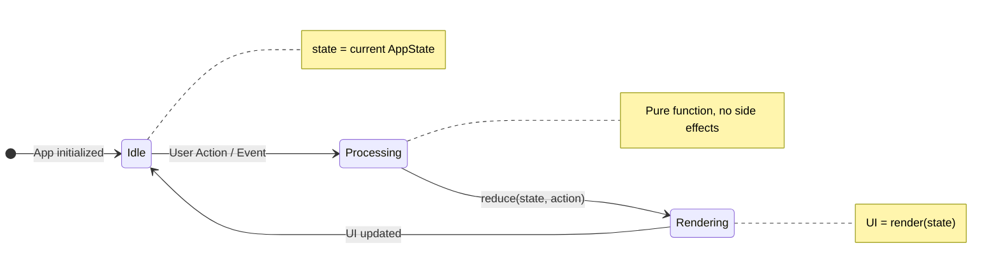
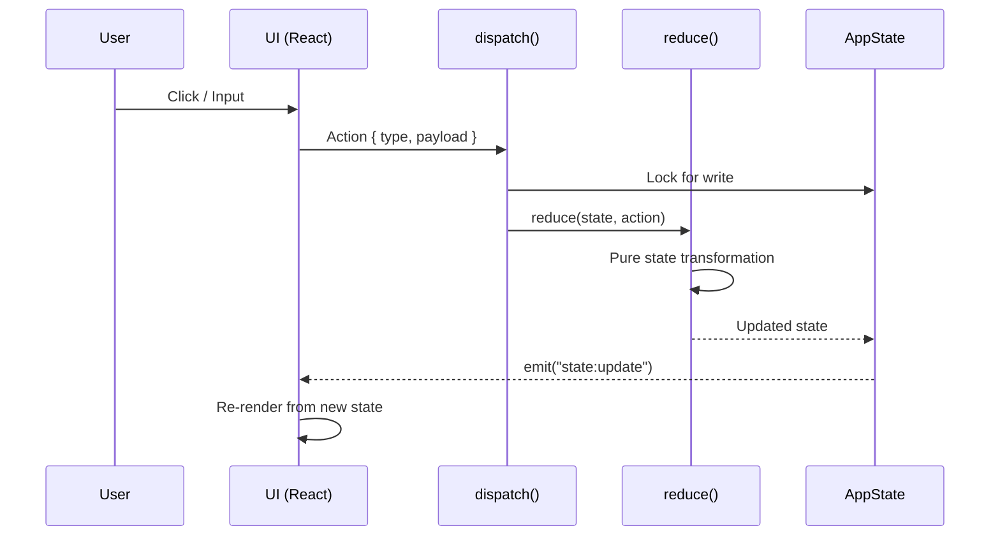

# 🎯 State Serializability - Core Architecture Principle

**Status**: 🎯 Core Principle (Feature 079)
**Created**: 2025-12-18
**Last Updated**: 2025-12-19

---

## TL;DR - For Claude Code

**Core Principle:** At any time, rstn's entire state MUST be JSON/YAML serializable.

**Why:**
- **Testability**: State-based tests are observable, deterministic, and stable
- **Reproducibility**: Save state → load state → exact bug reproduction
- **Clarity**: State is the single source of truth, UI is derived

**Concrete Runtime Model (Target)**:
- See [State-First MVI](mvi.md) for `Msg → Reduce → State → Render` with explicit serializable Effects

**Testing Requirements (MANDATORY):**
1. Every feature MUST include state serialization round-trip test
2. Every feature MUST include state transition tests
3. State structs MUST derive `Serialize + Deserialize + Debug + Clone`
4. NO hidden state (closures, thread-locals, unserializable fields)

**Enforcement:**
- CI checks: All state structs derive required traits
- Code review: State tests required for PR approval
- Test coverage: State tests are NOT optional

**Quick Example:**
```rust
#[derive(Debug, Clone, Serialize, Deserialize, PartialEq)]
pub struct AppState {
    pub version: String,
    pub worktree_view: WorktreeViewState,
    pub dashboard_view: DashboardState,
    pub settings_view: SettingsState,
}

#[test]
fn test_state_round_trip() {
    let state = AppState::default();
    let json = serde_json::to_string(&state).unwrap();
    let loaded: AppState = serde_json::from_str(&json).unwrap();
    assert_eq!(state, loaded); // MUST pass
}
```

---

## Core Principle

> **At any time, at any moment, rstn's entire state MUST be representable as JSON/YAML.**

This means:
- Every piece of application state can be serialized
- State can be saved, loaded, and restored exactly
- UI is a pure function of state: `UI = render(State)`
- No hidden state, no implicit assumptions
- All mutations go through explicit state transitions

---

## State-First Diagrams

### State Mutation Cycle



### Action → State → UI Flow



### State Serializability Contract

```mermaid
flowchart LR
    subgraph Valid["✅ Valid State"]
        A[Primitive types]
        B[Structs with Serialize]
        C[Enums with Serialize]
        D["Vec, HashMap, Option"]
    end

    subgraph Invalid["❌ Invalid State"]
        E[Closures]
        F[Thread handles]
        G[File handles]
        H[Non-Send types]
    end

    Valid --> J[AppState]
    Invalid -.->|"NEVER include"| J

    J --> K[JSON/YAML]
    K --> L[Save to disk]
    K --> M[Send to frontend]
    K --> N[Debug logging]
```



### State Testing Pyramid

```mermaid
flowchart TB
    subgraph Tests["State Testing Layers"]
        A["1. Round-trip Test
        serialize → deserialize → assert_eq"]
        B["2. Transition Test
        initial_state → action → expected_state"]
        C["3. Invariant Test
        any state → validate constraints"]
    end

    A --> D[All state structs]
    B --> E[All actions/reducers]
    C --> F[Business rules]

    style A fill:#90EE90
    style B fill:#87CEEB
    style C fill:#DDA0DD
```



---

## Why State Serializability?

### 1. **Testability**
State-based testing is **observable** and **deterministic**:

```rust
#[test]
fn test_prompt_workflow() {
    // Load known initial state
    let state = AppState::from_json(r#"{
        "input_mode": false,
        "session_id": null
    }"#);

    let mut app = App::from_state(state).unwrap();

    // Trigger action
    app.handle_view_action(ViewAction::RunPromptClaude {
        prompt: "test".into()
    });

    // Assert state transition
    let final_state = app.to_state();
    assert!(final_state.session_id.is_some());
    assert_eq!(final_state.input_mode, false);
}
```

**vs. DOM testing** (hard to observe):
```rust
// ❌ Fragile: depends on DOM structure / CSS selectors
// In GUI, testing via querySelector or pixel coordinates is brittle
// State-based testing via Tauri Commands is deterministic
```

### 2. **Reproducible Bugs**
Users can save state when bugs occur:

```bash
# User hits bug
rstn --save-state bug-report.json

# Developer loads exact state
rstn --load-state bug-report.json
# → Perfect reproduction
```

### 3. **Session Persistence**
Save on exit, restore on startup:

```yaml
# ~/.rstn/session.yaml
version: "0.1.0"
current_view: Worktree
input_mode: false
worktree_view:
  focus: GitStatus
  current_branch: "feature/042"
  session_id: "abc123-def456"
  claude_output:
    - type: assistant
      text: "Previous conversation..."
```

### 4. **Time-Travel Debugging**
Record all state transitions:

```rust
let mut history: Vec<AppState> = vec![];

loop {
    history.push(app.to_state()); // Snapshot
    app.handle_event(event);
}

// When bug occurs:
save_history("debug-trace.json", &history);
// → Replay state transitions to find exact failure point
```

### 5. **Clear Single Source of Truth**
State is **explicit** and **centralized**:
- No scattered state across components
- No "magic" hidden state
- No implicit dependencies
- Easy to reason about

---
