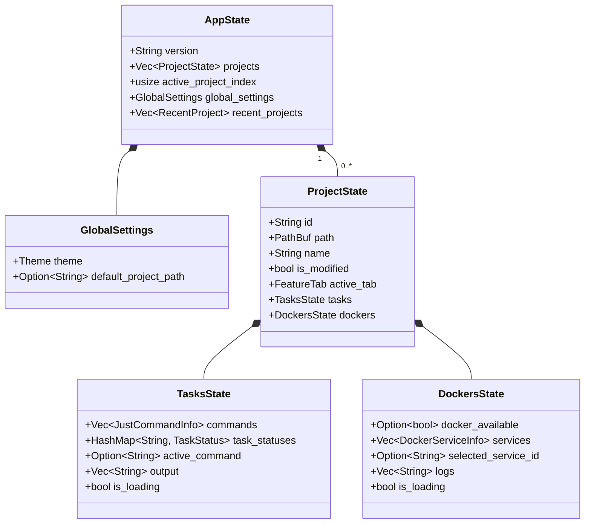

# State Topology

This document defines the structure and hierarchy of the `AppState` tree. It answers "Where should this variable live?" and "How is it persisted?".

## Core Principles

1.  **Single Tree**: There is only one root `AppState`.
2.  **Explicit Ownership**: Every piece of data has a clear owner.
3.  **Separation of Concerns**: State is divided by **Lifecycle** (Persistent vs Transient) and **Scope** (Global vs Project).
4.  **Multi-Project**: Multiple projects can be open simultaneously.

---

## State Tree Structure

The state tree supports multiple projects, each with isolated state.

### Hierarchy Diagram

---

## State Categories

### 1. Persistent State (The "Document")
Data that **MUST** survive a restart. It represents the user's valuable work.
*   **Examples**: Workflow history, Project configuration, User preferences.
*   **Storage**: `~/.rstn/session.yaml` or `project.rstn`
*   **Requirement**: Must be fully serializable.

### 2. Transient State (The "UI Context")
Data that is convenient to restore but not critical. It represents the user's immediate context.
*   **Examples**: Scroll position, Input cursor, Active tab.
*   **Handling**: Can be discarded on version mismatch or error.

### 3. Derived State (The "Cache")
Data computed from other state for performance or rendering ease. **NEVER serialized.**
*   **Examples**: Filtered list items, Layout Rects, Syntax highlighted spans.
*   **Handling**: Recomputed on startup or on demand.

### 4. Runtime State (The "System")
Handles to system resources. **NEVER serialized.**
*   **Examples**: Channel senders, Thread handles, DB connections.
*   **Handling**: Re-initialized on startup.

---

## Detailed Topology

### Root Level (`AppState`)
The entry point. Holds version, global settings, and the list of open projects.
- **version**: App version string
- **projects**: Vector of all open projects
- **active_project_index**: Which project tab is focused
- **global_settings**: App-wide preferences (theme, etc.)
- **recent_projects**: For "Open Recent" menu

### Project Level (`ProjectState`)
Each open project has isolated state. This enables multi-project workflows.
- **Identity**: path, name, id
- **Modified indicator**: Shows `*` in tab when tasks are running
- **Feature tab**: Which sidebar tab is active (Task, Docker, Settings)
- **Feature states**: TasksState, DockersState

### Feature Level (`TasksState`, `DockersState`)
State specific to each feature within a project.
- **TasksState**: Justfile commands, execution output, task statuses
- **DockersState**: Docker services, logs, selected service

---

## Data Flow Rules

1.  **Top-Down Props**: Parent state passes data down to children during render.
2.  **Bottom-Up Events**: Children emit `AppMsg` to request changes.
3.  **No Siblings**: Sibling components never talk directly. They communicate via the parent (Reducer).

---

## Migration Strategy

When the State Schema changes (e.g., v1 -> v2), we use **Defensive Deserialization**:

1.  **Attempt Load**: Try loading exact schema.
2.  **Fallback**: If fail, try loading "Previous Version" schema and convert.
3.  **Partial Recovery**: If fail, discard Transient State and try recovering Persistent State only.
4.  **Nuclear Option**: If all fails, backup corrupted file and start fresh.