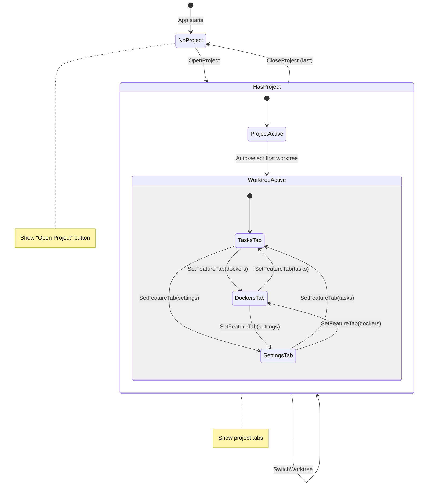
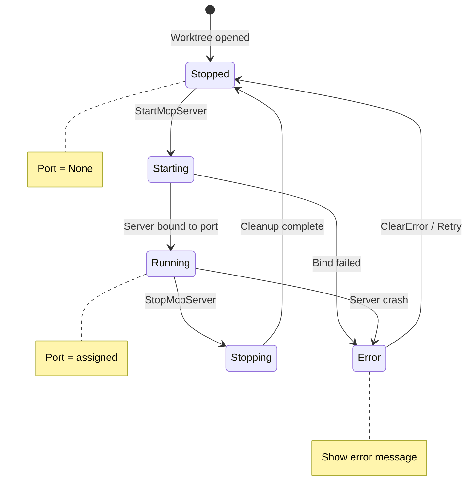
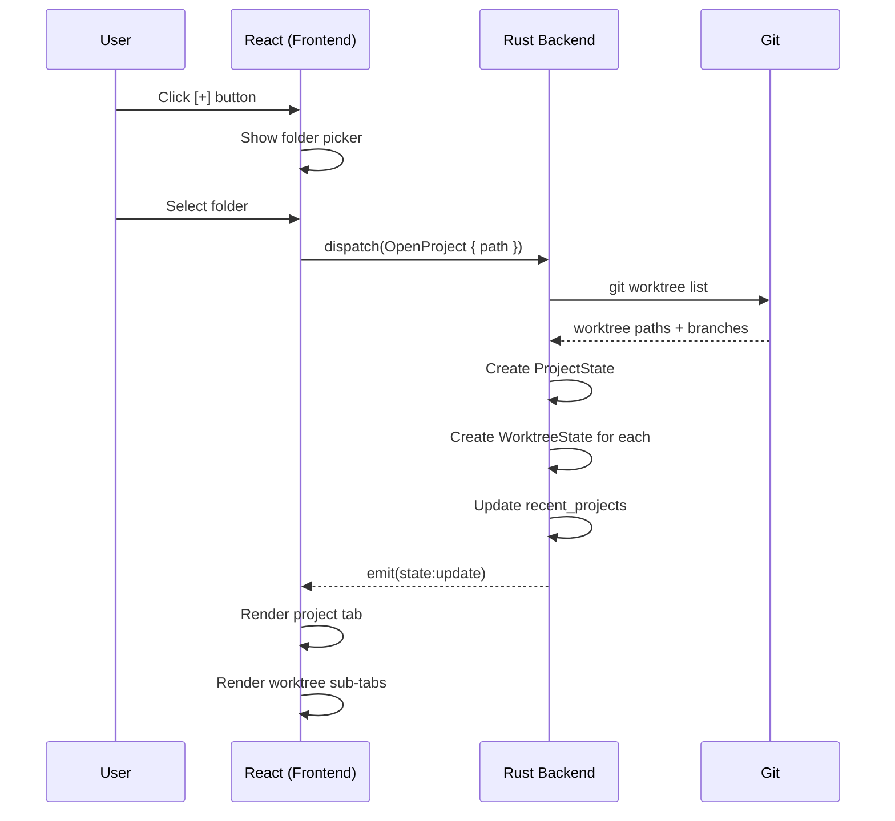
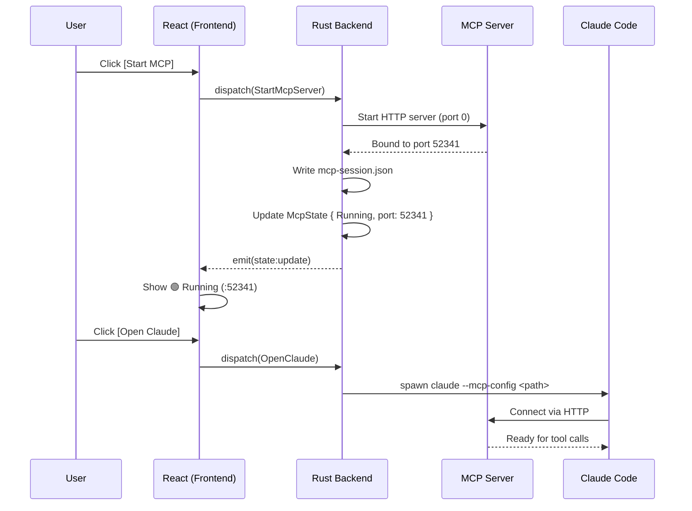
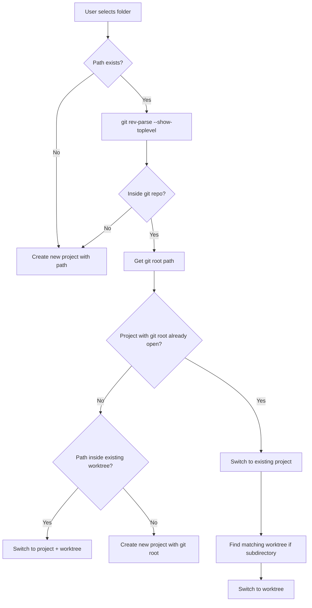

# Multi-Project & Worktree Architecture

## 1. Overview

rstn supports a two-level hierarchy:
- **Project** = Git repository
- **Worktree** = Git worktree (default: main branch)

Each worktree has its own MCP server for Claude Code integration.

### Hierarchy

```
Project (git repo: rustation)
├── Worktree: main              ~/projects/rustation
│   └── MCP Server :52341
├── Worktree: feature/auth      ~/projects/rustation-auth
│   └── MCP Server :52342
└── Worktree: fix/bug-123       ~/projects/rustation-fix
    └── MCP Server :52343
```

### Use Cases

| Level | Use Case |
|-------|----------|
| **Project** | Copy .env between worktrees, manage worktrees |
| **Worktree** | Independent Claude Code session, run tasks, Docker |

---

## 2. UI Layout

```
┌─────────────────────────────────────────────────────────────────────────────┐
│ [rustation ▼] [other-project ▼] [+]                        <- Project Tabs  │
│  └─ main | feature/auth | fix/bug                          <- Worktree Tabs │
├─────────┬───────────────────────────────────────────────────────────────────┤
│         │                                                                   │
│  Tasks  │   Worktree: feature/auth                                         │
│         │   Path: ~/projects/rustation-auth                                │
│ ─────── │   MCP: 🟢 :52341  [Open Claude]                                  │
│         │                                                                   │
│ Docker  │   ┌──────────────────────────────────────┐                        │
│         │   │ Copy .env from: [main ▼] [Copy]     │  <- Project-level 功能  │
│ ─────── │   └──────────────────────────────────────┘                        │
│         │                                                                   │
│Settings │   (Feature content...)                                            │
│         │                                                                   │
└─────────┴───────────────────────────────────────────────────────────────────┘
```

### UI Components

| Component | Level | Description |
|-----------|-------|-------------|
| **Project Tab** | Project | Dropdown shows all worktrees |
| **Worktree Sub-Tab** | Worktree | Switch between worktrees |
| **Feature Sidebar** | Worktree | Tasks, Docker, Settings |
| **MCP Status Bar** | Worktree | Shows MCP server status |

---

## 3. State Structure

### AppState (Root)

```
AppState
├── projects: Vec<ProjectState>
├── active_project_index: usize
├── global_settings: GlobalSettings
└── recent_projects: Vec<RecentProject>
```

### ProjectState (Git Repo)

```
ProjectState
├── id: String
├── path: PathBuf                    # Path to main worktree
├── name: String                     # Repo name
├── worktrees: Vec<WorktreeState>    # All worktrees
├── active_worktree_index: usize     # Currently selected worktree
└── repo_settings: RepoSettings      # Project-level settings
```

### WorktreeState (Git Worktree)

```
WorktreeState
├── id: String
├── path: PathBuf                    # Worktree path
├── branch: String                   # "main", "feature/auth"
├── is_main: bool                    # Is this the main worktree?
├── mcp: McpState                    # MCP server state
├── active_tab: FeatureTab           # Task | Docker | Settings
├── tasks: TasksState
└── dockers: DockersState
```

### McpState

```
McpState
├── status: McpStatus                # Stopped | Starting | Running | Error
├── port: Option<u16>                # Assigned port (dynamic)
├── config_path: Option<PathBuf>     # ~/.rstn/worktrees/<hash>/mcp-session.json
└── error: Option<String>
```

### Hierarchy Diagram

```
AppState
└── ProjectState (git repo)
    └── WorktreeState (git worktree)
        ├── McpState (MCP server)
        ├── TasksState (justfile)
        └── DockersState (docker)
```

---

## 4. Workflow Diagrams

### 4.1 Project/Worktree Navigation FSM



### 4.2 MCP Server Lifecycle FSM



### 4.3 Open Project Sequence



### 4.4 Start MCP & Open Claude Sequence



---

## 5. Actions

### Project-Level Actions

| Action | Payload | Description |
|--------|---------|-------------|
| `OpenProject` | `{ path }` | Open a git repo |
| `CloseProject` | `{ index }` | Close project tab |
| `SwitchProject` | `{ index }` | Focus different project |
| `CreateWorktree` | `{ branch, path }` | Create new worktree |
| `DeleteWorktree` | `{ worktree_index }` | Remove worktree |
| `CopyEnvFile` | `{ from_worktree, to_worktree }` | Copy .env |

### Worktree-Level Actions

| Action | Payload | Description |
|--------|---------|-------------|
| `SwitchWorktree` | `{ index }` | Focus different worktree |
| `StartMcpServer` | `{}` | Start MCP for active worktree |
| `StopMcpServer` | `{}` | Stop MCP server |
| `OpenClaude` | `{}` | Launch Claude Code with MCP config |
| `SetFeatureTab` | `{ tab }` | Switch feature tab |

---

## 6. MCP Server Management

### Lifecycle

```
rstn .  (open worktree)
   │
   ├─▶ 1. Start MCP Server (dynamic port)
   │
   ├─▶ 2. Write config: ~/.rstn/worktrees/<hash>/mcp-session.json
   │       {
   │         "mcpServers": {
   │           "rstn": { "type": "http", "url": "http://127.0.0.1:<port>/mcp" }
   │         }
   │       }
   │
   └─▶ 3. Launch Claude Code:
           claude --mcp-config ~/.rstn/worktrees/<hash>/mcp-session.json
```

### Port Allocation

- Use port 0 (OS assigns available port)
- Store assigned port in `McpState.port`
- Each worktree gets independent port

### Config File Location

```
~/.rstn/
├── state.json                          # Global app state
└── worktrees/
    ├── <hash1>/
    │   └── mcp-session.json           # MCP config for worktree 1
    └── <hash2>/
        └── mcp-session.json           # MCP config for worktree 2
```

Hash = SHA256(worktree_path)[0:8]

---

## 7. Data Flow

### Opening a Project (with Git Root Detection)

When a user opens a folder, the system automatically detects if it's inside a git repository and associates it with the correct project:



**Key behaviors:**

| Scenario | Action |
|----------|--------|
| Open `/projects/rustation` | Open as new project (if not already open) |
| Open `/projects/rustation/src` | Detect git root → switch to rustation project |
| Open `/projects/rustation-feature` (worktree) | Switch to rustation project + feature worktree |

### Opening a Project (Sequence)

```
User clicks [+]
    │
    ▼
Select folder (any path)
    │
    ▼
Backend: git rev-parse --show-toplevel
    │
    ▼
Normalize to git root (if inside repo)
    │
    ▼
Check: Is git root already open?
    ├── YES → Switch to existing project
    │         └── Find & switch to matching worktree
    │
    └── NO → Check: Is path inside any open worktree?
              ├── YES → Switch to that project + worktree
              │
              └── NO → Create new ProjectState
                       └── git worktree list
                       └── Create WorktreeStates
                       └── Show project tab
```

### Starting MCP Server

```
User clicks [Start MCP] on worktree
    │
    ▼
Backend: Start axum HTTP server (port 0)
    │
    ▼
Write mcp-session.json
    │
    ▼
Update McpState { status: Running, port: 52341 }
    │
    ▼
UI: Show 🟢 Running (:52341)
```

### Opening Claude Code

```
User clicks [Open Claude]
    │
    ▼
Backend: Get mcp-session.json path
    │
    ▼
Spawn: claude --mcp-config <path> -p "..."
    │
    ▼
Claude Code connects to MCP server
```

---

## 8. Persistence

### Global State (~/.rstn/state.json)

```json
{
  "version": "0.1.0",
  "recent_projects": [...],
  "global_settings": {...}
}
```

### Per-Worktree State (~/.rstn/worktrees/<hash>/state.json)

```json
{
  "path": "/Users/chris/projects/rustation",
  "active_tab": "tasks",
  "mcp_auto_start": true
}
```

---

## 9. Implementation Phases

### Phase 1: Worktree Support ✅ (Current)
- [ ] Update state structure (ProjectState → WorktreeState)
- [ ] UI: Two-level tabs (Project + Worktree)
- [ ] Backend: `git worktree list` parsing
- [ ] Actions: SwitchWorktree, CreateWorktree

### Phase 2: MCP Server
- [ ] Port MCP server to packages/core (napi-rs)
- [ ] Dynamic port allocation
- [ ] MCP config file management
- [ ] UI: MCP status indicator

### Phase 3: Claude Integration
- [ ] [Open Claude] button
- [ ] Spawn Claude Code with --mcp-config
- [ ] MCP tools: rstn_get_state, rstn_report_status

### Phase 4: Project-Level Features
- [ ] Copy .env between worktrees
- [ ] Worktree management UI (create/delete)
