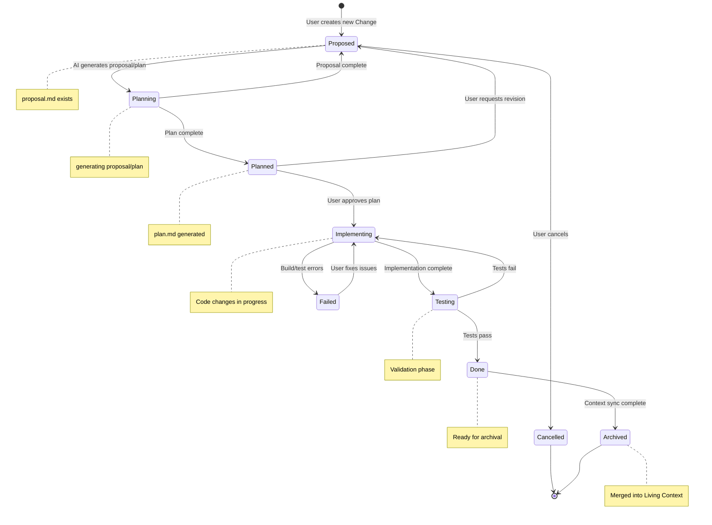
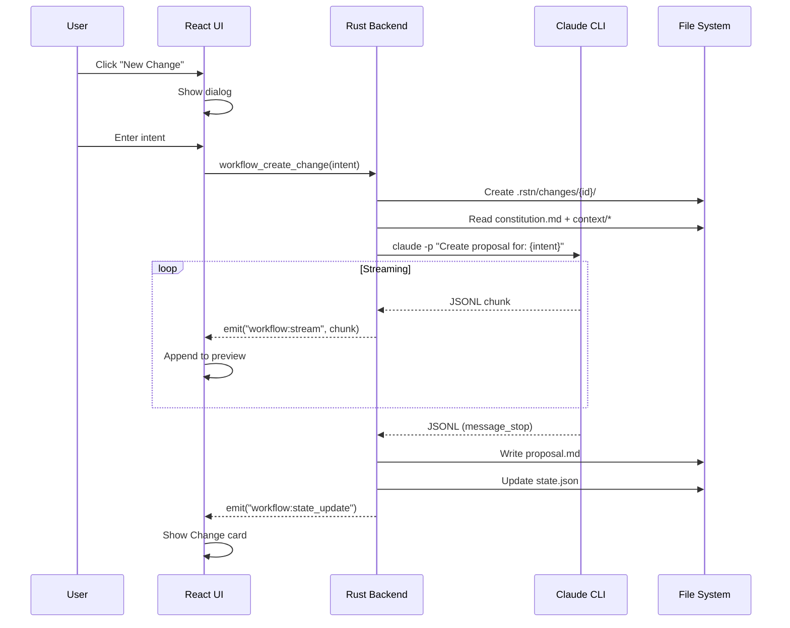
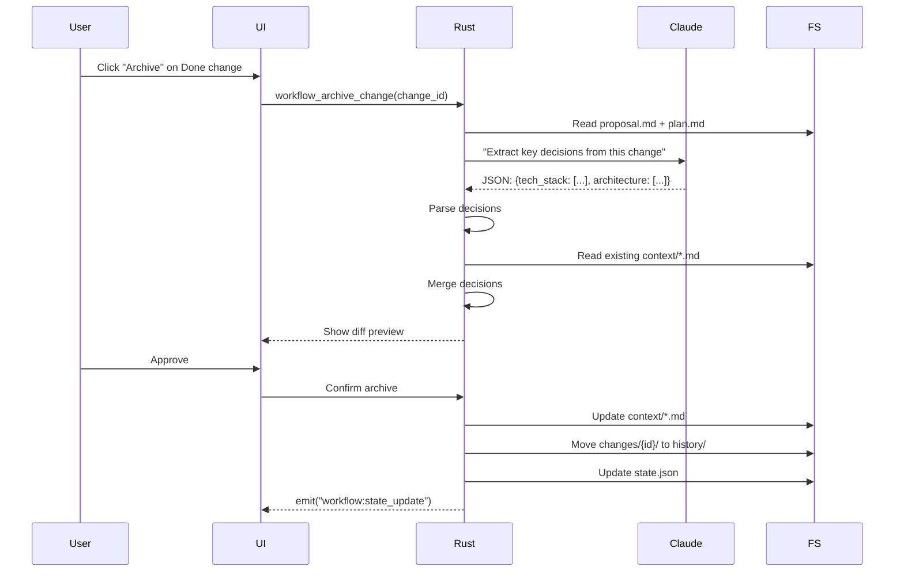

# Architecture: CESDD Workflow Management

## 1. Overview

This document defines the architecture for **Context-Enhanced Spec-Driven Development (CESDD)** workflow management in rstn. CESDD is a hybrid paradigm that combines:

- **GitHub Spec Kit's** governance model (Constitution layer)
- **OpenSpec's** incremental change management (Transactional layer)
- **Google Conductor's** context-driven approach (Living Context layer)

### 1.1 Design Philosophy

**Core Principle**: Make AI development workflows **visible, trackable, and reversible** through a desktop GUI.

**Key Differentiators**:
- 🖥️ **GUI-first**: First visual tool for context engineering (vs CLI-only competitors)
- 🎨 **State visualization**: See project constitution, living context, and active changes
- 🔗 **Unified platform**: Integrates with existing rstn features (Justfile, Docker)
- 🌐 **Model-agnostic**: Supports Claude, extensible to other models

### 1.2 Position in rstn Ecosystem

```
rstn Tabs:
├─ Tasks      → Execute Justfile commands
├─ Dockers    → Manage containers
├─ Workflow   → **NEW: CESDD workflow orchestration**
└─ Settings   → Configuration
```

**Integration Points**:
- Tasks: Generate Justfile tasks from CESDD plans
- Dockers: Define container requirements in Living Context
- Settings: Configure Claude CLI path and MCP servers

---

## 2. Three-Layer Context Architecture

### 2.1 Layer 1: Constitution (Governance)

**Path**: `.rstn/constitutions/*.md` (legacy: `.rstn/constitution.md`)

**Purpose**: Immutable constraints that govern all AI-generated code.

**Lifecycle**: **Human-maintained only**. AI agents MUST NOT modify this file.

**Content Examples**:
```markdown
# Project Constitution

## Non-Negotiable Constraints

### Technology Stack
- MUST use TypeScript Strict Mode
- MUST use React 18+ with hooks only (no class components)
- MUST use Tailwind CSS (no inline styles)

### Security
- ALL API endpoints MUST validate JWT tokens
- NO raw SQL queries (ORM only)
- NO secrets in source code

### Code Quality
- ALL functions MUST have unit tests
- Test coverage MUST be >= 80%
- MUST follow Airbnb ESLint rules
```

**Validation**: Any AI-generated plan violating Constitution → Auto-reject.

### 2.2 Layer 2: Living Context (Auto-Curated)

**Path**: `.rstn/context/`

**Structure**:
```
.rstn/context/
├─ product.md        # What we're building and why
├─ tech-stack.md     # Current technologies and versions
├─ architecture.md   # System design decisions
└─ conventions.md    # Code style and patterns
```

**Purpose**: **Source of truth** about the system's current state.

**Lifecycle**: **AI-maintained**. Updated automatically when Changes are archived.

**Update Mechanism**:
```
Change Complete → AI extracts key decisions → Update Living Context
```

**Example Flow**:
1. User completes "Add JWT authentication" change
2. AI detects: "Decision made to use `jsonwebtoken` crate"
3. AI updates `tech-stack.md`:
   ```diff
   + ## Authentication
   + - Library: `jsonwebtoken` v9.2.0
   + - Token expiry: 24 hours
   + - Refresh token: 7 days
   ```

**Context Caching**: This layer should be cached in Claude's prompt cache for performance.

### 2.3 Layer 3: Transactional (Ephemeral)

**Path**: `.rstn/changes/`

**Structure**:
```
.rstn/changes/
└─ feature-xxx/
   ├─ proposal.md   # What to build (Spec)
   ├─ plan.md       # How to build (Implementation plan)
   └─ tasks.md      # Actionable checklist
```

**Purpose**: Short-lived work units (features, bugs, refactors).

**Lifecycle**: Created → Developed → **Archived** (deleted or moved to history).

**Change Status Lifecycle**:
```
Proposed → Planning → Planned → Implementing → Testing → Done → Archived
```

**Note**: `Planning` is a transient state for proposal/plan generation and can return to `Proposed` if only the proposal is completed.

**Key Insight**: Changes are **deltas** (incremental). Background context lives in Layer 2.

---

## 3. State Machine Design

### 3.1 Change State Machine



### 3.2 Workflow State (Global)

```rust
#[derive(Serialize, Deserialize, Debug, Clone)]
pub struct WorkflowState {
    /// Path to the project root (.rstn/ parent)
    pub project_root: PathBuf,

    /// Constitution (Layer 1)
    pub constitution: Constitution,

    /// Living Context (Layer 2)
    pub living_context: LivingContext,

    /// Active Changes (Layer 3)
    pub active_changes: Vec<Change>,

    /// Workflow metadata
    pub metadata: WorkflowMetadata,
}

#[derive(Serialize, Deserialize, Debug, Clone)]
pub struct Change {
    pub id: String,                    // e.g., "feature-auth"
    pub name: String,                  // Human-readable title
    pub status: ChangeStatus,
    pub created_at: DateTime<Utc>,
    pub updated_at: DateTime<Utc>,

    /// File paths
    pub proposal_path: PathBuf,        // .rstn/changes/feature-auth/proposal.md
    pub plan_path: Option<PathBuf>,    // Generated after planning
    pub tasks_path: Option<PathBuf>,   // Generated after planning
}

#[derive(Serialize, Deserialize, Debug, Clone, PartialEq)]
pub enum ChangeStatus {
    Proposed,      // proposal.md created
    Planned,       // plan.md generated
    Implementing,  // Code changes in progress
    Testing,       // Validation phase
    Done,          // Ready for archival
    Archived,      // Merged into Living Context
    Cancelled,     // User cancelled
    Failed,        // Build/test errors
}
```

**State Persistence**: Serialized to `.rstn/state.json` (JSON format for human readability).

---

## 4. Claude CLI Integration

### 4.1 Command Patterns

**Pattern 1: Generate Proposal**

```bash
claude -p \
  --output-format stream-json \
  --verbose \
  --append-system-prompt "$(cat .rstn/constitution.md .rstn/context/*.md)" \
  "Create a detailed proposal for: ${user_intent}"
```

**Output**: Streamed to `.rstn/changes/${change_id}/proposal.md`

**Pattern 2: Generate Plan**

```bash
claude -p \
  --output-format stream-json \
  --verbose \
  --context-file ".rstn/constitution.md" \
  --context-file ".rstn/changes/${change_id}/proposal.md" \
  "Generate an implementation plan with file-by-file changes"
```

**Output**: Streamed to `.rstn/changes/${change_id}/plan.md`

**Pattern 3: Extract Context (for archival)**

```bash
claude -p \
  --output-format json \
  --verbose \
  --context-file ".rstn/changes/${change_id}/proposal.md" \
  --context-file ".rstn/changes/${change_id}/plan.md" \
  "Extract key architectural decisions from this completed change"
```

**Output**: JSON response parsed and merged into `.rstn/context/*.md`

### 4.2 Stream Processing

**Backend (Rust)** spawns `claude` as child process and parses JSONL:

```rust
async fn call_claude(
    prompt: &str,
    context_files: Vec<PathBuf>,
) -> Result<impl Stream<Item = ClaudeChunk>, Error> {
    let mut cmd = Command::new("claude");
    cmd.arg("-p")
       .arg("--output-format").arg("stream-json")
       .arg("--verbose");

    for file in context_files {
        cmd.arg("--context-file").arg(file);
    }

    cmd.arg(prompt);

    // Spawn and parse JSONL stream
    let child = cmd.stdout(Stdio::piped()).spawn()?;
    // ... stream parsing logic
}
```

**Frontend (React)** receives via Tauri events:

```typescript
await listen('workflow:stream', (event) => {
  const chunk = event.payload;
  appendToProposal(chunk.delta);
});
```

---

## 5. File System Structure

### 5.1 Standard Layout

```
project-root/
├─ .rstn/
│  ├─ constitution.md           # Layer 1
│  ├─ context/                  # Layer 2
│  │  ├─ product.md
│  │  ├─ tech-stack.md
│  │  ├─ architecture.md
│  │  └─ conventions.md
│  ├─ changes/                  # Layer 3
│  │  ├─ feature-auth/
│  │  │  ├─ proposal.md
│  │  │  ├─ plan.md
│  │  │  └─ tasks.md
│  │  └─ bugfix-login/
│  │     └─ proposal.md
│  ├─ state.json                # Workflow state
│  └─ .gitignore                # Ignore changes/ folder
├─ src/
├─ package.json
└─ ...
```

### 5.2 Git Integration

**Recommendation**:
- ✅ **Commit**: `constitution.md`, `context/`
- ❌ **Ignore**: `changes/` (transactional, not source of truth)
- ⚠️ **Optional**: `state.json` (team preference)

**Rationale**: Living Context is the source of truth. Transactional changes are ephemeral.

---

## 6. UI Design (Workflow Tab)

### 6.1 Layout Structure

```
┌─────────────────────────────────────────────────────┐
│ Workflow Tab                                        │
├─────────────────────────────────────────────────────┤
│ Left Panel (40%)        │ Right Panel (60%)         │
│                         │                           │
│ 📜 Constitution         │ 📝 Active Changes         │
│ ┌─────────────────────┐ │ ┌───────────────────────┐ │
│ │ • Tech Stack        │ │ │ feature-auth          │ │
│ │ • Security Rules    │ │ │ Status: 🟡 Planned    │ │
│ │ • Code Quality      │ │ │ Created: 2h ago       │ │
│ │ [View Full]         │ │ │ [View] [Continue]     │ │
│ └─────────────────────┘ │ │ [Archive]             │ │
│                         │ └───────────────────────┘ │
│ 🏗️ Living Context      │                           │
│ ┌─────────────────────┐ │ ┌───────────────────────┐ │
│ │ Product             │ │ │ bugfix-login          │ │
│ │ • Vision            │ │ │ Status: 🟢 Done       │ │
│ │ • User Personas     │ │ │ Created: 1d ago       │ │
│ │                     │ │ │ [View] [Archive]      │ │
│ │ Tech Stack          │ │ └───────────────────────┘ │
│ │ • React 18          │ │                           │
│ │ • Rust (napi-rs)    │ │ 🆕 [New Change...]        │
│ │                     │ │                           │
│ │ Architecture        │ │                           │
│ │ • Electron app      │ │                           │
│ │ • State-first       │ │                           │
│ │ [Refresh]           │ │                           │
│ └─────────────────────┘ │                           │
└─────────────────────────────────────────────────────┘
```

### 6.2 Key Interactions

**1. New Change Dialog**
```
┌─────────────────────────────────────┐
│ Create New Change                   │
├─────────────────────────────────────┤
│ Describe what you want to build:   │
│ ┌─────────────────────────────────┐ │
│ │ Add JWT authentication to API   │ │
│ │                                 │ │
│ └─────────────────────────────────┘ │
│                                     │
│ [Cancel]           [Generate →]     │
└─────────────────────────────────────┘
```

**Flow**: User input → Call Claude → Stream proposal → Save to `.rstn/changes/`

**2. Change Card Actions**

| Status | Available Actions |
|--------|-------------------|
| Proposed | [View Proposal] [Generate Plan] [Edit] [Cancel] |
| Planned | [View Plan] [Start Implementation] [Revise] [Cancel] |
| Implementing | [View Progress] [Mark Testing] |
| Testing | [Mark Done] [Back to Implementing] |
| Done | [Archive] [Revert] |

**3. Archive Flow**
```
User clicks [Archive]
  ↓
Confirmation dialog: "Extract decisions to Living Context?"
  ↓
Call Claude to analyze proposal + plan
  ↓
AI generates context updates
  ↓
Show diff preview
  ↓
User approves → Update context/*.md → Move change to history
```

### 6.3 Component Structure

```
WorkflowPage/
├─ ConstitutionPanel.tsx
├─ LivingContextPanel.tsx
├─ ActiveChangesPanel.tsx
│  ├─ ChangeCard.tsx
│  └─ NewChangeDialog.tsx
├─ ChangeDetailView.tsx
│  ├─ ProposalViewer.tsx
│  ├─ PlanViewer.tsx
│  └─ TasksViewer.tsx
└─ ArchiveDialog.tsx
```

---

## 7. Backend Architecture

### 7.1 Module Structure

```
packages/core/src/
├─ workflow/
│  ├─ mod.rs              # Public API
│  ├─ state.rs            # WorkflowState, Change types
│  ├─ constitution.rs     # Constitution management
│  ├─ living_context.rs   # Living Context CRUD
│  ├─ change.rs           # Change lifecycle
│  ├─ claude_cli.rs       # Claude integration
│  └─ archive.rs          # Archival workflow
```

### 7.2 napi-rs Bindings

```rust
// packages/core/src/workflow/mod.rs

#[napi]
pub async fn workflow_init(project_root: String) -> Result<WorkflowState> {
    // Initialize .rstn/ structure
}

#[napi]
pub async fn workflow_create_change(
    project_root: String,
    intent: String
) -> Result<Change> {
    // Create new change, call Claude to generate proposal
}

#[napi]
pub async fn workflow_generate_plan(
    project_root: String,
    change_id: String
) -> Result<()> {
    // Call Claude to generate plan.md
}

#[napi]
pub async fn workflow_archive_change(
    project_root: String,
    change_id: String
) -> Result<ContextUpdate> {
    // Extract decisions, update Living Context
}

#[napi]
pub fn workflow_get_state(project_root: String) -> Result<WorkflowState> {
    // Read current state
}
```

### 7.3 Event Emissions

```rust
// During streaming
window.emit("workflow:stream", StreamChunk { delta, change_id })?;

// State updates
window.emit("workflow:state_update", workflow_state)?;

// Errors
window.emit("workflow:error", ErrorPayload { message, change_id })?;
```

---

## 8. Implementation Phases

### Phase 1: Foundation (MVP) ✨
**Goal**: Initialize and visualize project context

**Scope**:
- [ ] Backend: Initialize `.rstn/` structure
- [ ] Backend: Read/write Constitution
- [ ] Backend: Read/write Living Context
- [ ] UI: Workflow Tab skeleton
- [ ] UI: Display Constitution (read-only)
- [ ] UI: Display Living Context (read-only)
- [ ] E2E: Verify file creation and display

**Success Criteria**: User can initialize project and see context in GUI.

**Estimated Complexity**: ~500 LOC

---

### Phase 2: Change Management
**Goal**: Create and track Changes

**Scope**:
- [ ] Backend: Change state machine
- [ ] Backend: Create Change + call Claude for proposal
- [ ] UI: New Change dialog
- [ ] UI: Active Changes list
- [ ] UI: Change detail view (proposal)
- [ ] E2E: Create Change and view proposal

**Success Criteria**: User can create Changes and see AI-generated proposals.

---

### Phase 3: Workflow Orchestration
**Goal**: Complete Propose → Plan → Implement flow

**Scope**:
- [ ] Backend: Generate plan.md from proposal
- [ ] Backend: Generate tasks.md from plan
- [ ] UI: Plan approval flow
- [ ] UI: Task checklist view
- [ ] E2E: Complete full workflow

**Success Criteria**: User can go from intent to actionable tasks.

---

### Phase 4: Context Sync (Advanced)
**Goal**: Auto-update Living Context

**Scope**:
- [ ] Backend: Archive workflow
- [ ] Backend: AI extracts decisions
- [ ] Backend: Merge into Living Context
- [ ] UI: Archive dialog with diff preview
- [ ] E2E: Verify context updates

**Success Criteria**: Living Context stays synchronized with completed work.

---

## 9. Testing Strategy

### 9.1 State Tests (Rust)

```rust
#[test]
fn test_change_state_transitions() {
    let mut change = Change::new("feature-test");
    assert_eq!(change.status, ChangeStatus::Proposed);

    change.transition_to_planned().unwrap();
    assert_eq!(change.status, ChangeStatus::Planned);

    // Cannot skip states
    assert!(change.transition_to_archived().is_err());
}

#[test]
fn test_workflow_state_serialization() {
    let state = WorkflowState::new("/tmp/project");
    let json = serde_json::to_string(&state).unwrap();
    let restored: WorkflowState = serde_json::from_str(&json).unwrap();
    assert_eq!(state.project_root, restored.project_root);
}
```

### 9.2 Integration Tests (Rust)

```rust
#[tokio::test]
async fn test_claude_cli_proposal_generation() {
    let result = call_claude(
        "Add user authentication",
        vec![PathBuf::from("test/constitution.md")]
    ).await;

    assert!(result.is_ok());
    let stream = result.unwrap();
    // Verify stream produces valid JSONL
}
```

### 9.3 E2E Tests (Playwright)

```typescript
test('create new change and view proposal', async ({ page }) => {
  await page.goto('/workflow');

  // Click New Change
  await page.click('[data-testid="new-change-btn"]');

  // Enter intent
  await page.fill('[data-testid="intent-input"]', 'Add dark mode');

  // Submit
  await page.click('[data-testid="generate-btn"]');

  // Wait for proposal to stream
  await page.waitForSelector('[data-testid="change-card"]');

  // Verify change appears
  const changeCard = page.locator('[data-testid="change-card"]').first();
  await expect(changeCard).toContainText('Add dark mode');
  await expect(changeCard).toContainText('Proposed');
});
```

---

## 10. Logging & Observability

### 10.1 Structured Logs

All workflow operations MUST emit structured logs:

```rust
info!(
    target: "workflow::change",
    change_id = %change.id,
    status = ?change.status,
    "Change state transitioned"
);

info!(
    target: "workflow::claude",
    command = %cmd,
    context_files = ?context_files,
    "Calling Claude CLI"
);
```

### 10.2 Debug Panel (Future)

In Settings → Debug, show:
- Last 100 workflow events
- Claude CLI command history
- Context cache hit/miss stats

---

## 11. Migration & Compatibility

### 11.1 Existing Projects

**Scenario**: User opens rstn in a project without `.rstn/`

**Flow**:
1. Workflow Tab shows "Initialize CESDD" prompt
2. User clicks "Initialize"
3. Backend creates `.rstn/` with templates
4. Ask user to fill in Constitution

### 11.2 Template System

Provide templates for common project types:

```
.rstn/templates/
├─ react-typescript/
│  ├─ constitution.md
│  └─ context/
│     ├─ product.md
│     └─ tech-stack.md
├─ rust-cli/
└─ nextjs-app/
```

User selects template → Files pre-filled → User edits.

---

## 12. Security Considerations

### 12.1 Prompt Injection

**Risk**: User enters malicious intent to manipulate Claude.

**Mitigation**:
- Constitution acts as guard rail
- Sandbox Claude CLI execution
- Review all AI-generated plans before execution

### 12.2 File System Access

**Risk**: AI writes to arbitrary paths.

**Mitigation**:
- All file operations scoped to `.rstn/`
- Whitelist allowed paths
- Validate all PathBuf before write

---

## 13. Future Extensions

### 13.1 Multi-Model Support

Abstract `claude_cli.rs` into `ai_provider.rs`:
```rust
trait AIProvider {
    async fn generate_proposal(&self, intent: &str) -> Result<String>;
    async fn generate_plan(&self, proposal: &str) -> Result<String>;
}

impl AIProvider for ClaudeProvider { ... }
impl AIProvider for GeminiProvider { ... }
```

### 13.2 Team Collaboration

- Sync `.rstn/context/` via Git
- Conflict resolution for concurrent Changes
- Lock mechanism for active Changes

### 13.3 Analytics Dashboard

- Show metrics: avg. time per Change status
- Track context growth over time
- Visualize decision history

---

## 14. References

### 14.1 Related Documents

- `kb/architecture/02-state-first-principle.md` - State serialization requirements
- `kb/architecture/09-workflow-prompt-claude.md` - Claude CLI integration basics
- `kb/workflow/definition-of-done.md` - Feature completion checklist

### 14.2 External Resources

- [Spec-Driven Development Report](/Users/chrischeng/Downloads/Spec Driven 與 Context Driven 探討.md)
- [GitHub Spec Kit](https://github.com/github/spec-kit)
- [OpenSpec](https://github.com/Fission-AI/OpenSpec)
- [Google Conductor](https://developers.googleblog.com/conductor-introducing-context-driven-development-for-gemini-cli/)

---

## Appendix A: Mermaid Diagrams

### A.1 Complete Workflow Sequence



### A.2 Archive Workflow



---

## 11. Implementation Status

### Phase 1: Constitution Initialization ✅ IMPLEMENTED (2025-12-28)

**Status**: **COMPLETE** - Fully functional in rstn GUI

#### What Was Implemented

**Backend (Rust)**:
- ✅ `ConstitutionWorkflow` state type in `app_state.rs`
- ✅ `WorkflowStatus` enum: `Collecting`, `Generating`, `Complete`
- ✅ 5 actions in `actions.rs`:
  - `StartConstitutionWorkflow`
  - `AnswerConstitutionQuestion { answer }`
  - `GenerateConstitution`
  - `AppendConstitutionOutput { content }`
  - `SaveConstitution`
- ✅ Reducer handlers for all actions (synchronous state transitions)
- ✅ Async handler for `GenerateConstitution` (spawns Claude CLI, streams output)
- ✅ File write handler for saving `.rstn/constitution.md`

**Frontend (React)**:
- ✅ `ConstitutionPanel.tsx` component (100 LOC)
  - Collecting phase: Questions + textarea + Next button
  - Generating phase: Streaming markdown preview
  - Complete phase: Final constitution display
- ✅ TasksPage integration (2-column layout when active)
- ✅ TypeScript types mirroring Rust state

**Tests**:
- ✅ 6 Rust unit tests (state transitions + serialization)
- ✅ 18 React component tests (all phases + edge cases)
- ✅ All 148 tests passing

**Files Modified/Created**:
1. `packages/core/src/app_state.rs` (+25 LOC)
2. `packages/core/src/actions.rs` (+18 LOC)
3. `packages/core/src/reducer.rs` (+70 LOC)
4. `packages/core/src/lib.rs` (+180 LOC async handlers)
5. `apps/desktop/src/renderer/src/types/state.ts` (+28 LOC)
6. `apps/desktop/src/renderer/src/features/tasks/ConstitutionPanel.tsx` (NEW - 235 LOC)
7. `apps/desktop/src/renderer/src/features/tasks/TasksPage.tsx` (+40 LOC)
8. `packages/core/src/reducer.rs` (tests) (+217 LOC)
9. `apps/desktop/src/renderer/src/features/tasks/__tests__/ConstitutionPanel.test.tsx` (NEW - 320 LOC)

**Total**: ~1,133 LOC (including tests)

#### How It Works

1. User selects "Initialize Constitution" from Tasks Tab
2. Workflow starts with 4 hardcoded questions:
   - `tech_stack`: "What technology stack does this project use?"
   - `security`: "What security requirements must all code follow?"
   - `code_quality`: "What code quality standards?"
   - `architecture`: "Any architectural constraints?"
3. User answers each question sequentially
4. After all answered, user clicks "Generate Constitution"
5. Backend spawns Claude CLI with template prompt + answers:
   ```rust
   claude -p --verbose --output-format stream-json --include-partial-messages "<prompt>"
   ```
6. Output streams to UI in real-time (JSONL parsing)
7. Constitution saved to `.rstn/constitution.md`
8. Workflow marked complete

#### Testing Coverage

**Rust (reducer.rs)**:
- ✅ Workflow initialization
- ✅ Question answering (all 4 questions)
- ✅ Status transitions (Collecting → Generating → Complete)
- ✅ Output streaming
- ✅ State serialization/deserialization

**React (ConstitutionPanel.test.tsx)**:
- ✅ Renders all 3 phases correctly
- ✅ Form validation (disabled Next when empty)
- ✅ Dispatches correct actions
- ✅ Shows progress indicators
- ✅ Displays markdown output
- ✅ Loading states

#### User Documentation

- ✅ `docs/workflows/constitution-management.md` - User guide with examples

#### Known Limitations

1. **Hardcoded Questions**: The 4 questions are hardcoded in reducer.rs (line 416-417). Future: Make configurable via UI or config file.
2. **No Edit Workflow**: After generation, users must manually edit `.rstn/constitution.md`. Future: Add "Re-generate" or "Edit & Regenerate" button.
3. **No Validation**: No check if constitution already exists. Future: Warn user before overwriting.
4. **Claude CLI Required**: Workflow fails if Claude CLI not installed. Future: Add graceful error message with installation link.

#### Next Steps (Future Phases)

- **Phase 2**: Specify Workflow (generate `proposal.md` using constitution as context)
- **Phase 3**: Plan Workflow (generate `plan.md` using constitution + proposal)
- **Phase 4**: Implement Workflow (execute plan with Claude Code)
- **Phase 5**: Archive Workflow (extract learnings back into constitution)

---

**END OF DOCUMENT**
