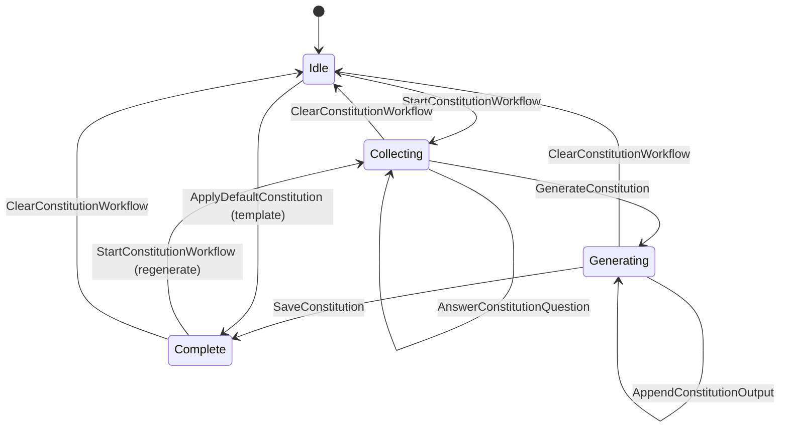
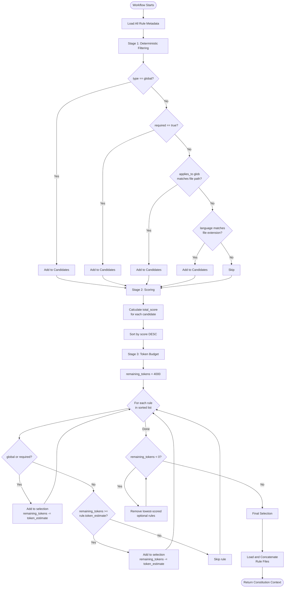
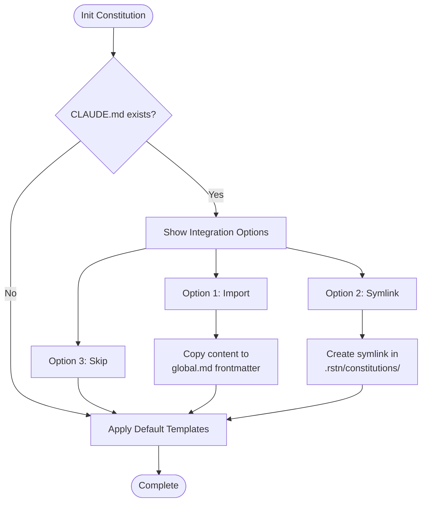

# Constitution System

**Status**: Redesign (Phase 2)
**Last Updated**: 2025-12-29
**Related**: `09-workflow-prompt-claude.md`, `01-system-specification.md`

---

## 1. Overview

### Purpose

The Constitution system addresses a critical challenge in large monorepos: **how to provide context-aware coding guidelines to LLM agents without overwhelming the token budget**.

In a monorepo with multiple languages (Rust, TypeScript, Python), frameworks (React, Electron, napi-rs), and components (backend APIs, frontends, CLI tools), a single monolithic `constitution.md` file quickly becomes:

- **Too large**: Exceeds token budgets (4000 tokens reserved for constitution)
- **Too noisy**: Irrelevant rules dilute important context
- **Unmaintainable**: Changes require editing a massive file

### Philosophy

**Optimized Templates > User Customization**

Key insight: Constitution effectiveness depends on **structure and patterns**, not user creativity.

- **Battle-tested templates**: Pre-optimized rules that work well with LLMs
- **Standardized format**: Consistent structure improves LLM adherence
- **Minimal customization**: User input may reduce effectiveness
- **CLAUDE.md integration**: Leverage existing project documentation

### Design Principles

1. **Optimized by Default**: Templates are researched and battle-tested
2. **Token Efficiency**: Stay within 4000 token budget for constitution
3. **CLAUDE.md Aware**: Detect and integrate existing project documentation
4. **Deterministic**: No LLM required for rule selection
5. **Extensibility**: Easy to add new language/component rules

### What NOT to Do

- ❌ Free-form Q&A workflow for custom constitution (deprecated)
- ❌ Free-form user input for rules
- ❌ Complex customization UI

## Guided Constitution Setup (Legacy Q&A)

**Purpose**: Provide a low-effort guided setup that minimizes typing while still capturing project-specific constraints.

**Flow**:
1. User selects options for each question (multi-select).
2. Optional short notes per question (free text, minimized).
3. Answers are compiled into a structured summary.
4. Claude generates a **modular** custom file at `.rstn/constitutions/custom.md`.

**Questions**:
- Technology Stack
- Security Requirements
- Code Quality Standards
- Architectural Constraints

**Rules**:
- Always write to modular structure (never overwrite other files).
- Use a single custom module (`custom.md`) for guided additions.
- If `CLAUDE.md` is referenced, include it as context only.

**Example Output (Module)**:
```pseudo-code
---
name: "Custom Rules"
type: custom
priority: 30
required: false
---

# Custom Rules

## Technology Stack
- Rust
- TypeScript

## Security Requirements
- No secrets in repo
- Validate all inputs
```

## Legacy Q&A Workflow State Machine (Current Implementation)



**Note**: `constitution_exists` is driven by file checks and is not part of the workflow state itself.

---

## 2. File Structure

### Directory Layout (Default and Required)

```
.rstn/
├── constitution.md              # Legacy: one-click default template (backward compat)
└── constitutions/
    ├── global.md                # Global rules (always loaded, type: global)
    ├── rust.md                  # Rust language conventions (type: language)
    ├── typescript.md            # TypeScript conventions (type: language)
    ├── react.md                 # React framework patterns (type: language)
    ├── python.md                # Python conventions (type: language)
    ├── electron.md              # Electron-specific patterns (type: component)
    ├── napi-rs.md               # napi-rs binding conventions (type: component)
    ├── backend-api.md           # Backend API component rules (type: component)
    └── frontend-ui.md           # Frontend component rules (type: component)
```

### Rule Types

| Type | Description | Selection Rule | Example |
|------|-------------|----------------|---------|
| `global` | Project-wide principles | Always loaded | Architecture principles, testing philosophy |
| `language` | Language-specific conventions | Loaded when file extension matches | Rust error handling, TypeScript typing |
| `component` | Component/package-specific | Loaded when working in component directory | `packages/core/**` rules, `apps/desktop/**` rules |

### Default Policy (Single-Project and Monorepo)

**Policy**: Always use modular constitutions. Multi-file structure is the default for **all** projects, not just monorepos.

**Detection**: Monorepo detection (if used) only pre-selects recommended modules. It does **not** change the file structure.

### Migration Path

**Backward Compatibility**: If `.rstn/constitutions/` does not exist, fall back to `.rstn/constitution.md` (legacy behavior).

**Migration Strategy**:
1. Initialize with default templates using `rstn constitution init`
2. Importing `CLAUDE.md` creates `.rstn/constitutions/claude.md` (custom module)
2. Users can gradually split existing `constitution.md` into modular files
3. System auto-detects which mode to use (legacy vs modular)

---

## 3. Frontmatter Schema

Each rule file contains YAML frontmatter for metadata-driven selection.

### Schema Definition

```yaml
---
name: "Rust Conventions"           # Human-readable name
type: language                      # Type: global | language | component
language: rust                      # (Optional) Language identifier (rust, typescript, python, etc.)
applies_to:                         # (Optional) Glob patterns for file/directory matching
  - "packages/core/**"
  - "**/*.rs"
tags:                               # (Optional) Semantic tags for thematic grouping
  - backend
  - systems
  - napi-rs
priority: 50                        # Priority score (0-100, higher = more important)
required: false                     # If true, always load (like global, but for components)
token_estimate: 800                 # Estimated token count (for budget calculation)
---

# Rule Content

Markdown content with actual coding guidelines...
```

### Field Specifications

| Field | Type | Required | Description |
|-------|------|----------|-------------|
| `name` | String | Yes | Human-readable rule name |
| `type` | Enum | Yes | `global`, `language`, `component` |
| `language` | String | No | Language identifier (lowercase: `rust`, `typescript`, `python`) |
| `applies_to` | Array[String] | No | Glob patterns for file/directory matching |
| `tags` | Array[String] | No | Semantic tags (e.g., `backend`, `frontend`, `testing`) |
| `priority` | Integer | Yes | Base priority score (0-100) |
| `required` | Boolean | No | If true, always load (default: false) |
| `token_estimate` | Integer | Yes | Estimated token count for budget management |

### Glob Pattern Matching

Use standard glob syntax:
- `**/*.rs` - All Rust files
- `packages/core/**` - All files in `packages/core`
- `apps/desktop/src/renderer/**` - Frontend renderer code
- `**/tests/**` - All test directories

---

## 4. Selection Algorithm (3-Stage Pipeline)

The Constitution selection algorithm is **deterministic** and **LLM-free** by design. It uses metadata, file paths, and scoring heuristics to select the most relevant rules.

### Input Context

The selector receives:
- `current_file_path`: Absolute path of file being edited (optional)
- `working_directory`: Current working directory (optional)
- `explicit_tags`: User-provided tags to boost relevance (optional)
- `language_hint`: Explicitly specified language (optional)
- `TOKEN_BUDGET`: Maximum tokens reserved for constitution (default: 4000)

### Stage 1: Deterministic Filtering (No LLM)

**Objective**: Narrow down rule files to a candidate set based on hard constraints.

**Rules**:

1. **Global Rules** (`type: global`)
   - **Always select** (non-negotiable)
   - These define project-wide principles

2. **Required Rules** (`required: true`)
   - **Always select** (even if not in score-based top-K)
   - Used for critical component rules (e.g., security policies)

3. **File Path Matching** (`applies_to` globs)
   - If `current_file_path` matches any glob in `applies_to`
   - **Add to candidates**

4. **Language Matching** (`language` field)
   - Detect language from file extension:
     - `.rs` → `rust`
     - `.ts`, `.tsx` → `typescript`
     - `.py` → `python`
     - `.jsx` → `javascript`
   - If `rule.language == detected_language`
   - **Add to candidates**

5. **Working Directory Matching** (`applies_to` globs)
   - If `working_directory` is within any glob pattern
   - **Add to candidates**

**Output**: Candidate set of rule files

---

### Stage 2: Scoring (No LLM)

**Objective**: Rank candidates by relevance to current context.

**Score Calculation**:

```
total_score = base_priority
            + exact_package_match_bonus
            + parent_dir_match_bonus
            + glob_match_bonus
            + language_match_bonus
            + tag_match_bonus
```

**Scoring Components**:

| Component | Score | Condition |
|-----------|-------|-----------|
| Base Priority | `rule.priority` | Always added (from frontmatter) |
| Exact Package Match | +100 | `current_file_path` is in same package as `applies_to` |
| Parent Directory Match | +50 | `current_file_path` parent matches `applies_to` |
| Glob Match | +20 | `current_file_path` matches any glob in `applies_to` |
| Language Match | +80 | `rule.language` matches detected language |
| Tag Match | +10 per tag | `rule.tags` contains any tag in `explicit_tags` |

**Example**:

Working on: `packages/core/src/lib.rs`

- `rust.md`:
  - Base: 50
  - Language match: +80
  - Glob match (`**/*.rs`): +20
  - **Total: 150**

- `napi-rs.md`:
  - Base: 60
  - Exact package match (`packages/core/**`): +100
  - Language match: +80
  - **Total: 240**

- `global.md`:
  - Base: 100
  - Type: global (always included)
  - **Total: 100**

**Sort**: Descending by `total_score`

---

### Stage 3: Token Budget Management

**Objective**: Respect token budget by selecting top-K rules until budget is filled.

**Algorithm**:

```
1. Start with empty selection = []
2. Initialize remaining_tokens = TOKEN_BUDGET (default: 4000)

3. For each rule in sorted candidates (highest score first):
   a. If rule.type == "global" OR rule.required == true:
      - Force add to selection (even if over budget)
      - remaining_tokens -= rule.token_estimate

   b. Else:
      - If remaining_tokens >= rule.token_estimate:
        - Add to selection
        - remaining_tokens -= rule.token_estimate
      - Else:
        - Skip rule (budget exhausted)

4. If remaining_tokens < 0 (over budget):
   - Remove lowest-scored non-required, non-global rules
   - Until remaining_tokens >= 0

5. Return final selection (list of rule files)
```

**Token Budget Strategy**:

- **Global rules**: Always included (even if over budget)
- **Required rules**: Always included (even if over budget)
- **Scored rules**: Greedily fill budget from highest to lowest score
- **Over-budget fallback**: Remove lowest-scored optional rules

**Output**: Final list of constitution files to load

---

## 5. System Flow Diagram



---

## 6. Selection Examples

### Example 1: Editing Rust napi-rs Code

**Context**:
- File: `packages/core/src/lib.rs`
- Detected language: `rust`
- Working directory: `packages/core`

**Stage 1 - Candidates**:
- `global.md` (type: global)
- `rust.md` (language: rust, matches extension)
- `napi-rs.md` (applies_to: `packages/core/**`, matches path)

**Stage 2 - Scores**:
- `global.md`: 100 (base priority)
- `rust.md`: 50 + 80 (language) = 130
- `napi-rs.md`: 60 + 100 (exact package) + 80 (language) = 240

**Stage 3 - Selection** (assuming 4000 token budget):
1. `napi-rs.md` (240 score, 800 tokens) → 3200 remaining
2. `rust.md` (130 score, 1000 tokens) → 2200 remaining
3. `global.md` (100 score, 500 tokens) → 1700 remaining

**Final Constitution**: `global.md` + `rust.md` + `napi-rs.md`

---

### Example 2: Editing React Frontend

**Context**:
- File: `apps/desktop/src/renderer/features/Tasks/TasksPanel.tsx`
- Detected language: `typescript`
- Working directory: `apps/desktop`

**Stage 1 - Candidates**:
- `global.md` (type: global)
- `typescript.md` (language: typescript)
- `react.md` (applies_to: `**/*.tsx`, matches)
- `frontend-ui.md` (applies_to: `apps/desktop/src/renderer/**`, matches)

**Stage 2 - Scores**:
- `global.md`: 100
- `typescript.md`: 50 + 80 (language) = 130
- `react.md`: 70 + 80 (language) + 20 (glob) = 170
- `frontend-ui.md`: 60 + 50 (parent dir) = 110

**Stage 3 - Selection** (4000 token budget):
1. `react.md` (170 score, 900 tokens) → 3100 remaining
2. `typescript.md` (130 score, 800 tokens) → 2300 remaining
3. `frontend-ui.md` (110 score, 700 tokens) → 1600 remaining
4. `global.md` (100 score, 500 tokens) → 1100 remaining

**Final Constitution**: `global.md` + `typescript.md` + `react.md` + `frontend-ui.md`

---

### Example 3: Over-Budget Scenario

**Context**:
- File: `packages/core/src/docker.rs`
- Detected language: `rust`
- Token budget: 4000

**Candidates with Scores**:
1. `global.md` (required: true, 1000 tokens, score: 100)
2. `rust.md` (language match, 1500 tokens, score: 130)
3. `napi-rs.md` (package match, 1200 tokens, score: 240)
4. `backend-api.md` (tag match, 800 tokens, score: 90)

**Greedy Selection**:
1. `napi-rs.md`: 1200 tokens → 2800 remaining
2. `rust.md`: 1500 tokens → 1300 remaining
3. `global.md`: 1000 tokens → 300 remaining (FORCE ADD, now over budget)
4. `backend-api.md`: 800 tokens → Would go to -500 → SKIP

**Final Selection**: `global.md` + `rust.md` + `napi-rs.md` (total: 3700 tokens)

---

## 7. Implementation Architecture

### State Machine Integration

The Constitution system is part of the Workflow State Machine (see `09-workflow-prompt-claude.md`).

**State**: `ConstitutionInitializing`

**Actions**:
1. `LoadConstitutionMetadata` - Read all `.rstn/constitutions/*.md` frontmatter
2. `SelectRelevantRules` - Run 3-stage selection algorithm
3. `LoadConstitutionContent` - Read selected rule files, concatenate content
4. `ValidateTokenBudget` - Verify final token count <= 4000

**Transition**: `ConstitutionInitializing → Ready`

### Data Structures

```rust
struct ConstitutionRule {
    name: String,
    rule_type: RuleType,          // Global, Language, Component
    language: Option<String>,
    applies_to: Vec<String>,      // Glob patterns
    tags: Vec<String>,
    priority: u8,                 // 0-100
    required: bool,
    token_estimate: u32,
    file_path: PathBuf,
}

enum RuleType {
    Global,
    Language,
    Component,
}

struct SelectionContext {
    current_file_path: Option<PathBuf>,
    working_directory: Option<PathBuf>,
    explicit_tags: Vec<String>,
    language_hint: Option<String>,
    token_budget: u32,            // Default: 4000
}

struct SelectedRule {
    rule: ConstitutionRule,
    score: u32,
    content: String,
}
```

### Rust Module Organization

```
packages/core/src/
└── constitution/
    ├── mod.rs                # Public API
    ├── metadata.rs           # Frontmatter parsing
    ├── selector.rs           # 3-stage selection algorithm
    ├── loader.rs             # File loading and concatenation
    └── tests.rs              # Unit and integration tests
```

---

## 8. Future Considerations

### Phase 2 Enhancements (Optional)

1. **LLM-Assisted Selection** (Optional Enhancement)
   - After Stage 2 scoring, use LLM to re-rank candidates
   - Provide: user's prompt + current file content + candidate summaries
   - LLM suggests relevance adjustments
   - **Trade-off**: Adds latency, requires LLM call
   - **When to use**: Complex scenarios where heuristic scoring is insufficient

2. **Caching and Performance**
   - Cache rule metadata in memory (avoid re-parsing YAML)
   - Cache selection results per (file_type, working_directory) tuple
   - Invalidate cache on `.rstn/constitutions/**` file changes

3. **User Override Mechanism**
   - CLI flag: `--constitution-include rust.md,napi-rs.md`
   - CLI flag: `--constitution-exclude frontend-ui.md`
   - Interactive selection prompt (for power users)

4. **Analytics and Feedback**
   - Log selected rules + scores for each workflow
   - User feedback: "This rule was helpful/not helpful"
   - Train scoring weights based on feedback

5. **Validation and Linting**
   - `rstn constitution validate` - Check all frontmatter is valid
   - `rstn constitution estimate` - Estimate token usage for current context
   - `rstn constitution lint` - Check for duplicate/conflicting rules

6. **Dynamic Rules**
   - Rules that query project state (e.g., "if using dependency X, load rule Y")
   - Rules that adapt to user's coding style (learned from history)

---

## 9. Testing Strategy

### Unit Tests (Rust)

1. **Metadata Parsing**
   - Parse valid frontmatter → Success
   - Parse invalid YAML → Error
   - Missing required fields → Error

2. **Glob Matching**
   - `**/*.rs` matches `src/lib.rs` → True
   - `packages/core/**` matches `packages/core/src/lib.rs` → True
   - Negative test cases

3. **Scoring Algorithm**
   - Language match adds +80 → Verify
   - Exact package match adds +100 → Verify
   - Multiple bonuses stack correctly → Verify

4. **Token Budget Management**
   - Under budget → All top-K rules selected
   - Over budget → Lowest-scored rules removed
   - Required rules never removed → Verify

### Integration Tests (Rust)

1. **End-to-End Selection**
   - Given: File path + rule files
   - When: Run selector
   - Then: Verify expected rules selected

2. **Real Rule Files**
   - Load actual `.rstn/constitutions/*.md` files
   - Test selection for various file paths
   - Verify token budget respected

### E2E Tests (Playwright)

1. **Workflow Integration**
   - Initialize Constitution workflow
   - Verify correct rules loaded
   - Verify token budget not exceeded

2. **User Scenarios**
   - Scenario: Edit Rust file → Rust rules loaded
   - Scenario: Edit React file → TypeScript + React rules loaded
   - Scenario: Over-budget → Lowest rules excluded

---

## 10. CLAUDE.md Integration

### Overview

Many projects already have a `CLAUDE.md` file with project-specific instructions. The Constitution system should detect and integrate this existing documentation rather than duplicating it.

### Detection Flow



### Integration Options

| Option | Description | Use Case |
|--------|-------------|----------|
| **Import** | Copy CLAUDE.md content into `global.md` | When you want to consolidate everything |
| **Symlink** | Create `constitutions/claude.md` → `../../CLAUDE.md` | When CLAUDE.md is actively maintained |
| **Skip** | Ignore existing CLAUDE.md | When starting fresh or CLAUDE.md is outdated |

### Implementation Note

- Detection: Check for `CLAUDE.md` at project root
- If found: Show 3 options in UI
- Default: **Symlink** (preserves existing workflow, reduces duplication)

---

## 11. Migration and Rollout

### Current State: Optimized Templates Only

The Constitution initialization provides:
1. **Auto-detect languages** in project (Rust, TypeScript, Python, etc.)
2. **Apply optimized templates** for detected languages
3. **CLAUDE.md integration** if exists (Import/Symlink/Skip)

### What's Deprecated

- ❌ **Q&A Workflow**: Removed - user input reduces template effectiveness
- ❌ **Custom Constitution Creation**: Use templates instead
- ❌ **Complex Customization UI**: Simplicity over flexibility

### Migration Path

**For Projects with Legacy `constitution.md`**:
1. Backup existing file
2. Run `constitution-management` → Apply Default Templates
3. Review generated files in `.rstn/constitutions/`
4. Optionally merge custom content from backup

**For New Projects**:
1. Run `constitution-management`
2. Choose CLAUDE.md integration option (if applicable)
3. Templates auto-applied based on detected languages

### Backward Compatibility

- If `.rstn/constitutions/` exists → Use modular system
- If only `.rstn/constitution.md` exists → Legacy mode (read only)
- If neither exists → Initialize with templates

---

## 12. Design Principles

### Deterministic by Default

- **No LLM required** for core selection (LLM is optional enhancement)
- Reproducible results for same input context
- Fast execution (no API latency)

### Token Budget as First-Class Constraint

- Every rule declares `token_estimate` upfront
- Selection algorithm respects budget strictly
- Over-budget handling is explicit and predictable

### Metadata-Driven

- Frontmatter metadata enables intelligent selection
- No need to parse full rule content during selection
- Metadata is self-documenting

### Composability

- Rules are independent, single-responsibility files
- Combine rules dynamically based on context
- Easy to add/remove rules without touching other files

### User Control

- Explicit metadata fields (no magic heuristics)
- Clear scoring algorithm (users can predict behavior)
- Future: CLI overrides for power users

---

## 13. Comparison to Alternatives

### Alternative 1: Monolithic Constitution

**Problem**: Single `constitution.md` with all rules

- **Cons**:
  - Exceeds token budget in large projects
  - Irrelevant rules dilute context
  - Hard to maintain (thousands of lines)
  - No granular control

- **Why Modular is Better**: Each rule is focused, selectable, and budget-aware

---

### Alternative 2: Manual Rule Selection

**Problem**: User manually specifies rules via CLI flag

- **Cons**:
  - High cognitive overhead (user must remember all rules)
  - No context awareness (user must decide relevance)
  - Repetitive (user must specify for every workflow)

- **Why Automatic is Better**: System infers relevant rules from file path/language

---

### Alternative 3: LLM-Based Selection

**Problem**: Use LLM to decide which rules to load

- **Cons**:
  - Adds latency (extra LLM API call)
  - Non-deterministic (different results for same input)
  - Requires LLM even for simple cases (Rust file → Rust rules)
  - Higher token cost

- **Why Heuristic is Better**: Deterministic, fast, free for 90% of cases (LLM optional for edge cases)

---

## 14. Open Questions

1. **Token Estimation Accuracy**: How to ensure `token_estimate` is accurate?
   - **Option 1**: Manual specification (user provides)
   - **Option 2**: Auto-calculate on `rstn constitution validate`
   - **Option 3**: Tiktoken library (accurate but requires dependency)

2. **Rule Conflicts**: What if two rules contradict each other?
   - **Option 1**: Higher priority rule wins (explicit in frontmatter)
   - **Option 2**: User-defined conflict resolution order
   - **Option 3**: CLI warning on detected conflicts

3. **Dynamic Contexts**: How to handle workflows with multiple file types?
   - **Example**: User edits both Rust and TypeScript in same workflow
   - **Option 1**: Union of all relevant rules (may exceed budget)
   - **Option 2**: Re-select on each file change (dynamic)
   - **Option 3**: User specifies multi-language context upfront

4. **Rule Discovery**: How do users find available rules?
   - **Option 1**: `rstn constitution list` - List all rules with metadata
   - **Option 2**: `rstn constitution search <tag>` - Search by tag
   - **Option 3**: Interactive TUI for rule browsing

---

## 15. References

- **Workflow State Machine**: `09-workflow-prompt-claude.md`
- **Testing Guide**: `../workflow/testing-guide.md`
- **State-First Principle**: `02-state-first-principle.md`
- **System Specification**: `01-system-specification.md`

---

## 16. Changelog

| Date | Change | Author |
|------|--------|--------|
| 2025-12-29 | Initial design document | Claude Sonnet 4.5 |
| 2025-12-29 | Added 3-stage selection algorithm | Claude Sonnet 4.5 |
| 2025-12-29 | Added token budget management | Claude Sonnet 4.5 |
| 2025-12-29 | **Redesign**: Deprecated Q&A workflow, added "Optimized Templates > User Customization" philosophy | Claude Opus 4.5 |
| 2025-12-29 | Added CLAUDE.md integration section (Import/Symlink/Skip options) | Claude Opus 4.5 |

---

**End of Document**
