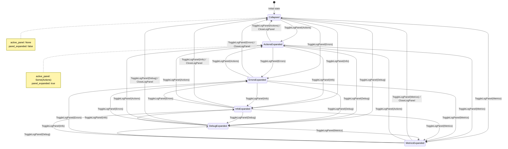

# UI Layout Specification

## 1. Overview

This document defines the complete UI layout structure for rustation v3 desktop application, including the main layout, navigation, and panel management.

## 2. Core Layout Structure

### 2.1 Overall Layout

```
┌────────────────────────────────────────────────────────────────────────────────────┐
│  Project Tabs: [*proj-1] [proj-2] [+]                    📸 Screenshot 🐳 Docker 🔔│
├──────────┬───────────────────────────────────────────────────────────────────────┬──┤
│          │                                                                       │  │
│  Sidebar │                    Main Content Area                                 │ R│
│          │                                                                       │ i│
│   Flow   │  ┌──────────────────────────────────────────────────────────────┐   │ g│
│          │  │                                                              │   │ h│
│   🤖     │  │  Feature-specific content                                    │   │ t│
│  Claude  │  │  (Tasks / Docker / Workflows / etc.)                         │   │  │
│          │  │                                                              │   │ I│
│   📋     │  └──────────────────────────────────────────────────────────────┘   │ c│
│  Tasks   │                                                                       │ o│
│          │                                                                       │ n│
│   🐳     │                                                                       │  │
│  Docker  │                                                                       │ B│
│          │                                                                       │ a│
│   💬     │                                                                       │ r│
│  Chat    │                                                                       │  │
│          │                                                                       │  │
│   ⚙️     │                                                                       │  │
│ Settings │                                                                       │  │
│          │                                                                       │  │
└──────────┴───────────────────────────────────────────────────────────────────────┴──┘
```

### 2.2 Layout Dimensions

- **Window**: 1200x800 default, min 800x600
- **Sidebar**: Fixed 60px width (icon-only)
- **Right Icon Bar**: Fixed 48px width
- **Main Content**: Flexible (fills remaining space)

## 3. Right Icon Bar (Log Panel Management)

### 3.1 Purpose

The Right Icon Bar provides a space-efficient way to access different types of logs and debug information without cluttering the main content area.

### 3.2 Icon Bar Structure

```
┌────┐
│ 📋 │ <- Actions Log (default)
├────┤
│ ⚠️ │ <- Error Log
├────┤
│ ℹ️  │ <- Info Log
├────┤
│ 🔍 │ <- Debug Log
├────┤
│ 📊 │ <- Performance Metrics
└────┘
```

### 3.3 Icon Definitions

| Icon | Category | Description | Badge |
|------|----------|-------------|-------|
| 📋 | Actions | All action logs (RS/ACT entries) | Count of entries |
| ⚠️ | Errors | Error messages and failures | Error count |
| ℹ️ | Info | General information logs | Info count |
| 🔍 | Debug | Debug-level logs | Debug count |
| 📊 | Metrics | Performance and stats | - |

### 3.4 Interaction States

#### Collapsed State (Default)
```
┌────┐
│ 📋 │ <- Icon with badge (35)
│ 35 │
└────┘
```

#### Expanded State (Active)
```
┌─────────────────────────────────┬────┐
│  Actions Log (35)           ✕   │ 📋 │ <- Highlighted (Active)
│  ───────────────────────────    │ 35 │
│  › RS  ACT  OpenProject         ├────┤
│  › RS  ACT  ClearConst...       │ ⚠️ │
│  › RS  ACT  CheckConst...       │  3 │
│  › RS  ACT  SetClaudeMd...      ├────┤
│  › RS  ACT  RefreshContext      │ ℹ️  │
│  ...                            │  8 │
└─────────────────────────────────┴────┘
     Expanded Panel (300px)        Icon Bar
```

### 3.5 Behavior Specification

1. **Default State**: All panels collapsed, only icons visible
2. **Single Panel Active**: Only one panel can be expanded at a time
3. **Toggle**:
   - Click icon → Expand panel (slide in from right)
   - Click same icon again → Collapse panel
   - Click different icon → Switch to that panel (no collapse animation)
4. **Close**: Click ✕ button in panel header → Collapse panel
5. **Panel Width**: Fixed 300px when expanded
6. **Animation**: 200ms ease-in-out slide transition

### 3.6 Panel Structure

Each expanded panel follows this structure:

```tsx
<Panel>
  <Header>
    <Title>{Category Name} ({Count})</Title>
    <CloseButton>✕</CloseButton>
  </Header>
  <Content>
    <LogList>
      {entries.map(entry => (
        <LogEntry
          timestamp={entry.timestamp}
          level={entry.level}
          message={entry.message}
          expandable={entry.hasDetails}
        />
      ))}
    </LogList>
  </Content>
  <Footer>
    <ClearButton>Clear All</ClearButton>
    <ExportButton>Export</ExportButton>
  </Footer>
</Panel>
```

## 4. Left Sidebar

### 4.1 Navigation Icons

Fixed vertical icon bar for primary navigation:

| Icon | Tab | Description |
|------|-----|-------------|
| 🌊 | Flow | Workflow overview |
| 🤖 | Claude | AI assistant interaction |
| 📋 | Tasks | Justfile command runner |
| 🐳 | Docker | Container management |
| 💬 | Chat | Communication panel |
| 🏃 | RUN | Quick run commands |
| 🖥️ | Term | Terminal integration |
| ⚙️ | Settings | Configuration |

### 4.2 Behavior

- **Active Indicator**: Colored background on selected tab
- **Tooltip**: Show full name on hover (after 500ms delay)
- **Width**: Fixed 60px

## 5. Project Tabs (Top)

### 5.1 Structure

```
┌────────────────────────────────────────────────────────┐
│ [*proj-1] [proj-2] [proj-3] [+]       📸 Screenshot... │
└────────────────────────────────────────────────────────┘
```

### 5.2 Behavior

- **Active Tab**: Indicated by `*` prefix and visual styling
- **New Tab**: `[+]` button opens project selector
- **Close Tab**: Hover → show ✕ button
- **Max Tabs**: No limit, horizontal scroll if overflow

## 6. Main Content Area

### 6.1 Responsive Behavior

The main content area adjusts its width based on:
- Right Icon Bar state (collapsed: +300px, expanded: -0px)
- Sidebar width (fixed -60px)

```
Available Width = Window Width - Sidebar Width - Icon Bar Width - (Panel Width if expanded)
                = 1200px - 60px - 48px - (300px if expanded)
                = 1092px (collapsed) or 792px (expanded)
```

### 6.2 Content Padding

- **Top**: 16px
- **Right**: 16px (adjust when panel expanded)
- **Bottom**: 16px
- **Left**: 16px

## 7. Theme Support

### 7.1 Color Variables

```css
/* Light Theme */
--sidebar-bg: #f5f5f5;
--icon-bar-bg: #ffffff;
--panel-bg: #ffffff;
--panel-border: #e0e0e0;
--active-icon-bg: #3b82f6;
--active-icon-color: #ffffff;

/* Dark Theme */
--sidebar-bg: #1e1e1e;
--icon-bar-bg: #252525;
--panel-bg: #2a2a2a;
--panel-border: #3a3a3a;
--active-icon-bg: #3b82f6;
--active-icon-color: #ffffff;
```

## 8. Accessibility

### 8.1 Keyboard Navigation

- `Tab`: Cycle through focusable elements
- `Shift+Tab`: Reverse cycle
- `Escape`: Close active panel
- `Alt+1-5`: Toggle panels 1-5 (Actions, Errors, Info, Debug, Metrics)

### 8.2 Screen Reader Support

- All icons have `aria-label` attributes
- Panel state announced on toggle (opened/closed)
- Log entry count announced

## 9. State Machine

### 9.1 State Diagram

The UI Layout follows a simple state machine where only one panel can be active at a time.



### 9.2 State Invariants

1. **Single Active Panel**: Only one panel can be expanded at a time
2. **Consistent Flags**: `panel_expanded == true` ⟺ `active_panel.is_some()`
3. **Width Persistence**: `panel_width` is preserved across state transitions
4. **Idempotent Collapse**: Calling `CloseLogPanel` when `Collapsed` has no effect

### 9.3 State Transitions

| Current State | Action | Next State | Side Effects |
|---------------|--------|------------|--------------|
| Collapsed | ToggleLogPanel(X) | X Expanded | Set active_panel = Some(X), panel_expanded = true |
| X Expanded | ToggleLogPanel(X) | Collapsed | Set active_panel = None, panel_expanded = false |
| X Expanded | ToggleLogPanel(Y) | Y Expanded | Set active_panel = Some(Y), keep panel_expanded = true |
| Any | CloseLogPanel | Collapsed | Set active_panel = None, panel_expanded = false |
| Any | SetLogPanelWidth(w) | Same | Update panel_width = w |

## 10. Implementation Notes

### 10.1 State Management

```rust
// In Rust AppState
pub struct UiLayoutState {
    pub active_panel: Option<LogPanelType>,
    pub panel_width: u32, // 300
    pub panel_expanded: bool,
}

pub enum LogPanelType {
    Actions,
    Errors,
    Info,
    Debug,
    Metrics,
}
```

### 10.2 React Components

```
components/
├── layout/
│   ├── RightIconBar.tsx
│   ├── LogPanel.tsx
│   ├── LeftSidebar.tsx
│   └── MainLayout.tsx
```

## 11. Future Enhancements

- [ ] Resizable panel width (drag handle)
- [ ] Panel position preference (left/right)
- [ ] Multiple panels open simultaneously (split view)
- [ ] Floating panel mode (detachable)
- [ ] Custom panel ordering

---

## References

- `01-system-specification.md` - Overall system architecture
- `01-ui-component-architecture.md` - Component structure
- `02-state-first-principle.md` - State management principles
