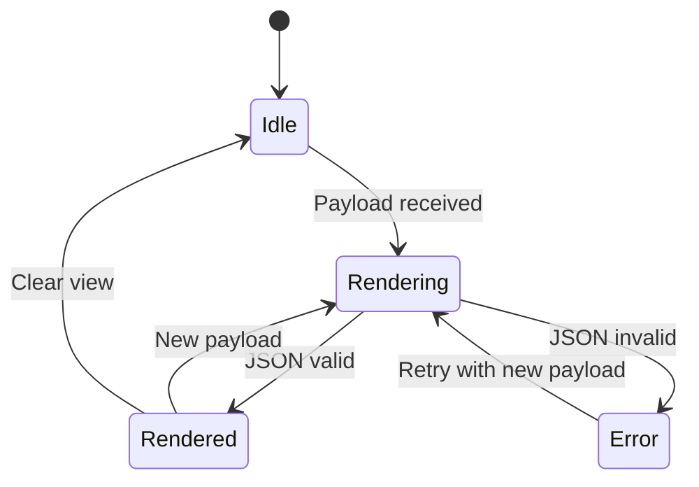

# A2UI Integration

## 1. Overview

**A2UI (Agent-to-UI)** is an experimental feature that allows the backend (or an AI Agent via MCP) to define user interfaces dynamically using JSON. This enables "Server-Driven UI" where the layout and content are not hardcoded in the frontend.

## 2. Architecture

### 2.1 The Renderer
A recursive React component (`A2UIRenderer`) that traverses a JSON tree and maps node types to native React components.

**Location**: `apps/desktop/src/renderer/src/features/a2ui/`

### 2.2 The Registry
A mapping table (`registry.tsx`) that connects JSON `type` strings to actual React components.

**Supported Components**:
- **Primitives**: `div`, `span`, `text`
- **MUI**: `card`, `button`, `text-field`, `chip`, `alert`, `scroll-area`
- **Icons**: `icon-alert`, `icon-info`, etc.

### 2.3 Protocol (Simplified)

```pseudo-code
{
  "type": "card",
  "props": { "sx": { "p": 2 } },
  "children": [
    { "type": "card-title", "children": ["Hello World"] },
    {
      "type": "button",
      "props": { "variant": "default" },
      "children": ["Click Me"],
      "action": { "type": "mcp:submit", "data": "..." }
    }
  ]
}
```

## 3. Integration with MCP

The goal is to allow Claude Code (or other agents) to send this JSON structure via an MCP tool (e.g., `render_ui`), which `rstn` then displays in the A2UI tab.

## 3.1 A2UI Rendering State Machine



## 4. Current Status

- [x] **Renderer**: Implemented and recursive.
- [x] **Registry**: Mapped to standard MUI components.
- [x] **Page**: Added `A2UIPage` with a static demo payload.
- [ ] **MCP Tool**: Backend needs to expose a tool to accept JSON and push event to frontend.
- [ ] **Interactive**: Handling `action` events and sending them back to the backend.
