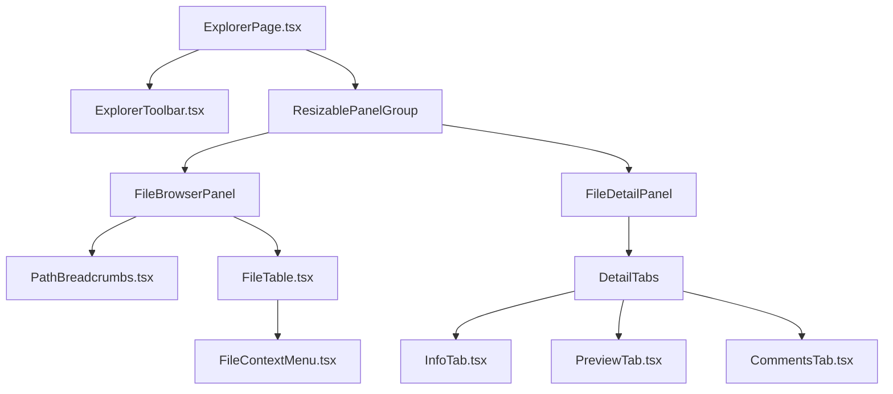

# File Explorer & Details UI

## 1. Overview

The File Explorer is a full-featured file management module integrated with Git status and project-specific annotations (comments). It follows the **Master-Detail** pattern and supports advanced navigation.

---

## 2. State Structure (Rust)

Stored in `WorktreeState.explorer`.

```rust
pub struct FileExplorerState {
    pub current_path: String,          // Absolute path being viewed
    pub entries: Vec<FileEntry>,       // Sorted & filtered list
    pub selected_path: Option<String>, // Currently selected file/dir
    pub sort_config: SortConfig,       // Sorting preferences
    pub filter_query: String,          // Search query
    pub history: NavigationHistory,    // Back/Forward stacks
    pub git_status: HashMap<String, GitFileStatus>, // Path -> Status
    pub clipboard: Option<FileClipboard>, // Copy/Cut state
    pub is_loading: bool,
    pub preview: Option<FilePreview>,
}

pub struct NavigationHistory {
    pub back_stack: Vec<String>,
    pub forward_stack: Vec<String>,
}

pub struct FileEntry {
    pub name: String,
    pub path: String,
    pub kind: FileKind, // File, Directory, Symlink
    pub size: u64,
    pub permissions: String, // Unix mode string
    pub updated_at: String,
    pub comment_count: usize,
    pub git_status: Option<GitFileStatus>, // Derived from map
}

#[derive(Serialize, Deserialize)]
pub enum GitFileStatus {
    Modified,
    Added,
    Deleted,
    Untracked,
    Ignored,
    Clean,
}
```

---

## 3. Features

### 3.1 Advanced Navigation
- **History**: Back/Forward buttons (like browser/finder).
- **Breadcrumbs**: Clickable path segments.
- **Go to Parent**: `Backspace` key support.

### 3.2 File List (Master)
- **Visuals**:
    - File icons based on extension.
    - **Git Status Color**: Green (Added), Yellow (Modified), Gray (Ignored).
- **Interactions**:
    - **Click**: Select & Load Preview.
    - **Double Click**: Enter directory.
    - **Context Menu**:
        - Open in OS (Finder/Explorer)
        - Copy Path / Copy Relative Path
        - Rename (F2)
        - Delete (Del) -> Move to Trash
        - New File / New Folder

### 3.3 Detail Panel (Detail)
- **Info Tab**: 
    - Full path, size, dates.
    - Permissions visualizer (rwx-rwx-rwx).
- **Preview Tab**: 
    - Text: Syntax highlighted code (read-only).
    - Image: Thumbnail.
- **Comments Tab**: 
    - Threaded discussion UI.
    - Stored in local SQLite (`.rstn/rstn.db`).

---

## 4. Component Architecture (React)

Located in `src/features/explorer/`.



---

## 5. Actions

| Action | Payload | Description |
|--------|---------|-------------|
| `ExploreDir` | `{ path }` | Load directory content |
| `NavigateBack` | - | Pop from back stack |
| `NavigateForward` | - | Pop from forward stack |
| `NavigateUp` | - | Go to parent directory |
| `SelectFile` | `{ path }` | Select & Preview |
| `CreateFile` | `{ path, kind }` | Create new file/folder |
| `RenameFile` | `{ old_path, new_name }` | Rename item |
| `DeleteFile` | `{ path }` | Move to trash |
| `RevealInOS` | `{ path }` | Open system file explorer |
| `AddFileComment`| `{ path, content }` | Persist comment |

---

## 6. Implementation Notes

- **Git Integration**: The backend should run `git status --porcelain` asynchronously when loading a directory to populate `git_status`.
- **Performance**: `FileEntry` list should be virtualized (using `tanstack/react-virtual` or similar) to handle 10k+ files.
- **Security**: All file operations must be validated against `project_root` to prevent path traversal.

## 7. References
- [SQLite Database Design](../architecture/04-sqlite-database.md)