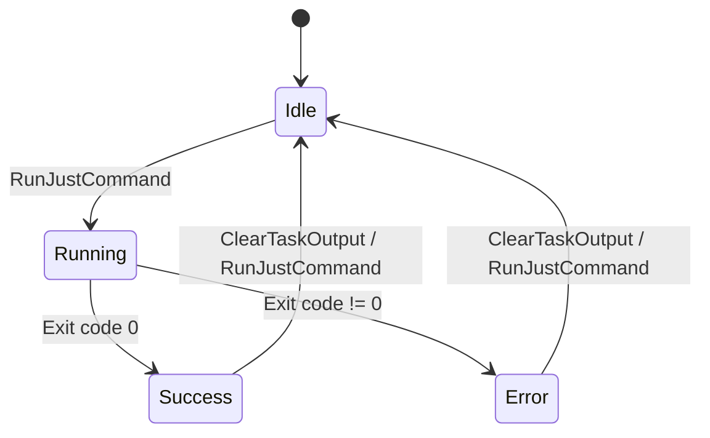
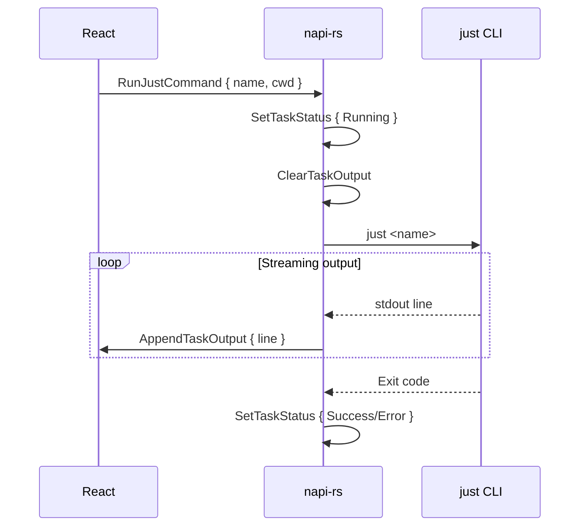

# Tasks Tab (Justfile Runner)

## Overview

The Tasks tab provides a GUI for running [just](https://github.com/casey/just) commands defined in your project's `justfile`.

---

## Features

### Command List

```
┌─────────────────────────────────────────────────────┐
│ Commands                                            │
├─────────────────────────────────────────────────────┤
│ ┌─────────────────────────────────────────────────┐ │
│ │ build                              [▶ Run]      │ │
│ │ Build the project                               │ │
│ └─────────────────────────────────────────────────┘ │
│ ┌─────────────────────────────────────────────────┐ │
│ │ test                               [▶ Run]      │ │
│ │ Run all tests                                   │ │
│ └─────────────────────────────────────────────────┘ │
└─────────────────────────────────────────────────────┘
```

- **Parse justfile** from project root
- **Display commands** with descriptions
- **Run button** per command
- **Status indicator**: Idle, Running, Success, Error

### Output Panel

- **Real-time streaming** from command execution
- **Auto-scroll** to latest output
- **Clear output** between runs
- **Copy to clipboard**

### Task Execution State Machine



---

## Justfile Parsing

### Supported Format

```just
# Build the project
build:
    cargo build --release

# Run all tests
test:
    cargo test

# Format code
fmt:
    cargo fmt
```

### Extracted Information

| Field | Source |
|-------|--------|
| `name` | Recipe name |
| `description` | Comment above recipe |
| `recipe` | Full recipe content |

---

## Actions

| Action | Payload | Description |
|--------|---------|-------------|
| `LoadJustfileCommands` | `{ path: string }` | Parse justfile |
| `SetJustfileCommands` | `{ commands: [] }` | Set parsed commands |
| `RunJustCommand` | `{ name, cwd }` | Execute command |
| `SetTaskStatus` | `{ name, status }` | Update task status |
| `SetActiveCommand` | `{ name: string }` | Set running command |
| `AppendTaskOutput` | `{ line: string }` | Add output line |
| `ClearTaskOutput` | - | Clear output panel |
| `SetTasksLoading` | `{ is_loading }` | Set loading state |
| `SetTasksError` | `{ error: string }` | Set error message |

---

## Backend Implementation

### Justfile Parser

```rust
// packages/core/src/justfile.rs

pub struct JustCommand {
    pub name: String,
    pub description: Option<String>,
    pub recipe: String,
}

pub fn justfile_parse(path: &str) -> Vec<JustCommand>
pub fn justfile_run(command: &str, cwd: &str) -> String
```

### Execution Flow



---

## UI Components

### TasksPage.tsx

- **Command list**: TaskCard for each command
- **Output panel**: LogPanel with streaming output
- **Loading state**: While parsing justfile
- **Error state**: No justfile found

### TaskCard.tsx

- **Command name** and description
- **Status badge** (idle/running/success/error)
- **Run button** (disabled while running)

---

## State Structure

```typescript
interface TasksState {
  commands: JustCommandInfo[]
  task_statuses: Record<string, TaskStatus>
  active_command: string | null
  output: string[]
  is_loading: boolean
  error: string | null
}

interface JustCommandInfo {
  name: string
  description: string | null
  recipe: string
}

type TaskStatus = 'idle' | 'running' | 'success' | 'error'
```

---

## Per-Worktree Isolation

Each worktree maintains its own:
- Parsed commands (different justfile per worktree)
- Task statuses
- Output buffer

Switching worktrees preserves task context.

---

## References

- [Architecture Overview](../architecture/00-overview.md)
- [State Topology](../architecture/02-state-topology.md)
