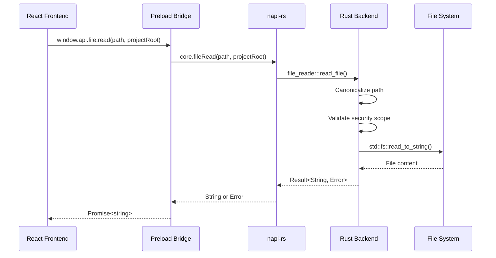

# File Reader API

## Overview

The File Reader API provides secure file reading within allowed scopes:
- Project root directory (and subdirectories)
- `~/.rstn/` directory (and subdirectories)

## API

### `window.api.file.read(path: string, projectRoot: string): Promise<string>`

Read a file from allowed scopes.

**Parameters:**
- `path` - Absolute path to the file
- `projectRoot` - Project root directory (used for security scope validation)

**Returns:** File contents as UTF-8 string

**Throws:** Error with one of these codes:
- `FILE_NOT_FOUND` - File does not exist
- `PERMISSION_DENIED` - OS permission denied
- `SECURITY_VIOLATION` - Path outside allowed scope
- `FILE_TOO_LARGE` - File exceeds 10MB limit
- `NOT_UTF8` - File is not valid UTF-8 text

## Usage Example

```pseudo-code
// In a workflow component
worktreePath = state.active_project?.worktrees[0]?.path
if worktreePath:
  try:
    content = await window.api.file.read(
      worktreePath + "/.rstn/constitution.md",
      worktreePath
    )
    console.log(content)
  catch error:
    if error.message contains 'FILE_NOT_FOUND':
      console.log('Constitution not found')
```

## Security Model

1. **Path Canonicalization**: All paths are canonicalized to resolve symlinks and `..` components
2. **Scope Validation**: Canonicalized path must start with an allowed root
3. **Allowed Roots**:
   - `projectRoot` parameter (the worktree/project path)
   - `~/.rstn/` (global rstn config directory)

### Security Tests

Path traversal attacks are prevented:
```
/project/../../../etc/passwd  -->  SECURITY_VIOLATION
/project/./src/../../../etc   -->  SECURITY_VIOLATION
```

## Constraints

- **File Size**: Maximum 10MB (10,485,760 bytes)
- **Encoding**: UTF-8 only (binary files not supported)
- **Scope**: Read-only (no write API in Phase 1)

## Architecture



## Implementation Files

| File | Purpose |
|------|---------|
| `packages/core/src/file_reader.rs` | Core Rust implementation |
| `packages/core/src/lib.rs` | napi-rs export (`file_read`) |
| `apps/desktop/src/preload/index.ts` | Bridge to frontend |
| `apps/desktop/src/preload/index.d.ts` | TypeScript types |

## Related

- `persistence.rs` - Uses `get_rstn_dir()` for `~/.rstn/` path
- TODOS.md - File Operations Roadmap (Phase 1-3)
