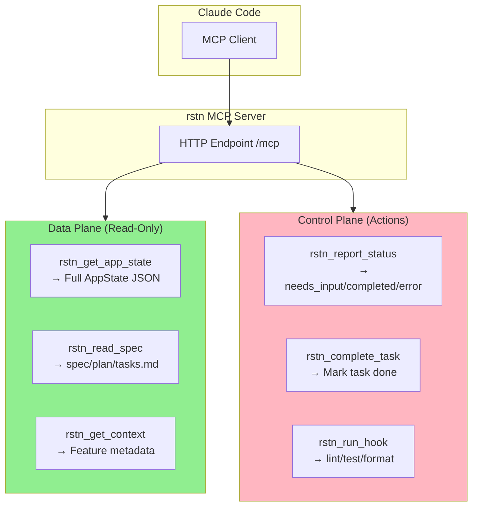
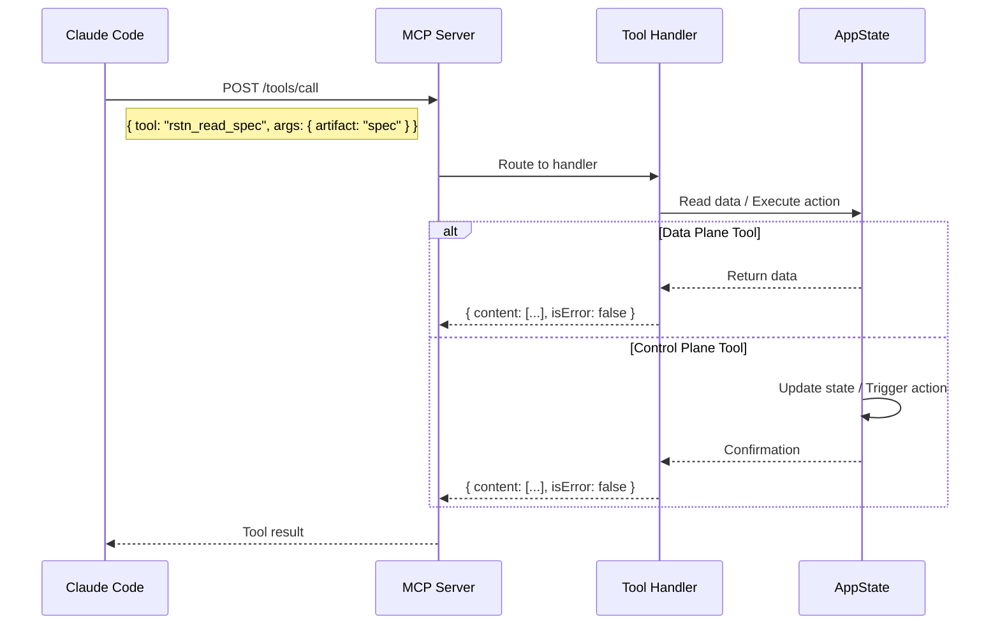

# rstn MCP Tool Reference

This document provides detailed schemas and examples for all MCP tools provided by rstn.

## Overview

rstn exposes six MCP tools for Claude Code to interact with the TUI:

| Tool | Category | Purpose |
|------|----------|---------|
| `rstn_get_app_state` | Data | Get full TUI application state as JSON |
| `rstn_report_status` | Control | Report task status changes (needs_input, completed, error) |
| `rstn_read_spec` | Data | Read spec artifacts from current feature |
| `rstn_get_context` | Data | Get current feature context and metadata |
| `rstn_complete_task` | Control | Mark a task as complete with validation |
| `rstn_run_hook` | Control | Run project-configured hook (lint, test, format) |

### Tool Architecture Diagram



### Tool Request/Response Sequence



---

## rstn_get_app_state

**Category**: Data Plane
**Purpose**: Get full TUI application state as JSON

Use this tool to inspect the complete application state for debugging or context.

### Input Schema

```json
{
  "type": "object",
  "properties": {},
  "required": []
}
```

No parameters required - returns complete application state.

### Response Structure

```json
{
  "running": true,
  "current_view": "worktree",
  "project_root": "/path/to/project",
  "worktree_view": {
    "commands": [...],
    "selected_command_index": 0,
    "workflow_output": "...",
    "status_message": "Ready"
  },
  "active_workflows": {...}
}
```

### Use Cases

- Debug current TUI state
- Inspect active workflows
- Get current view and focus information

---

## rstn_report_status

**Category**: Control Plane
**Purpose**: Report current task status to rstn control plane

Use this tool to communicate status changes during SDD workflows:
- Request user input
- Signal task completion
- Report errors

### Input Schema

```json
{
  "type": "object",
  "properties": {
    "status": {
      "type": "string",
      "enum": ["needs_input", "completed", "error"],
      "description": "Current task status"
    },
    "prompt": {
      "type": "string",
      "description": "Prompt to show user (for needs_input)"
    },
    "message": {
      "type": "string",
      "description": "Error message (for error status)"
    }
  },
  "required": ["status"]
}
```

### Parameters

| Parameter | Type | Required | Description |
|-----------|------|----------|-------------|
| `status` | string | Yes | One of: "needs_input", "completed", "error" |
| `prompt` | string | No | Prompt text for needs_input status |
| `message` | string | No | Error message for error status |

### Examples

**Request user input:**
```json
{
  "status": "needs_input",
  "prompt": "Please describe the feature you want to implement"
}
```

**Signal completion:**
```json
{
  "status": "completed"
}
```

**Report error:**
```json
{
  "status": "error",
  "message": "Could not find spec directory for feature 060"
}
```

### Response

```json
{
  "content": [
    {
      "type": "text",
      "text": "Status 'needs_input' reported successfully"
    }
  ],
  "isError": false
}
```

### Behavior

- **needs_input**: Opens input dialog in TUI, keeps command running
- **completed**: Marks command done, updates status message
- **error**: Marks command done, shows error in status bar

---

## rstn_read_spec

**Category**: Data Plane
**Purpose**: Read a spec artifact for the current feature

Use this tool to access spec-kit artifacts without file system operations.

### Input Schema

```json
{
  "type": "object",
  "properties": {
    "artifact": {
      "type": "string",
      "enum": ["spec", "plan", "tasks", "checklist", "analysis"],
      "description": "Artifact to read"
    }
  },
  "required": ["artifact"]
}
```

### Parameters

| Parameter | Type | Required | Description |
|-----------|------|----------|-------------|
| `artifact` | string | Yes | One of: "spec", "plan", "tasks", "checklist", "analysis" |

### Artifact Mapping

| Artifact | Filename | Purpose |
|----------|----------|---------|
| `spec` | `spec.md` | Feature specification (WHAT to build) |
| `plan` | `plan.md` | Implementation plan (HOW to build) |
| `tasks` | `tasks.md` | Task breakdown with dependencies |
| `checklist` | `checklist.md` | Validation checklist |
| `analysis` | `analysis.md` | Cross-artifact consistency analysis |

### Examples

**Read spec:**
```json
{
  "artifact": "spec"
}
```

**Read tasks:**
```json
{
  "artifact": "tasks"
}
```

### Response (Success)

```json
{
  "content": [
    {
      "type": "text",
      "text": "# Feature 060: MCP Server Infrastructure\n\n**Feature Branch**: `060-mcp-server-infrastructure`\n..."
    }
  ],
  "isError": false
}
```

### Response (Not Found)

```json
{
  "content": [
    {
      "type": "text",
      "text": "Artifact 'spec' not found. Feature context: None"
    }
  ],
  "isError": true
}
```

### Error Cases

- **No feature context**: Returns error if not in a feature worktree
- **File not found**: Returns error if artifact doesn't exist
- **Invalid artifact**: Validation error for unknown artifact names

---

## rstn_get_context

**Category**: Data Plane
**Purpose**: Get current feature context and metadata

Use this tool to understand the current development context.

### Input Schema

```json
{
  "type": "object",
  "properties": {},
  "required": []
}
```

No parameters required - returns current feature context.

### Response Structure

```json
{
  "feature_number": "060",
  "feature_name": "mcp-server-infrastructure",
  "branch": "060-mcp-server-infrastructure",
  "phase": "implement",
  "spec_dir": "specs/060-mcp-server-infrastructure"
}
```

### Fields

| Field | Type | Description |
|-------|------|-------------|
| `feature_number` | string? | Feature number (e.g., "060") |
| `feature_name` | string? | Feature name (e.g., "mcp-server-infrastructure") |
| `branch` | string? | Git branch name |
| `phase` | string? | Current SDD phase ("specify", "plan", "tasks", "implement") |
| `spec_dir` | string? | Path to spec directory |

All fields are optional and will be `null` if not in a feature worktree.

### Examples

**When in feature worktree:**
```json
{
  "content": [
    {
      "type": "text",
      "text": "{\"feature_number\":\"062\",\"feature_name\":\"mcp-resource-tools\",\"branch\":\"062-mcp-resource-tools\",\"phase\":\"implement\",\"spec_dir\":\"specs/062-mcp-resource-tools\"}"
    }
  ],
  "isError": false
}
```

**When not in feature worktree:**
```json
{
  "content": [
    {
      "type": "text",
      "text": "{\"feature_number\":null,\"feature_name\":null,\"branch\":null,\"phase\":null,\"spec_dir\":null}"
    }
  ],
  "isError": false
}
```

### Use Cases

- Determine current feature before reading specs
- Validate feature context before operations
- Get spec directory path for file operations

---

## rstn_complete_task

**Category**: Control Plane
**Purpose**: Mark a task as complete with optional validation

Use this tool to mark tasks complete in `tasks.md` during implementation.

### Input Schema

```json
{
  "type": "object",
  "properties": {
    "task_id": {
      "type": "string",
      "description": "Task ID (e.g., T001, T002)"
    },
    "skip_validation": {
      "type": "boolean",
      "default": false,
      "description": "Skip validation checks"
    }
  },
  "required": ["task_id"]
}
```

### Parameters

| Parameter | Type | Required | Description |
|-----------|------|----------|-------------|
| `task_id` | string | Yes | Task ID from tasks.md (e.g., "T001") |
| `skip_validation` | boolean | No | Skip validation checks (default: false) |

### Examples

**Complete task:**
```json
{
  "task_id": "T001"
}
```

**Complete without validation:**
```json
{
  "task_id": "T005",
  "skip_validation": true
}
```

### Response (Success)

```json
{
  "content": [
    {
      "type": "text",
      "text": "Task T001 marked for completion. Processing..."
    }
  ],
  "isError": false
}
```

### Behavior

1. Finds task by ID in current feature's tasks.md
2. Marks task as complete: `- [ ] T001` → `- [x] T001`
3. Saves updated tasks.md
4. Sends `Event::McpTaskCompleted` to TUI
5. TUI updates display and shows progress (e.g., "3/10 tasks complete")

### Error Cases

| Error | Cause | Message |
|-------|-------|---------|
| Task not found | Invalid task_id | "Task T999 not found" |
| No task list | Not in implement phase | "No task list loaded" |
| No feature context | Not in feature worktree | "No feature context" |

---

## rstn_run_hook

**Category**: Control Plane
**Purpose**: Run a project-configured hook command

Use this tool to execute project-specific commands like linting, testing, or formatting.

### Input Schema

```json
{
  "type": "object",
  "properties": {
    "hook_name": {
      "type": "string",
      "description": "Name of the hook (e.g., lint, test, format)"
    },
    "args": {
      "type": "array",
      "items": {"type": "string"},
      "description": "Additional arguments to pass to the hook"
    }
  },
  "required": ["hook_name"]
}
```

### Parameters

| Parameter | Type | Required | Description |
|-----------|------|----------|-------------|
| `hook_name` | string | Yes | Hook name from `.rstn/hooks.yaml` |
| `args` | string[] | No | Additional arguments |

### Hook Configuration

Hooks are defined in `.rstn/hooks.yaml`:

```yaml
hooks:
  lint:
    command: "uv run ruff check ."
    timeout_secs: 60
  test:
    command: "uv run pytest"
    timeout_secs: 300
  format:
    command: "uv run ruff format ."
    timeout_secs: 60
```

### Examples

**Run lint:**
```json
{
  "hook_name": "lint"
}
```

**Run test with args:**
```json
{
  "hook_name": "test",
  "args": ["-v", "--tb=short"]
}
```

### Response (Success)

```json
{
  "content": [
    {
      "type": "text",
      "text": "{\"hook_name\":\"lint\",\"exit_code\":0,\"stdout\":\"All checks passed!\",\"stderr\":\"\",\"duration_secs\":1.5}"
    }
  ],
  "isError": false
}
```

### Response (Hook Not Found)

```json
{
  "content": [
    {
      "type": "text",
      "text": "Hook not found: deploy. Available: lint, test, format"
    }
  ],
  "isError": true
}
```

### Use Cases

- Run linting before committing
- Execute tests during implementation
- Format code automatically

---

## Tool Discovery

Claude Code discovers rstn's MCP tools via `~/.rstn/mcp-session.json`:

```json
{
  "mcpServers": {
    "rstn": {
      "type": "http",
      "url": "http://127.0.0.1:{dynamic_port}/mcp"
    }
  }
}
```

**Important**:
- **Protocol**: `"type": "http"` (NOT `"transport": "sse"`)
- **Port**: Dynamically assigned (port 0 → auto-assign), NOT hard-coded 19560
- **Endpoint**: `/mcp` path required
- **Location**: `~/.rstn/mcp-session.json` (NOT `~/.config/claude-code/`)
- **Usage**: Pass to Claude CLI via `--mcp-config ~/.rstn/mcp-session.json`

This file is automatically created when rstn's MCP server starts.

---

## Error Handling

### Validation Errors

```json
{
  "content": [
    {
      "type": "text",
      "text": "Error: Missing 'status' field"
    }
  ],
  "isError": true
}
```

Returned when required parameters are missing or invalid.

### Internal Errors

```json
{
  "content": [
    {
      "type": "text",
      "text": "Error: Failed to send event: channel closed"
    }
  ],
  "isError": true
}
```

Returned when internal operations fail (file I/O, event dispatch, etc.).

---

## Best Practices

### When to use rstn_report_status

✅ **Use for:**
- Requesting user input during workflows
- Signaling phase completion
- Reporting errors that stop execution

❌ **Don't use for:**
- Progress updates (use text output)
- Informational messages (use text output)
- Debugging (use tracing logs)

### When to use rstn_read_spec

✅ **Use for:**
- Reading spec artifacts during implementation
- Validating against requirements
- Understanding task context

❌ **Don't use for:**
- Reading arbitrary files (use file system)
- Modifying specs (specs are read-only via this tool)

### When to use rstn_complete_task

✅ **Use for:**
- Marking tasks complete after implementation
- Tracking progress through task list

❌ **Don't use for:**
- Creating new tasks (modify tasks.md directly)
- Reordering tasks (modify tasks.md directly)

---

## Implementation Reference

For implementation details, see:
- `rstn/mcp/tools.py` - Tool definitions and handlers (McpToolRegistry)
- `rstn/mcp/types.py` - MCP types (McpToolResponse, HookConfig, etc.)
- `rstn/mcp/server.py` - FastAPI server lifecycle (McpServer)
- `rstn/mcp/routes.py` - HTTP endpoints for MCP protocol
- `rstn/mcp/hooks.py` - Hook configuration and execution
- `rstn/msg/__init__.py` - MCP message types
- `rstn/reduce/__init__.py` - MCP reducers
- `tests/test_mcp/` - Unit tests
