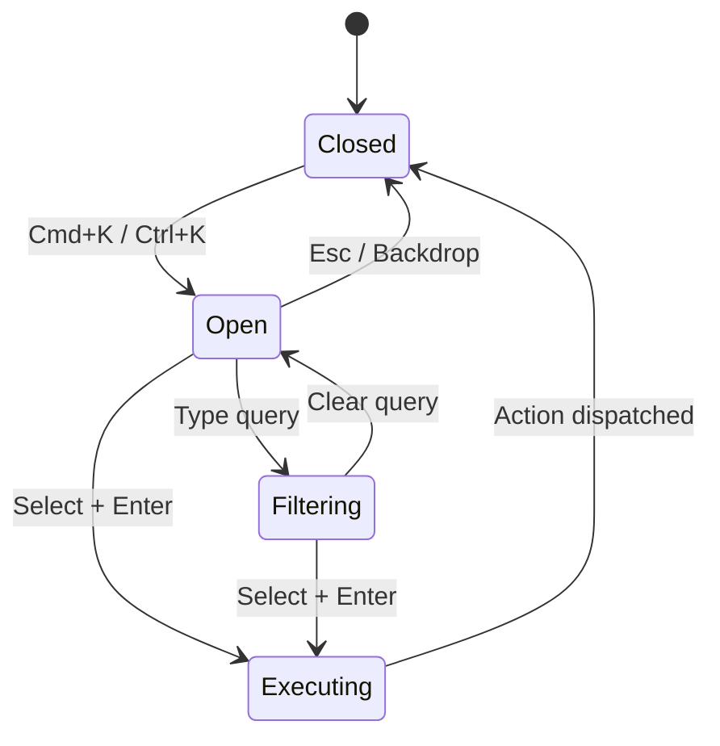

# Feature Spec: Global Command Palette

## 1. Overview

**Goal**: A keyboard-centric "launcher" to navigate projects, worktrees, and run commands.
**Core Value**: Speed. Users should not need to reach for the mouse to switch contexts or run tasks.

## 2. User Stories

1. **Quick Switch**: As a user, I want to type "auth" and jump to the `feature/auth` worktree.
2. **Run Task**: As a user, I want to type "build" and run `just build` in the current worktree.
3. **Toggle View**: As a user, I want to type "docker" to switch to the Docker view.

## 3. UI Design

### Interaction
- **Trigger**: `Cmd+K` (Mac) or `Ctrl+K` (Win/Linux).
- **Behavior**: Modal overlay centered on screen.
- **Closing**: `Esc` or clicking backdrop.

### Layout
```
+-------------------------------------------------------+
| > Type a command or search...                         |
+-------------------------------------------------------+
| PROJECTS                                              |
|   my-app                                              |
|   rustation                                           |
| WORKTREES                                             |
|   main                                                |
|   feature/auth                                        |
| ACTIONS                                               |
|   Run: just build                                     |
|   Run: just test                                      |
|   View: Docker                                        |
|   View: Settings                                      |
+-------------------------------------------------------+
```

## 4. State Architecture

### Frontend State (React)
- `isOpen`: boolean
- `searchQuery`: string
- `selectedIndex`: number

### Command Palette State Machine



### Data Sources
- **Projects**: `appState.projects`
- **Worktrees**: `appState.active_project.worktrees`
- **Tasks**: `appState.active_worktree.tasks`
- **Global Actions**: Hardcoded list (Theme, Views).

## 5. Actions & API

No new Backend Actions needed specifically for the palette. It calls existing actions:
- `SwitchProject`
- `SwitchWorktree`
- `RunJustCommand`
- `SetActiveView`

## 6. Implementation Plan

### Phase 1: Basic UI
- Install `cmdk` (Radix UI primitive for command menus) or build custom.
- Global keyboard listener in `App.tsx`.
- Basic rendering of static actions.

### Phase 2: Data Connection
- Connect to Redux/Context state to filter Projects/Worktrees.
- Fuzzy search implementation (using `cmdk` built-in or `fuse.js`).

### Phase 3: Task Integration
- Fetch tasks from active worktree state.
- Add "Run Task: ..." items.

## 7. Testing Strategy
- **E2E**:
  - Open app, press Cmd+K.
  - Type substring of worktree name.
  - Press Enter.
  - Verify worktree switched.
