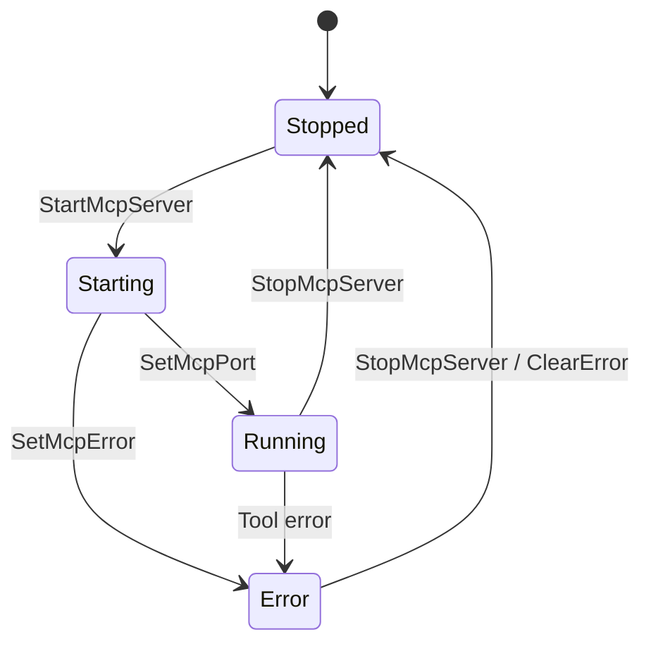

# Feature Spec: MCP Inspector Dashboard

## 1. Overview

**Goal**: Provide visibility into the embedded MCP server's operations.
**Core Value**: Debugging. When Claude says "I can't read that file", the user can check the Inspector to see if the tool call failed or was denied.

## 2. User Stories

1. **Status Check**: As a user, I want to see if the MCP server is running and on which port.
2. **Traffic Log**: As a user, I want to see a log of incoming tool calls (Request) and outgoing results (Response).
3. **Error Debugging**: As a user, I want to see stack traces for failed tool executions.

## 3. UI Design

### Location
- **View**: Settings -> "MCP" (Worktree Scope) OR a dedicated "Inspector" panel.

### Layout
```
+-------------------------------------------------------+
| MCP Server: RUNNING (Port 3456)      [Stop] [Restart] |
| Clients Connected: 1 (Claude Desktop)                 |
+-------------------------------------------------------+
| Traffic Log                                           |
| ----------------------------------------------------- |
| [10:05:22] IN  tools/call "read_file" {"path": "src/main.rs"}
| [10:05:22] OUT result "fn main() { ... }"             |
| [10:06:00] IN  tools/call "run_task" {"name": "test"} |
| [10:06:01] OUT error "Task 'test' not found"          |
+-------------------------------------------------------+
```

## 4. State Architecture

### Frontend State
- `log_entries`: Array of `{ timestamp, direction, method, payload }`.
- Note: High-volume logs should probably *not* be stored in Redux/AppState permanently to avoid bloat. Streaming them via a specific "Log Channel" event is better.

### MCP Inspector UI State Machine



## 5. Implementation Plan

### Phase 1: Logging Pipeline
- Add `mcp_log_event` hook in the Rust MCP server.
- Emit events to frontend via `window.api.on('mcp-log', callback)`.

### Phase 2: UI Component
- `LogViewer` component with JSON syntax highlighting.
- Auto-scroll behavior.
- Filter by "Error" / "Tool Call".

## 6. Edge Cases
- **High Volume**: Large file reads will flood the log. Need truncation (e.g., "Result: <2MB data>").
