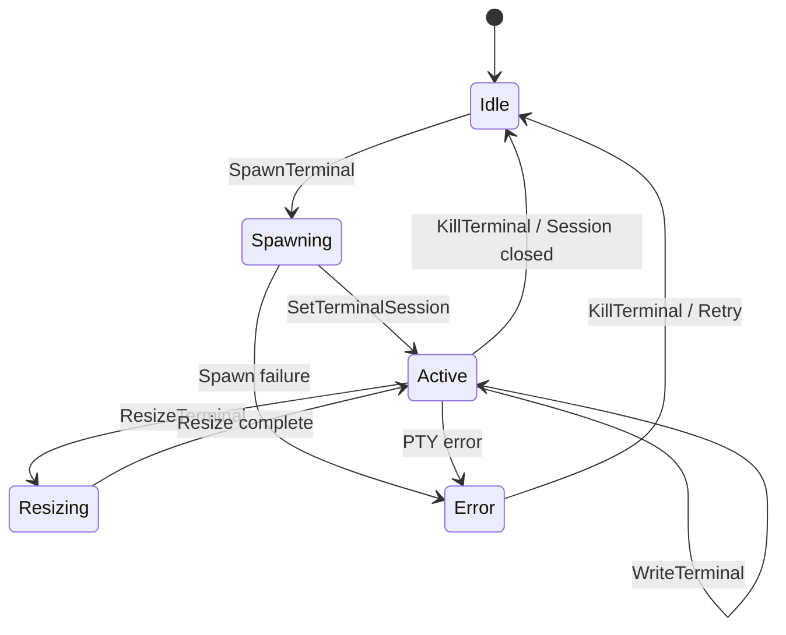

# Feature Spec: Integrated PTY Terminal

## 1. Overview

**Goal**: Embed a fully functional terminal emulator within the application.
**Core Value**: Workflow continuity. Run git commands, install packages, or run manual scripts without alt-tabbing to iTerm/Terminal.

## 2. User Stories

1. **Run Command**: As a user, I want to type `git status` and see the output in color.
2. **Persist**: As a user, I want my terminal session to remain active when I switch tabs (Tasks <-> Settings) within the same worktree.
3. **Multiple**: As a user, I want separate terminal sessions for separate worktrees.

## 3. Architecture

### Frontend
- **Library**: `xterm.js` (standard for web-based terminals).
- **Addons**: `xterm-addon-fit`, `xterm-addon-web-links`.

### Backend
- **Library**: `portable-pty` (Rust crate).
- **Process**: Spawns a shell (`/bin/zsh` or `bash` or `powershell`).
- **IO**:
  - Stdout/Stderr -> Streamed to Frontend via event.
  - Stdin (Keystrokes) -> Sent from Frontend via Action.

## 4. State Management

### WorktreeState
```rust
pub struct TerminalState {
    pub session_id: Option<String>,
    // Actual PTY handle is stored in a separate HashMap<String, PtyPair>
    // because it's not serializable.
}
```

### Terminal Session State Machine



## 5. Actions & API

| Action | Payload | Description |
|--------|---------|-------------|
| `SpawnTerminal` | `{ worktree_id, cols, rows }` | Create PTY |
| `ResizeTerminal` | `{ session_id, cols, rows }` | Handle window resize |
| `WriteTerminal` | `{ session_id, data }` | User input (keystrokes) |
| `KillTerminal` | `{ session_id }` | Close session |

## 6. Edge Cases
- **Zombies**: Ensure PTY processes are killed when the app closes or worktree is removed.
- **Performance**: High-throughput logs (e.g. `yes`) can freeze the bridge. Need flow control/buffering.
