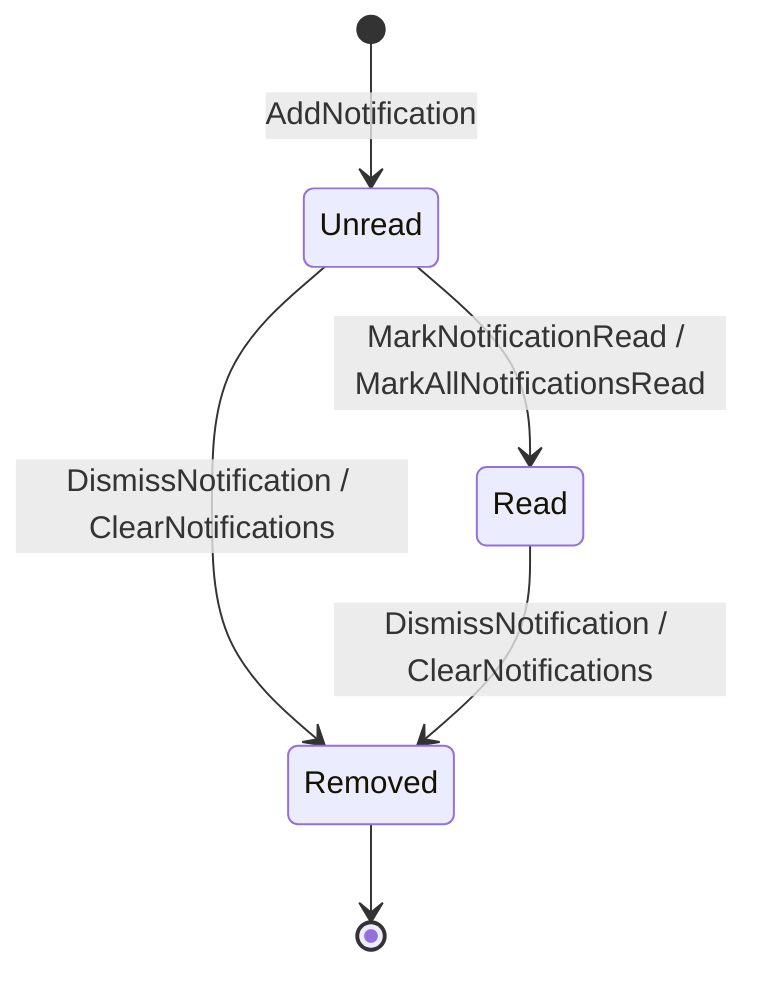

# Feature Spec: Notification Center

## 1. Overview

**Goal**: Centralize all application alerts, success messages, and background errors.
**Core Value**: Observability. "Why did that copy fail?" "Did the Docker service start?"

## 2. User Stories

1. **Toast**: As a user, I want to see a transient popup when an action completes successfully.
2. **History**: As a user, I want to open a drawer to see past notifications I might have missed.
3. **Levels**: As a user, I want clear visual distinction between Info, Success, Warning, and Error.

## 3. UI Design

### Components
1.  **Toaster**: Fixed overlay (bottom-right). Shows active notifications for 5s.
2.  **Drawer**: Slide-over panel from the right. Lists `appState.notifications` in reverse chronological order.

### Layout (Drawer)
```
+-----------------------------------+
| Notifications          [Clear All]|
+-----------------------------------+
| [Success] Copied .env files       |
| 10:00 AM - From main to dev       |
| --------------------------------- |
| [Error] Docker Start Failed       |
| 09:55 AM - Port 5432 in use       |
| [Retry] [Dismiss]                 |
+-----------------------------------+
```

## 4. State Architecture

### Existing State (AppState)
```rust
pub struct Notification {
    pub id: String,
    pub message: String,
    pub notification_type: NotificationType,
    pub timestamp: DateTime<Utc>,
    pub read: bool, // New field needed
}
```

### Notification Lifecycle State Machine



## 5. Actions & API

| Action | Payload | Description |
|--------|---------|-------------|
| `AddNotification` | `{ message, type }` | Create new |
| `DismissNotification` | `{ id }` | Remove from Toast (mark read) |
| `ClearNotifications` | `{ }` | Remove all from history |

## 6. Implementation Plan

### Phase 1: Frontend Toasts
- Use `sonner` or `radix-ui/toast`.
- Listen to state changes in `appState.notifications`.

### Phase 2: Drawer UI
- Create `NotificationDrawer` component.
- Add "Bell" icon to Global Bar (with badge for unread count).

## 7. Extensions
- **Actions**: Notifications can have buttons (e.g., "Undo", "Retry", "View Logs").
