# Contribution Guide (Tauri GUI)

Welcome to rustation v3! This version uses **Tauri v2** with a **React** frontend.

---

## Prerequisites

### Required Tools
- **Rust 1.77+**: Backend logic and Tauri host.
- **Node.js 20+** and **npm/pnpm**: Frontend development.
- **Git**: Version control.

### Recommended Tools
- **Tauri CLI**: `cargo install tauri-cli`.
- **VS Code Extensions**: Rust-analyzer, ES7+ React/Redux/React-Native snippets.

---

## Development Environment Setup

### 1. Clone & Install
```bash
git clone https://github.com/chrischeng-c4/rustation.git
cd rustation
npm install
```

### 2. Run in Development Mode
This starts the Vite dev server and the Tauri window with HMR (Hot Module Replacement).
```bash
npm run tauri dev
```

### 3. Run Tests
- **Backend (Rust)**: `cargo test`
- **Frontend (React)**: `npm test` (Vitest)

---

## 🎯 MANDATORY: State-First Testing (Backend)

The **State-First** principle remains our core architecture. Every feature MUST include state serialization and transition tests in Rust.

```rust
// src-tauri/src/state/your_feature.rs

#[test]
fn test_round_trip() {
    // Ensure state serializes/deserializes correctly for Frontend sync
}

#[test]
fn test_transition() {
    // Ensure Tauri Commands mutate state correctly
}
```

---

## Contribution Workflow

### Development Flow Diagram

```mermaid
flowchart TB
    subgraph Setup["1. Setup"]
        A[Clone repo] --> B[npm install]
        B --> C[npm run tauri dev]
    end

    subgraph Spec["2. Specification"]
        D{Non-trivial?}
        D -->|Yes| E[/speckit.specify]
        D -->|No| F[Skip spec]
        E --> G[spec.md created]
    end

    subgraph Implement["3. Implementation"]
        H[Backend State] --> I[Backend Commands]
        I --> J[Frontend UI]
        J --> K[Wire with invoke/listen]
    end

    subgraph Test["4. Testing"]
        L[cargo test] --> M{Pass?}
        M -->|No| H
        M -->|Yes| N[npm test]
        N --> O{Pass?}
        O -->|No| J
        O -->|Yes| P[cargo clippy]
    end

    subgraph PR["5. Pull Request"]
        Q[git commit] --> R[git push]
        R --> S[Create PR]
        S --> T{Review}
        T -->|Changes requested| H
        T -->|Approved| U[Merge]
    end

    Setup --> Spec
    Spec --> Implement
    Implement --> Test
    Test --> PR

    style H fill:#FFB6C1
    style I fill:#FFB6C1
    style J fill:#87CEEB
    style K fill:#DDA0DD
```

### 1. Specification (SDD)
All non-trivial changes must have a spec in `specs/`.
- Use `/speckit.specify` to define requirements.

### 2. Implementation Pattern

```mermaid
flowchart LR
    subgraph Backend["Rust Backend"]
        A["1. State
        src-tauri/src/state/"] --> B["2. Commands
        src-tauri/src/commands/"]
    end

    subgraph Frontend["React Frontend"]
        C["3. Components
        src/components/"] --> D["4. Hooks
        src/hooks/"]
    end

    subgraph Wire["Wiring"]
        E["invoke() → Commands"]
        F["listen() ← Events"]
    end

    Backend --> Wire
    Wire --> Frontend
```



1.  **Backend State**: Define the state in Rust (`src-tauri/src/state/`).
2.  **Backend Logic**: Implement Tauri Commands (`src-tauri/src/commands/`).
3.  **Frontend UI**: Create React components (`src/components/`) and sync state.
4.  **Wiring**: Use `invoke` to call backend commands and `listen` for state updates.

### 3. Code Style
- **Rust**: Follow `clippy` and `rustfmt`. No `unwrap()` in command handlers.
- **React**: Functional components, MUI components with Emotion styling.
- **TypeScript**: Strict typing mandatory.

---

## PR Requirements
- [ ] Backend State tests included.
- [ ] Frontend builds without warnings.
- [ ] No business logic in React (Logic belongs in Rust).
- [ ] `npm run lint` and `cargo clippy` pass.

---

## Quick Commands
| Command | Action |
| :--- | :--- |
| `npm run tauri dev` | Start development app |
| `npm run tauri build` | Build production installer |
| `cargo test` | Run Rust tests |
| `npm run lint` | Run ESLint/Prettier |
| `npm run type-check` | Run TypeScript compiler check |
