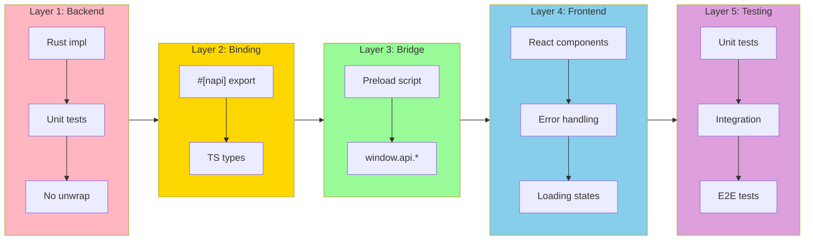
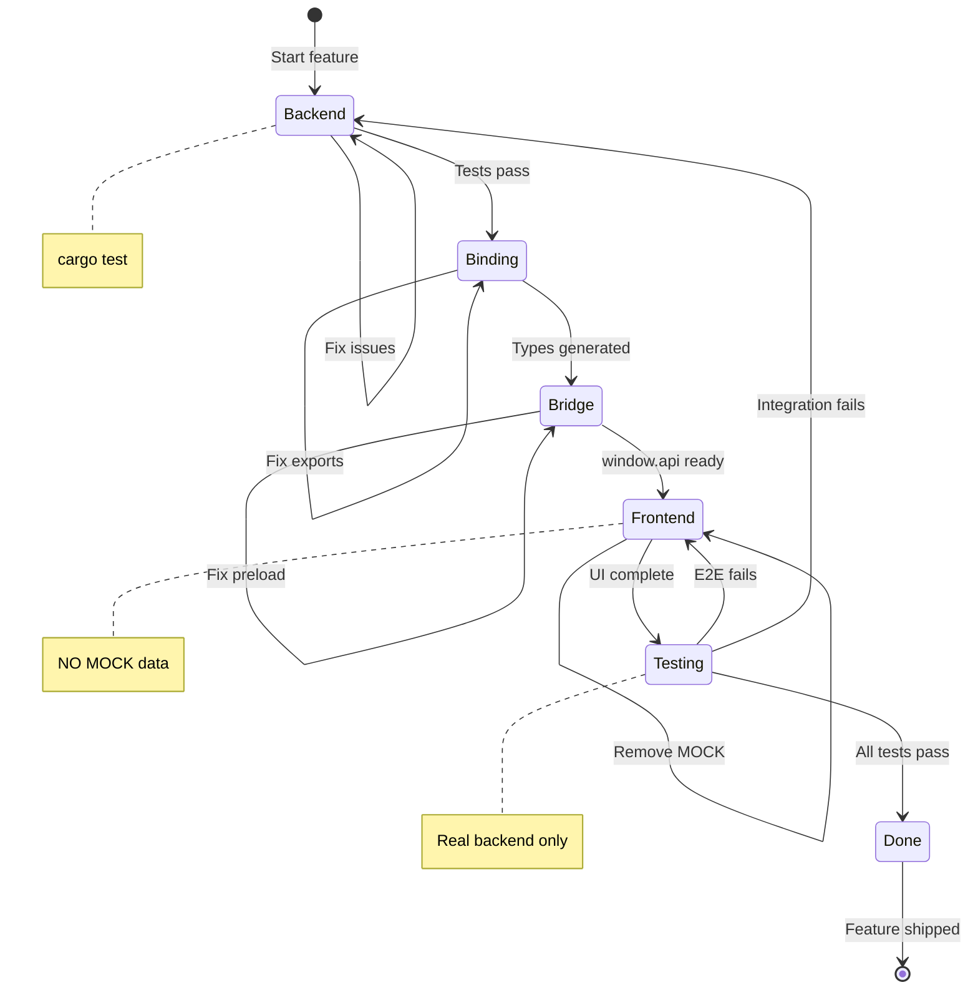

# Definition of Done (DoD)

## Purpose

This document defines what "done" means for features in rustation.
**A feature is not complete until all checklist items pass.**

---

## Layer Progression Diagram



### Layer Completion FSM



---

## Feature Completion Checklist

### 1. Backend Layer

- [ ] Rust implementation complete (`src/` or `packages/core/src/`)
- [ ] Unit tests pass (`cargo test`)
- [ ] No `unwrap()` in production code (use proper error handling)
- [ ] Functions are documented with `///` doc comments

### 2. Binding Layer (if applicable)

- [ ] napi-rs bindings complete (`packages/core/src/lib.rs`)
- [ ] All functions exported with `#[napi]` decorator
- [ ] TypeScript types generated (`packages/core/index.d.ts`)

### 3. Bridge Layer (Electron)

- [ ] Preload script exposes functions (`apps/desktop/src/preload/index.ts`)
- [ ] TypeScript types defined (`apps/desktop/src/preload/index.d.ts`)
- [ ] Functions accessible via `window.api.*`

### 4. Frontend Layer

- [ ] React components complete
- [ ] **UI Component Architecture followed**:
    - **Follows Material Design 3 Guidelines** (MUI v5).
    - Uses `Box`/`Stack` for layout, not raw `div`.
    - Global shared components in `src/components/shared`.
    - Feature-specific components in `src/features/*/components`.
- [ ] **NO MOCK data in production code** (see CI check below)
- [ ] Components use `window.api.*` for all backend calls
- [ ] Error states handled gracefully
- [ ] Loading states shown during async operations

### 5. Testing

- [ ] Rust unit tests pass (`cargo test`)
- [ ] Integration tests verify JS → Rust connection
- [ ] E2E tests verify full flow (not just UI)
- [ ] E2E tests skip gracefully when dependencies unavailable (e.g., Docker)

### 6. CI Checks

- [ ] `cargo clippy` passes
- [ ] `cargo test` passes
- [ ] `pnpm build` passes
- [ ] No MOCK data in `apps/desktop/src/renderer/` (CI enforced)

---

## Anti-Patterns to Avoid

### "Fake Complete"

A feature that looks done but isn't connected:

```
❌ UI works with MOCK data
❌ E2E tests pass but test MOCK, not real backend
❌ Backend implemented but preload bridge missing
```

### How to Prevent

1. **Develop in layers**: Backend → Binding → Bridge → Frontend
2. **Integration test after binding**: Verify JS can call Rust before building UI
3. **E2E tests must fail without backend**: If E2E passes with MOCK, it's not testing reality
4. **CI blocks MOCK in production**: Automated check prevents MOCK from merging

---

## CI Enforcement

The following checks run on every PR:

```yaml
# Check for MOCK data in production code
- name: No MOCK in production
  run: |
    if grep -rE "MOCK_SERVICES|MOCK_COMMANDS|MOCK_" apps/desktop/src/renderer/; then
      echo "❌ MOCK data found in production code"
      exit 1
    fi
```

---

## Example Workflow

### Building a New Feature

1. **Backend first**
   ```bash
   # Implement in Rust
   vim packages/core/src/new_feature.rs
   cargo test
   ```

2. **Add napi binding**
   ```bash
   # Export to Node.js
   vim packages/core/src/lib.rs
   pnpm build  # in packages/core
   ```

3. **Test binding works**
   ```bash
   # Quick integration test
   node -e "const core = require('@rstn/core'); console.log(core.newFeature())"
   ```

4. **Add to preload bridge**
   ```bash
   vim apps/desktop/src/preload/index.ts
   vim apps/desktop/src/preload/index.d.ts
   ```

5. **Build UI (no MOCK)**
   ```bash
   # Use window.api.* from the start
   vim apps/desktop/src/renderer/src/features/new/NewPage.tsx
   ```

6. **E2E test**
   ```bash
   # Test verifies real backend behavior
   vim e2e/new.spec.ts
   pnpm test:e2e
   ```

---

## Summary

| Layer | "Done" means |
|-------|--------------|
| Backend | Tests pass, no unwrap() |
| Binding | Exported via #[napi] |
| Bridge | Exposed to window.api |
| Frontend | Uses window.api, no MOCK |
| Testing | E2E tests real behavior |
| CI | All checks pass |
