# SDD Workflow: When to Use Which Approach

**Last updated**: 2025-12-19
**Version**: v2 (state-first architecture)

This guide helps you choose the right Specification-Driven Development (SDD) workflow for your task.

**🎯 v2 Requirement**: ALL features MUST include state serialization and transition tests (see [State-First Architecture](../01-architecture/01-state-first-principle.md)).

---

## Quick Decision Tree

```mermaid
flowchart TD
    A[New work?] --> B{LOC > 500?}
    B -->|Yes| F[Full SDD]
    B -->|No| C{Touches > 5 files?}
    C -->|Yes| F
    C -->|No| D{Architecture change?}
    D -->|Yes| F
    D -->|No| E{New state structs?}
    E -->|Yes| F
    E -->|No| G{Complex algorithm?}
    G -->|Yes| F
    G -->|No| L[Lightweight SDD]

    F --> H[spec → plan → tasks → implement]
    L --> I[spec → implement directly]

    style F fill:#FFB6C1
    style L fill:#90EE90
    style H fill:#FFB6C1
    style I fill:#90EE90
```



**NOTE**: Regardless of workflow, state tests are MANDATORY.

---

## Two Workflows

### Full SDD (spec + plan + tasks)
- For complex features
- Complete artifact trail
- Detailed task breakdown
- ~2-4 weeks implementation

### Lightweight SDD (spec only)
- For simple changes
- Quick documentation
- Direct implementation
- ~2-5 days implementation

---

## Full SDD Workflow

### When to Use

**Mandatory for**:
- rush shell features (Phase 7-8)
- New rstn features >500 LOC
- Features touching >5 files
- Architecture changes
- New domain concepts
- Complex algorithms

**Characteristics**:
- Multiple user stories
- Cross-cutting concerns
- Requires planning phase
- Team coordination needed

### Workflow Steps



```mermaid
flowchart TB
    subgraph Phase1["Phase 1: Specify"]
        A["/speckit.specify"] --> B["spec.md
        - Requirements
        - User stories
        - Acceptance criteria"]
    end

    subgraph Phase2["Phase 2: Clarify (optional)"]
        C["/speckit.clarify"] --> D["Refine spec.md
        - 5 targeted questions
        - Update with answers"]
    end

    subgraph Phase3["Phase 3: Plan"]
        E["/speckit.plan"] --> F["plan.md
        - Architecture
        - Component design
        - File structure"]
    end

    subgraph Phase4["Phase 4: Tasks"]
        G["/speckit.tasks"] --> H["tasks.md
        - Phase breakdown
        - Task list with IDs
        - Dependencies"]
    end

    subgraph Phase5["Phase 5: Implement"]
        I["/speckit.implement"] --> J["Execute tasks
        1. Write state tests
        2. Define state structs
        3. Implement logic
        4. Implement UI"]
    end

    subgraph Phase6["Phase 6: Review"]
        K["/speckit.review"] --> L["Validate
        ✅ State tests
        ✅ Spec alignment
        ✅ All tasks done
        ✅ Clippy clean"]
    end

    Phase1 --> Phase2
    Phase2 --> Phase3
    Phase3 --> Phase4
    Phase4 --> Phase5
    Phase5 --> Phase6
```

### 🎯 v2 State-First Testing Requirements

**MANDATORY for ALL features** (enforced in code review):

```rust
// 1. Round-trip serialization test
#[test]
fn test_state_serialization_round_trip() {
    let state = AppState::default();
    let json = serde_json::to_string(&state).unwrap();
    let loaded: AppState = serde_json::from_str(&json).unwrap();
    assert_eq!(state, loaded); // MUST pass
}

// 2. State transition test
#[test]
fn test_state_transition() {
    let mut app = App::from_state(AppState::default()).unwrap();

    app.handle_action(ViewAction::YourFeature);

    let final_state = app.to_state();
    assert_eq!(final_state.your_field, expected_value);
}

// 3. State invariant test
#[test]
fn test_state_invariants() {
    let state = app.to_state();

    // Invariants that MUST always hold
    if state.feature_active {
        assert!(state.feature_data.is_some());
    }
}
```

**Why state tests are mandatory:**
- Testability: Observable, deterministic, stable
- Reproducibility: Save state → load state → exact bug reproduction
- Refactoring safety: Tests don't break on UI changes
- Documentation: Tests show intended behavior

See: [State-First Architecture](../01-architecture/01-state-first-principle.md) for details.
```

### Artifacts Produced

```
specs/{NNN}-{name}/
├── spec.md (3-10 KB)
│   └── Requirements, user stories, acceptance criteria
├── plan.md (2-5 KB)
│   └── Architecture, component design, file structure
├── tasks.md (2-8 KB)
│   └── Phase breakdown, task list, dependencies
└── checklist.md (optional)
    └── Pre-implementation checklist
```

### Example: Feature 052 (Internalize Spec Generation)

**Scope**: 500+ LOC, 5+ files, new domain module

**Artifacts**:
- spec.md: 4.2 KB (4 user stories, data models)
- plan.md: 3.1 KB (module structure, dependencies)
- tasks.md: 4.8 KB (49 tasks in 7 phases)

**Outcome**: 100% task completion, 29 tests passing, clippy clean

---

## Lightweight SDD Workflow

### When to Use

**Ideal for**:
- rstn UI changes
- Bug fixes
- Small refactors (<200 LOC)
- Single-file changes
- Widget improvements
- Config changes
- Documentation updates

**Characteristics**:
- Straightforward implementation
- Single module focus
- No architecture changes
- <1 week implementation

### Workflow Steps

```
1. /speckit-lite (coming soon)
   ↓
   Creates specs/{NNN}-{name}/spec.md (simplified)
   - Brief description (1-2 sentences)
   - User-facing benefit
   - Acceptance criteria
   - Files changed
   - Testing plan

2. Implement directly
   ↓
   No separate plan or tasks phase
   - Write code
   - Run tests
   - Verify acceptance criteria

3. Commit when done
   ↓
   feat(NNN): description
```

### Artifacts Produced

```
specs/{NNN}-{name}/
└── spec.md (< 1 KB)
    └── What, Why, Acceptance Criteria, Files, Testing
```

### Template (Simplified)

```markdown
# Spec: {Feature Name}

**ID**: {NNN}-{name}
**Type**: Enhancement | Bug Fix | Refactor
**Estimated LOC**: < 200

## What
[1-2 sentences describing the change]

## Why
[User-facing benefit or technical reason]

## Acceptance Criteria
- [ ] Criterion 1
- [ ] Criterion 2
- [ ] Tests pass
- [ ] Clippy clean

## Files Changed
- `path/to/file.rs` - [what changes]

## Testing Plan
- Unit tests: [describe]
- Manual testing: [describe]
```

---

## Decision Matrix

| Criteria | Full SDD | Lightweight SDD |
|----------|----------|-----------------|
| **Lines of Code** | > 500 | < 200 |
| **Files Touched** | > 5 | 1-3 |
| **Duration** | > 1 week | < 5 days |
| **Architecture Impact** | Yes | No |
| **User Stories** | Multiple | Single |
| **Domain Complexity** | High | Low |
| **Cross-cutting** | Yes | No |
| **rush feature** | Always | Never |
| **rstn UI change** | Rarely | Usually |
| **Bug fix** | Complex only | Usually |
| **Refactor** | Large scale | Small scope |

---

## Examples

### Full SDD Examples

**Feature 051: Interactive Specify Flow**
- **Why Full**: 88 tasks, new interaction model, cross-cutting
- **LOC**: 600+
- **Files**: 8+
- **Duration**: 3 weeks
- **Artifacts**: spec.md (5.2 KB), plan.md (4.1 KB), tasks.md (7.3 KB)

**Feature 052: Internalize Spec Generation**
- **Why Full**: New domain module, 49 tasks, architecture change
- **LOC**: 500+
- **Files**: 9 (new module)
- **Duration**: 2 weeks
- **Artifacts**: spec.md (4.2 KB), plan.md (3.1 KB), tasks.md (4.8 KB)

**Feature 060-065: MCP Infrastructure**
- **Why Full**: 6 related features, new protocol, cross-cutting
- **LOC**: 1000+
- **Files**: 15+
- **Duration**: 6 weeks
- **Artifacts**: 6 complete spec sets

### Lightweight SDD Examples

**Feature 076: Replace Input Dialog with Inline Input**
- **Why Lightweight**: UI-only change, single view, <200 LOC
- **LOC**: 150
- **Files**: 2 (view.rs + types.rs)
- **Duration**: 2 days
- **Artifacts**: spec.md only (simplified)

**Hypothetical Bug Fix: Fix Worktree Tab Click**
- **Why Lightweight**: Bug fix, single function, <50 LOC
- **LOC**: 30
- **Files**: 1 (app.rs)
- **Duration**: 1 day
- **Artifacts**: spec.md (bug report + fix approach)

**Hypothetical Widget Update: Add Placeholder to TextInput**
- **Why Lightweight**: Widget enhancement, <100 LOC
- **LOC**: 80
- **Files**: 1 (text_input.rs)
- **Duration**: 2-3 days
- **Artifacts**: spec.md (feature description + testing)

---

## When in Doubt

### Ask These Questions

1. **Could this break existing features?**
   - YES → Full SDD (need planning)
   - NO → Lightweight SDD

2. **Do I need to coordinate with other components?**
   - YES → Full SDD (need architecture)
   - NO → Lightweight SDD

3. **Will I need >5 PRs/commits?**
   - YES → Full SDD (need task breakdown)
   - NO → Lightweight SDD

4. **Is this a new concept/abstraction?**
   - YES → Full SDD (need design)
   - NO → Lightweight SDD

5. **Will this take >1 week?**
   - YES → Full SDD (need milestones)
   - NO → Lightweight SDD

### Rule of Thumb

**When in doubt, start with Lightweight SDD.**

If during implementation you find:
- Complexity is higher than expected
- Need to touch more files
- Architecture changes required
- Task breakdown would help

Then upgrade to Full SDD:
- Run `/speckit.plan` to create plan.md
- Run `/speckit.tasks` to create tasks.md
- Continue with structured approach

---

## Success Metrics

### Full SDD Success (Features 045-065)

**Completion Rate**: 83% (20/24 features with full SDD completed)

**Key Findings**:
- Features WITH full SDD: 100% completion rate
- Features WITHOUT full SDD: 0% completion rate (none finished)
- Average implementation time: 2-4 weeks
- Average spec size: 4-6 KB
- Average tasks: 40-60

**Conclusion**: Full SDD works when followed completely

### Lightweight SDD Success (Expected)

**Target Metrics**:
- Completion rate: >90%
- Average implementation time: 2-5 days
- Average spec size: <1 KB
- Overhead reduction: 80% less planning time

**Risk**: Overuse for complex features (mitigate with decision matrix)

---

## Migration Path

### Current (Before Lightweight SDD)

All features use Full SDD:
- rush features: ✅ Correct
- rstn complex features: ✅ Correct
- rstn simple changes: ❌ Overkill (wasting time on planning)

### After Lightweight SDD

Features use appropriate workflow:
- rush features: Full SDD
- rstn complex features: Full SDD
- rstn simple changes: Lightweight SDD
- Bug fixes: Lightweight SDD

**Expected Impact**:
- 50% of rstn features use Lightweight SDD
- Development velocity 2x faster for simple changes
- Same quality maintained (acceptance criteria still required)

---

## Checklist Before Starting

### Before Full SDD

- [ ] Feature is >500 LOC or touches >5 files
- [ ] Architecture impact or new domain concept
- [ ] rush feature (Phase 7-8) or complex rstn feature
- [ ] Ready to invest 2-4 weeks in implementation
- [ ] Need task breakdown for tracking

### Before Lightweight SDD

- [ ] Feature is <200 LOC and touches <3 files
- [ ] No architecture changes required
- [ ] Straightforward implementation path
- [ ] Can complete in <1 week
- [ ] rstn UI change or bug fix

---

## Related Documents

- [System Overview](../01-architecture/overview.md) - High-level architecture
- [Technical Debt](../03-complexity-analysis/technical-debt.md) - Current issues
- [CLAUDE.md](../../CLAUDE.md) - Development workflow instructions
- [specs/README.md](../../specs/README.md) - Spec system documentation

---

## Changelog

- 2025-12-18: Initial SDD workflow decision guide created
