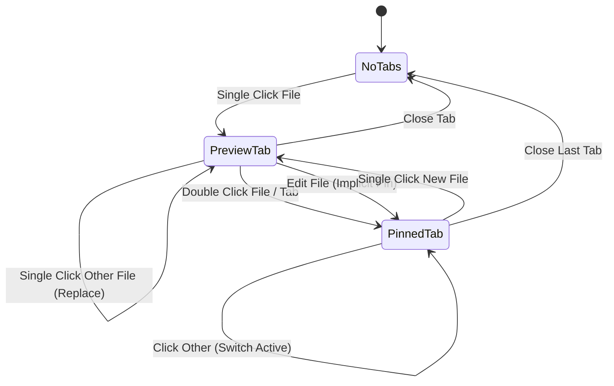
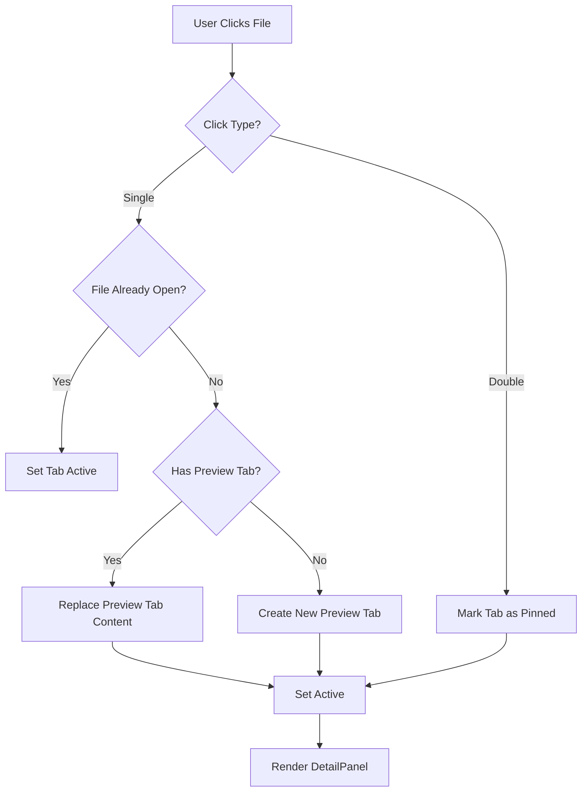
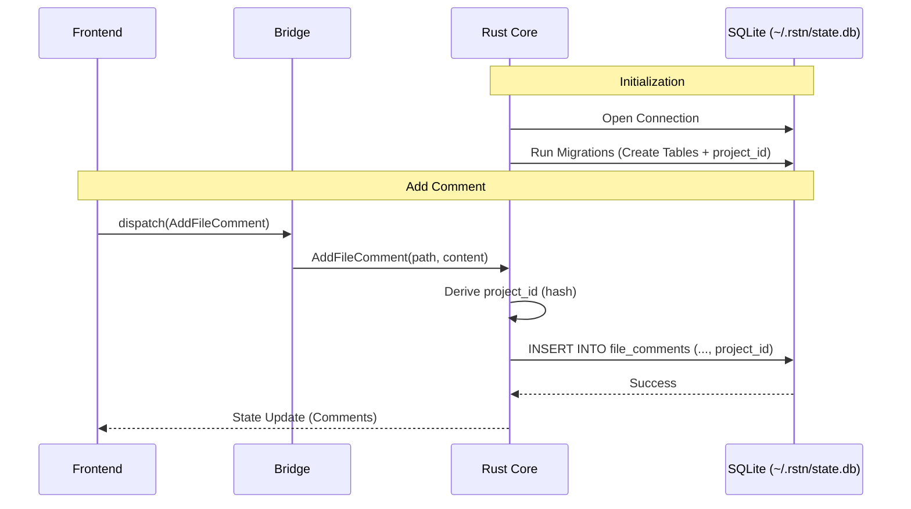

# Architecture Diagrams

## 1. State Diagram (Tab Lifecycle)



## 2. Flow Chart (File Selection Logic)



## 3. Sequence Diagram (Database Access)



## 4. UI Layout Diagram

```
┌──────────────────────────────────────────────────────────────────────────┐
│  Sidebar   │  File Explorer                                              │
│            │                                                             │
│ ┌────────┐ │ ┌───────────────────────────────────────────────────────┐   │
│ │ Docs   │ │ │  _README.md_  │  src/main.rs  │  package.json  │      │   │
│ │        │ │ └───────┬───────────────────────────────────────────────┘   │
│ │ Src    │ │         │                                                   │
│ │ └─ main│ │  # README                                               │   │
│ │        │ │                                                         │   │
│ └────────┘ │  Welcome to Rustation...                                │   │
│            │                                                             │
│            │                                                             │
│            │                                                             │
│            │                                                             │
│            └───────────────────────────────────────────────────────┘     │
└──────────────────────────────────────────────────────────────────────────┘
Legend:
- _Italic_: Preview Tab (Temporary)
- Normal: Pinned Tab (Persistent)
```
