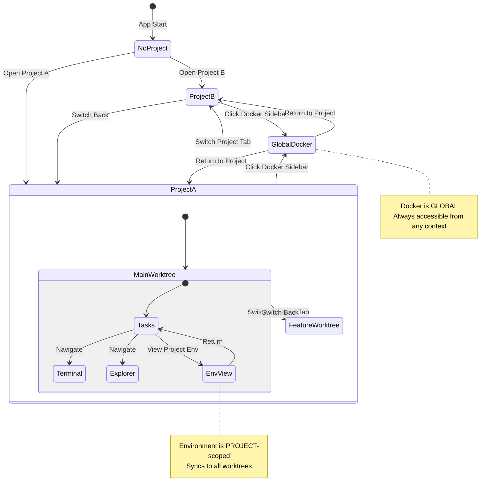
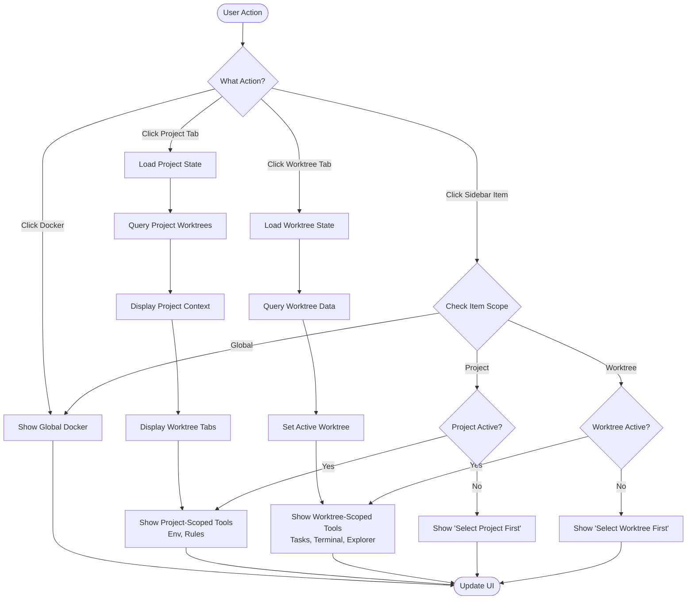
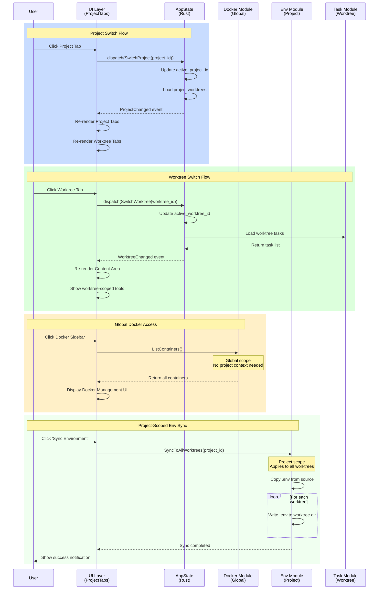

# Architecture Diagrams

## 1. State Diagram (State Transitions & Navigation)



## 2. Flow Chart (Decision Logic & Processing)



## 3. Sequence Diagram (Component Interactions)



## 4. UI Layout Diagram (Component Hierarchy)

```
┌─────────────────────────────────────────────────────────────────────────────────────┐
│  🔵 Project Tabs (Level 1) - Full Width                                             │
│  ┌─────────────┬─────────────┬─────────────┬──────────┐  ┌──┬──┬──┬──┬──┬──┬───┐  │
│  │ Project A   │ Project B   │ Project C   │ + Open   │  │📋│📸│📥│🔔│📊│🐳│⚙️ │  │
│  └─────────────┴─────────────┴─────────────┴──────────┘  └──┴──┴──┴──┴──┴──┴───┘  │
│  ← Projects (add from left)             Global Features (icon buttons, right) →     │
├─────────────────────────────────────────────────────────────────────────────────────┤
│  🟢 Worktree Tabs (Level 2) - Full Width                                            │
│  ┌─────────────┬─────────────┬─────────────┬──────────┐  ┌──────────┐             │
│  │ main        │ feature-x   │ bugfix-y    │ + Add    │  │ Env      │             │
│  └─────────────┴─────────────┴─────────────┴──────────┘  └──────────┘             │
│  ← Worktrees (add from left)              Project-Level Features (stack from right) →│
├─────────────┬───────────────────────────────────────────────────────────────────────┤
│             │                                                                         │
│  Sidebar    │  Content Area (Dynamic based on selection)                             │
│ (WORKTREE)  │                                                                         │
│             │  Navigation Sources:                                                    │
│ 📝 Tasks     │                                                                         │
│             │  • Project Tabs (right side) → Global icon buttons                     │
│ 💻 Terminal  │     📋 Copy: Copy screen to clipboard as image                         │
│             │     📸 Screenshot: Save screenshot as file                              │
│ 📂 Explorer  │     📥 Download: Download files/export data                             │
│             │     🔔 Notifications: View app notifications                            │
│             │     📊 Logs: View application logs                                      │
│             │     🐳 Docker: Manage all containers (cross-project)                    │
│             │     ⚙️ Settings: Application-wide settings                              │
│             │  • Worktree Tabs (right side) → Project-level views                    │
│ 🤖 Chat     │     - Environment: Sync .env across all worktrees                      │
│             │                                                                         │
│ 🔌 MCP      │                                                                         │
│             │  • Sidebar (left) → Worktree-level views                               │
│             │     - Tasks: Justfile tasks for ACTIVE worktree                        │
│             │     - Terminal: Shell in ACTIVE worktree dir                            │
│             │     - Explorer: Files of ACTIVE worktree                                │
│             │     - Chat: AI with ACTIVE worktree context                             │
│             │     - MCP: Tools for ACTIVE worktree                                    │
│             │                                                                         │
│             │  🔑 Key Design: "Tabs = Navigation, Sidebar = Tools"                   │
│             │     Tabs organize by scope (Global/Project/Worktree)                   │
│             │     Sidebar provides quick access to worktree tools                     │
│             │                                                                         │
└─────────────┴───────────────────────────────────────────────────────────────────────┘

Legend:
  🟠 Level 0 (Global)   - Accessible from anywhere (Docker, Settings)
  🔵 Level 1 (Project)  - Requires project selection (Environment)
  🟢 Level 2 (Worktree) - Requires worktree selection (Tasks, Terminal, Explorer, Chat, MCP)
```

---

## Visual Hierarchy Legend

- **🟠 Orange** = Level 0 (Global) - Accessible from anywhere
- **🔵 Blue** = Level 1 (Project) - Requires project selection
- **🟢 Green** = Level 2 (Worktree) - Requires worktree selection

---

## Key Insights

### Navigation Pattern
```
User Flow:
1. Click Project Tab → Switch to project context
2. Click Worktree Tab → Switch to worktree context
3. Click Docker Tab (Project Tabs right) → Access global Docker (no context change)
4. Click Environment Tab (Worktree Tabs right) → See project-level settings (applies to all worktrees)
5. Click Sidebar Tool → Access worktree-specific tool
```

### State Isolation Rules
- **Tasks, Terminal, Explorer, Chat, MCP** (Sidebar): Isolated per worktree
- **Environment** (Worktree Tabs right): Shared across worktrees in same project
- **Global Utilities** (Project Tabs right icons): Accessible from anywhere
  - 📋 Copy: Copy screen to clipboard as image
  - 📸 Screenshot: Save screenshot as file
  - 📥 Download: Download files/export data
  - 🔔 Notifications, 📊 Logs: Application-wide monitoring
  - 🐳 Docker, ⚙️ Settings: Cross-project management

### UI Behavior
| Component | Visibility Condition | Scope |
|-----------|---------------------|-------|
| Project Tabs | Always visible | Level 1 |
| Worktree Tabs | Only when project selected | Level 2 |
| Docker (Sidebar) | Always visible | Level 0 (Global) |
| Environment | Only when project selected | Project |
| Tasks | Only when worktree selected | Worktree |

### Data Flow Summary

1. **Global → Project**: User opens project → Load project metadata → Display project tabs
2. **Project → Worktree**: User selects project → Load worktrees → Display worktree tabs
3. **Worktree → Content**: User selects worktree → Load worktree data → Display worktree tools
4. **Sidebar → Global**: User clicks Docker → Show all containers (no context needed)

---

## Three-Layer Navigation Design

### Layer 1: Project Tabs (Level 1)

**Left Side - Project Selection:**
```
[Project A] [Project B] [Project C] [+ Open Project]
← New projects add from left
```

**Right Side - Global Features (icon buttons, stack from right):**
```
[📋] [📸] [📥] [🔔] [📊] [🐳] [⚙️]
← Global icon buttons stack from right →
```

- **📋 Copy**: Copy current screen to clipboard as image
- **📸 Screenshot**: Save screenshot as file (download)
- **📥 Download**: Download files or export data
- **🔔 Notifications**: View application notifications
- **📊 Logs**: View application logs (debug info)
- **🐳 Docker**: Manage all containers (cross-project)
- **⚙️ Settings**: Application-wide settings and preferences

### Layer 2: Worktree Tabs (Level 2)

**Left Side - Worktree Selection:**
```
[main] [feature-x] [bugfix-y] [+ Add]
← New worktrees add from left
```

**Right Side - Project-Level Features (stack from right):**
```
[Environment]
← Project features stack from right →
```

- **Environment Tab**: Sync .env across all worktrees in active project

### Layer 3: Sidebar (Worktree Tools)

**Left Sidebar - Worktree-Scoped Tools:**
```
Sidebar (Always Visible)
├─ 📝 Tasks (Worktree Scope)
│  └─ Click → Show tasks of ACTIVE worktree
│  └─ Disabled if no active worktree
│
├─ 💻 Terminal (Worktree Scope)
│  └─ Click → Show terminal in ACTIVE worktree dir
│
├─ 📂 Explorer (Worktree Scope)
│  └─ Click → Show file tree of ACTIVE worktree
│
├─ 🤖 Chat (Worktree Scope)
│  └─ Click → Show AI chat (context: ACTIVE worktree)
│
└─ 🔌 MCP (Worktree Scope)
   └─ Click → Show MCP tools for ACTIVE worktree
```

### Navigation Priority & Scope

```
Navigation Location          Scope              Examples
━━━━━━━━━━━━━━━━━━━━━━━━━━━━━━━━━━━━━━━━━━━━━━━━━━━━━━━━━━━━━━━━━
Project Tabs (right icons)   🟠 Global          📋📸📥🔔📊🐳⚙️
Worktree Tabs (right side)   🔵 Project         Environment
Sidebar (left side)          🟢 Worktree        Tasks, Terminal, Explorer, Chat, MCP
```

**Design Rationale:**
- **Tabs** = Context/Scope selection (what you're working on)
- **Sidebar** = Tools for current context (how you work with it)
- **Right-side tabs** = Always available features (don't depend on selection)
- **Left sidebar** = Context-dependent tools (require active worktree)

### Context Switching Behavior

**When user switches Worktree Tab:**
```
Before: [main] tab selected
  Explorer → shows main/ files
  Terminal → pwd = /project/main
  Tasks → lists main's justfile tasks

After: [feature-x] tab clicked
  Explorer → AUTO-UPDATE to show feature-x/ files
  Terminal → AUTO-UPDATE pwd to /project/feature-x
  Tasks → AUTO-UPDATE to feature-x's justfile tasks
```

**Implementation:**
- All worktree-scoped views subscribe to `active_worktree_id` state
- When state changes → views reactively update their content
- No need to manually refresh each view

### UI State Management

```rust
// In AppState
pub struct AppState {
    pub active_project_id: Option<String>,
    pub active_worktree_id: Option<String>,
    // ...
}

// When worktree tab is clicked
dispatch(Action::SwitchWorktree { worktree_id });

// All components using active_worktree_id will re-render:
// - Explorer: queries new file tree
// - Terminal: changes working directory
// - Tasks: loads new justfile
// - Chat: updates context with new files
// - MCP: re-initializes with new scope
```

### Visual Feedback

**Sidebar item states:**
- **Enabled** (clickable) → Has required context (project or worktree)
- **Disabled** (grayed out) → Missing context (e.g., no active worktree)
- **Active** (highlighted) → Currently displayed in Content Area

**Example:**
```
No project selected:
  🐳 Docker      [Enabled]
  🔐 Environment [Disabled - need project]
  📂 Explorer    [Disabled - need worktree]

Project "A" selected, worktree "main" selected:
  🐳 Docker      [Enabled]
  🔐 Environment [Enabled]
  📂 Explorer    [Enabled + Active if viewing]
```
