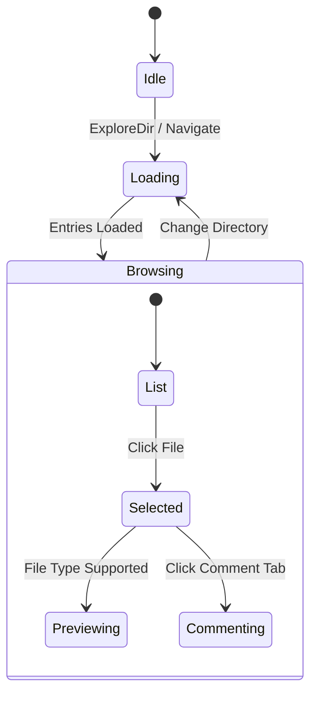
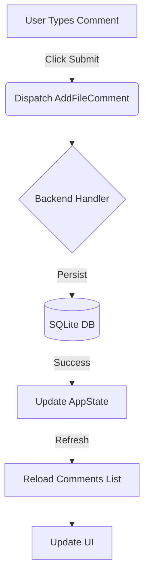
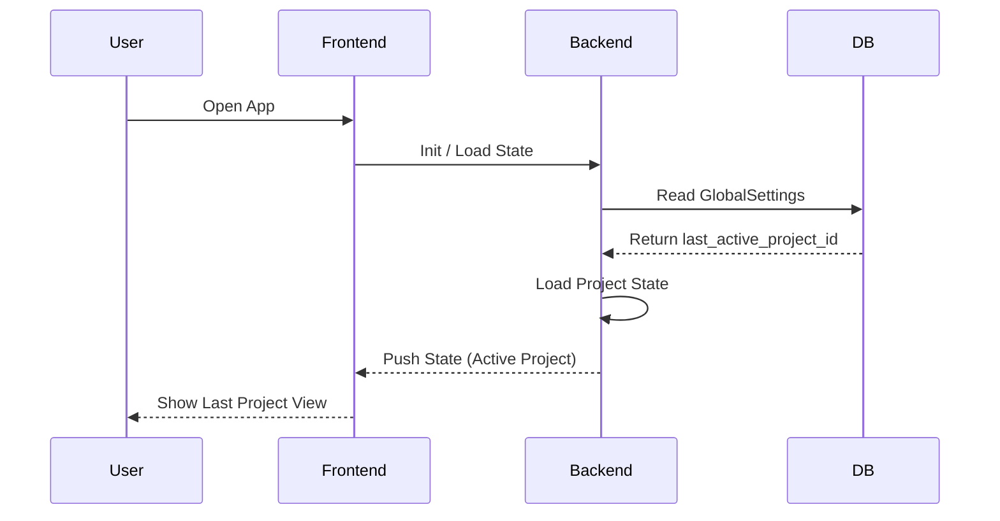

# Architecture Diagrams

## 1. State Diagram (File Explorer)



## 2. Flow Chart (Add Comment)



## 3. Sequence Diagram (Session Restore)



## 4. UI Layout Diagram

```
┌───────────────────────────────────────────────────────────────┐
│  Sidebar   │  Main Content Area                              │
│  (Nav)     │  (File Explorer)                                │
│            │                                                 │
│            │  ┌──────────────┐ ┌──────────────────────────┐  │
│            │  │  File Tree   │ │      File Preview        │  │
│            │  │              │ │                          │  │
│            │  │  src/        │ │  pub fn main() {         │  │
│            │  │  ├─ main.rs  │ │      println!("Hi");     │  │
│            │  │  └─ lib.rs   │ │  }                       │  │
│            │  │              │ │                          │  │
│            │  │              │ │  [Comments Tab]          │  │
│            │  │ (Fixed/Resize) │ (Flex Grow)              │  │
│            │  └──────────────┘ └──────────────────────────┘  │
│            │                                                 │
└────────────┴─────────────────────────────────────────────────┘
```
