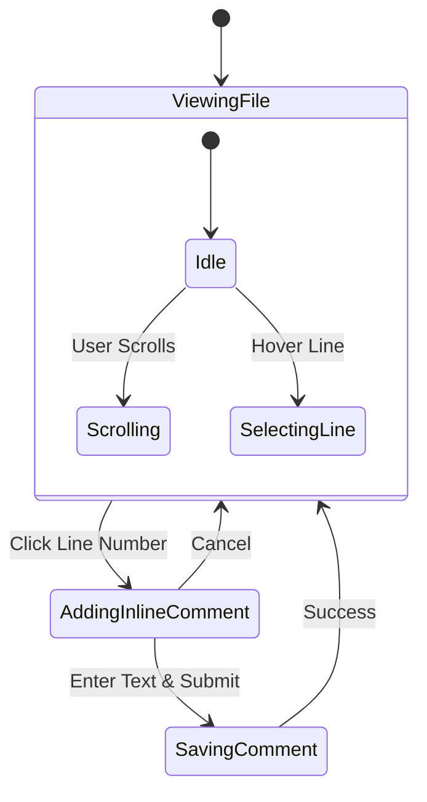
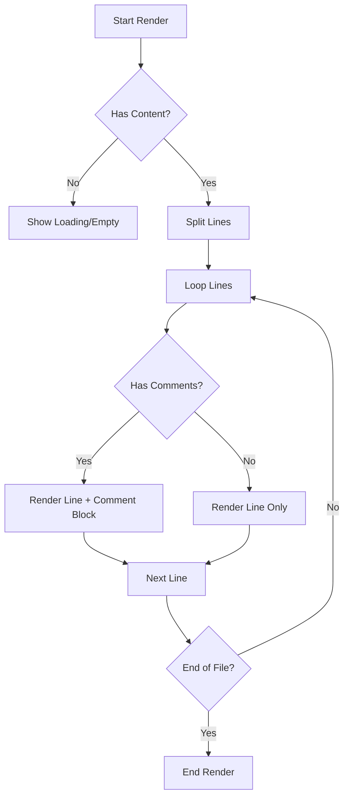
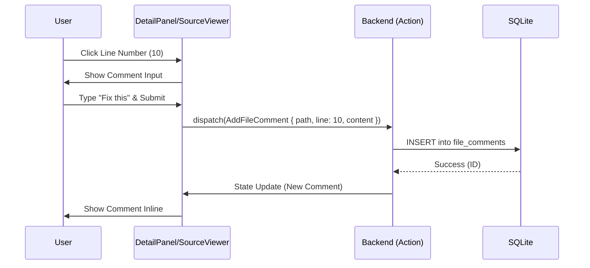

# Architecture Diagrams

## 1. State Diagram (Comment Lifecycle)



## 2. Flow Chart (Render Logic)



## 3. Sequence Diagram (Add Comment)



## 4. UI Layout Diagram

```
┌───────────────────────────────────────────────────────────────┐
│ File Explorer                                                 │
├──────────────────────┬────────────────────────────────────────┤
│ ┌──────────────────┐ │ ┌────────────────────────────────────┐ │
│ │ File List        │ │ │ Detail Panel                       │ │
│ │ 📄 main.rs       │ │ │ ┌────────────────────────────────┐ │ │
│ │ 📄 lib.rs        │ │ │ │ Info | Preview | Comments      │ │ │
│ │                  │ │ │ ├────────────────────────────────┤ │ │
│ │                  │ │ │ │ 1  fn main() {                 │ │ │
│ │                  │ │ │ │ 2      println!("Hello");      │ │ │
│ │                  │ │ │ │    ┌──────────────────────┐    │ │ │
│ │                  │ │ │ │    │ 💬 User: Nice code!  │    │ │ │
│ │                  │ │ │ │    └──────────────────────┘    │ │ │
│ │                  │ │ │ │ 3  }                           │ │ │
│ │                  │ │ │ │                                │ │ │
│ │                  │ │ │ │                                │ │ │
│ │                  │ │ │ └────────────────────────────────┘ │ │
│ │                  │ │ └────────────────────────────────────┘ │
│ └──────────────────┘ └────────────────────────────────────────┘
└───────────────────────────────────────────────────────────────┘
```
