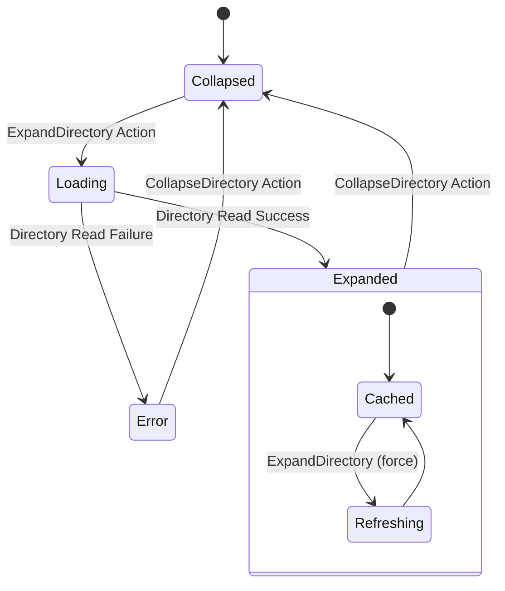
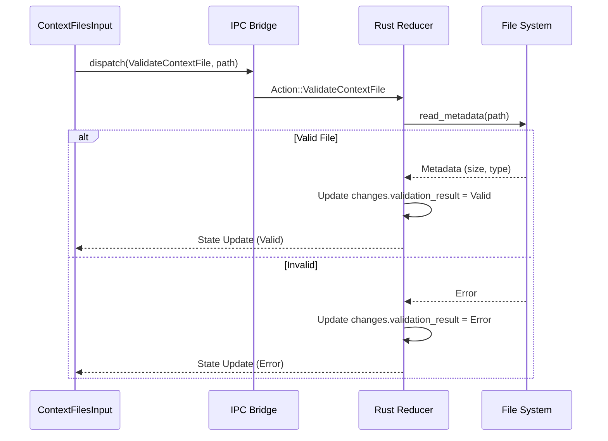
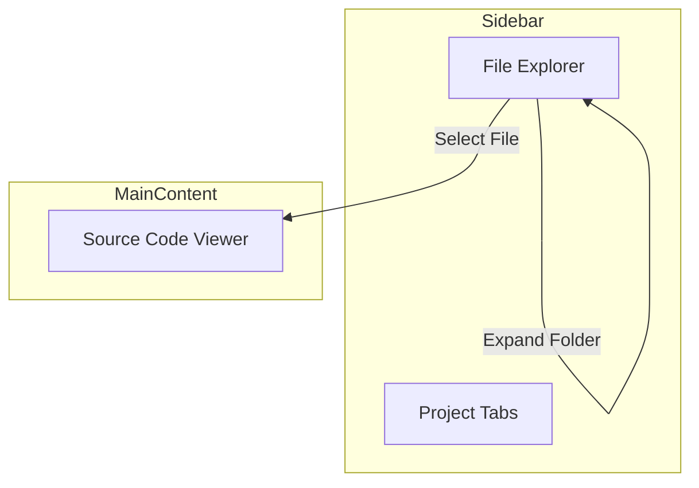

# Architecture Diagrams

## 1. State Diagram (Explorer Expansion)


## 2. Flow Chart (Chat Submission)
```mermaid
flowchart TD
    A[User types message] -->|Click Send| B[Dispatch SubmitChatMessage]
    B --> C{Backend Reducer}
    C -->|1. Update State| D[Add User Message to History]
    C -->|2. Trigger Effect| E[Call AI Provider]
    D --> F[UI Re-renders (User Msg)]
    E -->|Stream Chunks| G[Dispatch UpdateChatMessage]
    G --> H[UI Re-renders (Streaming)]
    E -->|Complete| I[Dispatch CompleteChatMessage]
```

## 3. Sequence Diagram (Context Validation)


## 4. UI Layout Diagram (Explorer)


```text
┌───────────────────┬──────────────────────────────────────────────┐
│  PROJECT TABS     │  src/main.rs                        [x]      │
├───────────────────┼──────────────────────────────────────────────┤
│ 📂 src            │                                              │
│ │  📂 features    │  fn main() {                                 │
│ │  │  📄 chat.rs  │      println!("Hello World");                │
│ │  └─ 📄 utils.rs │  }                                           │
│ 📄 Cargo.toml     │                                              │
│                   │                                              │
│                   │                                              │
└───────────────────┴──────────────────────────────────────────────┘
```
