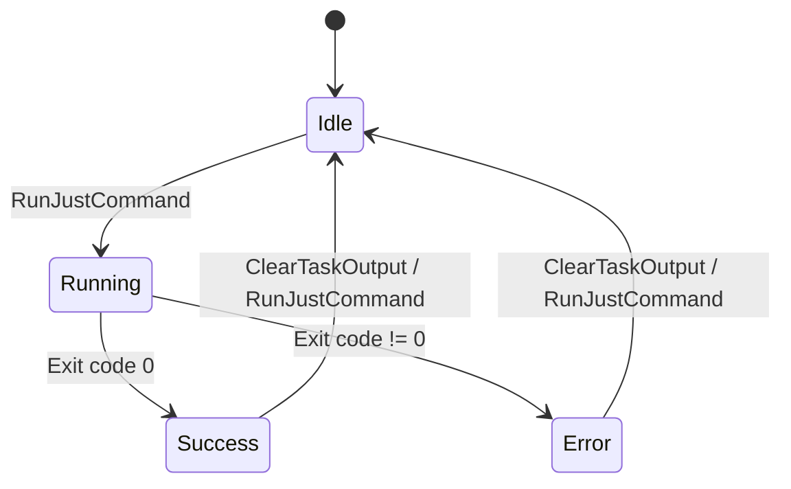

# Tasks (Justfile Runner)

GUI for running [just](https://github.com/casey/just) commands defined in project justfiles.

## Purpose

Provide a graphical interface for discovering and executing justfile tasks. Eliminate the need to memorize command names or switch to terminal for common development tasks like building, testing, and deploying.

## Requirements

### Requirement: Justfile Detection
The system SHALL automatically detect and parse justfile in project root.

#### Scenario: Justfile found
- **WHEN** worktree is loaded
- **THEN** search for `justfile` or `Justfile` in worktree root and parse commands

#### Scenario: Justfile not found
- **WHEN** no justfile exists in worktree
- **THEN** display "No justfile found" message with link to just documentation

#### Scenario: Justfile parse error
- **WHEN** justfile has syntax errors
- **THEN** display error message with line number

### Requirement: Command Parsing
The system SHALL extract command names and descriptions from justfile.

#### Scenario: Parse command with description
- **WHEN** justfile contains:
  ```just
  # Build the project
  build:
      cargo build --release
  ```
- **THEN** extract command `build` with description "Build the project"

#### Scenario: Parse command without description
- **WHEN** justfile contains command without preceding comment
- **THEN** extract command with empty description

#### Scenario: Parse multiple commands
- **WHEN** justfile contains multiple recipes
- **THEN** extract all commands as separate entries

### Requirement: Command Display
The system SHALL display parsed commands as interactive cards.

#### Scenario: Display command list
- **WHEN** justfile is parsed successfully
- **THEN** show command cards with name, description, and Run button

#### Scenario: Command status indicator
- **WHEN** displaying command card
- **THEN** show status badge: Idle (gray), Running (blue), Success (green), Error (red)

### Requirement: Command Execution
The system SHALL execute selected just commands and stream output.

#### Scenario: Run command
- **WHEN** user clicks Run button on command card
- **THEN** execute `just <command>` in worktree directory, set status to Running, and clear previous output

#### Scenario: Command succeeds
- **WHEN** command exits with code 0
- **THEN** set status to Success and keep output visible

#### Scenario: Command fails
- **WHEN** command exits with non-zero code
- **THEN** set status to Error and display error output

#### Scenario: Command already running
- **WHEN** user clicks Run while command is running
- **THEN** disable Run button and show "Running..." indicator

### Requirement: Output Streaming
The system SHALL stream command output in real-time.

#### Scenario: Stream stdout
- **WHEN** command produces stdout
- **THEN** append each line to output panel immediately

#### Scenario: Stream stderr
- **WHEN** command produces stderr
- **THEN** append stderr lines to output panel (optionally with different color)

#### Scenario: Auto-scroll output
- **WHEN** new output line is appended
- **THEN** scroll output panel to bottom automatically

### Requirement: Output Management
The system SHALL provide controls for output panel.

#### Scenario: Clear output
- **WHEN** user clicks Clear button or runs new command
- **THEN** clear all output from panel

#### Scenario: Copy output
- **WHEN** user clicks Copy button
- **THEN** copy all output text to system clipboard

### Requirement: Per-Worktree Isolation
The system SHALL maintain separate task state for each worktree.

#### Scenario: Different justfiles per worktree
- **WHEN** worktrees have different justfiles
- **THEN** parse and display commands specific to each worktree

#### Scenario: Separate output buffers
- **WHEN** user runs command in worktree A then switches to worktree B
- **THEN** preserve output from worktree A and show empty output for worktree B

#### Scenario: Separate task statuses
- **WHEN** command is running in worktree A
- **THEN** status in worktree B remains unaffected

### Requirement: Task State Machine
The system SHALL follow defined state transitions for task execution.



#### Scenario: State transition to Running
- **WHEN** user clicks Run button
- **THEN** transition from Idle to Running

#### Scenario: State transition to Success
- **WHEN** command exits successfully
- **THEN** transition from Running to Success

#### Scenario: State transition to Error
- **WHEN** command exits with error
- **THEN** transition from Running to Error

#### Scenario: Reset to Idle
- **WHEN** user clears output or runs new command
- **THEN** transition from Success/Error to Idle

### Requirement: Loading States
The system SHALL show loading indicators during justfile parsing.

#### Scenario: Loading justfile
- **WHEN** worktree is opened and justfile is being parsed
- **THEN** show skeleton loading state for command list

#### Scenario: Loading complete
- **WHEN** parsing completes
- **THEN** hide loading state and show command cards

## State Structure

```typescript
interface TasksState {
  commands: JustCommandInfo[]
  task_statuses: Record<string, TaskStatus>
  active_command: string | null
  output: string[]
  is_loading: boolean
  error: string | null
}

interface JustCommandInfo {
  name: string
  description: string | null
  recipe: string
}

type TaskStatus = 'idle' | 'running' | 'success' | 'error'
```

## Implementation References

- Backend: `packages/core/src/justfile.rs` (parser and executor)
- UI: `desktop/src/renderer/src/features/tasks/`
- State: `packages/core/src/reducer/tasks.rs`
- Justfile Spec: https://just.systems/man/en/
