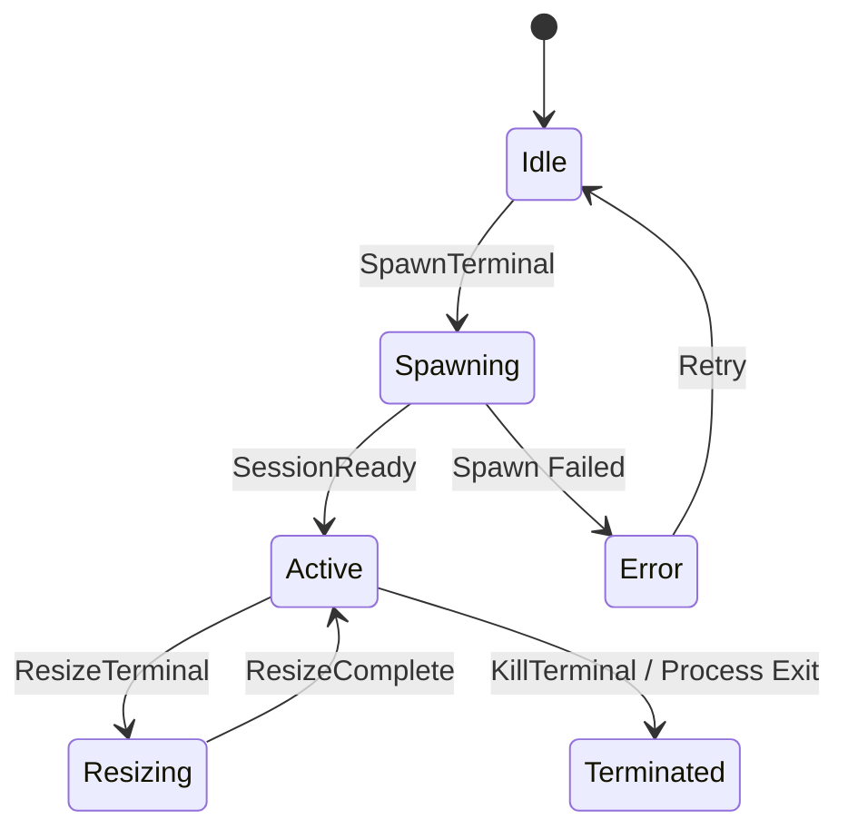

# Terminal (PTY)

Integrated terminal emulator with PTY (pseudo-terminal) support for each worktree.

## Purpose

Provide embedded terminal access within the application to eliminate context switching. Enable developers to run git commands, install packages, and execute scripts without leaving the workspace. Each worktree maintains separate terminal sessions.

## Requirements

### Requirement: Terminal Spawning
The system SHALL create terminal sessions using PTY (pseudo-terminal).

#### Scenario: Spawn terminal
- **WHEN** user opens Terminal tab or clicks "New Terminal"
- **THEN** spawn shell process (`/bin/zsh` or `bash` or `powershell` based on OS) with PTY

#### Scenario: Set working directory
- **WHEN** spawning terminal
- **THEN** set working directory to worktree path

#### Scenario: Set environment variables
- **WHEN** spawning terminal
- **THEN** inherit parent process environment and set `TERM=xterm-256color`

### Requirement: Terminal Display
The system SHALL render terminal using xterm.js in frontend.

#### Scenario: Display terminal output
- **WHEN** shell produces output
- **THEN** stream output to xterm.js for rendering with ANSI color support

#### Scenario: Handle control sequences
- **WHEN** shell sends ANSI escape sequences (colors, cursor movement)
- **THEN** xterm.js interprets and renders correctly

### Requirement: User Input
The system SHALL send user keyboard input to PTY.

#### Scenario: Type characters
- **WHEN** user types in terminal
- **THEN** send characters to PTY stdin

#### Scenario: Send special keys
- **WHEN** user presses Enter, Backspace, Arrow keys, Ctrl+C
- **THEN** send corresponding control sequences to PTY

### Requirement: Terminal Resizing
The system SHALL handle terminal window resize events.

#### Scenario: Window resized
- **WHEN** user resizes terminal panel
- **THEN** calculate new dimensions (cols, rows) and send resize signal to PTY

#### Scenario: Fit to container
- **WHEN** terminal is displayed
- **THEN** calculate optimal cols/rows based on container size and font metrics

### Requirement: Session Persistence
The system SHALL maintain terminal session state per worktree.

#### Scenario: Switch tabs
- **WHEN** user switches from Terminal to Tasks tab within same worktree
- **THEN** keep terminal process running in background

#### Scenario: Return to Terminal tab
- **WHEN** user switches back to Terminal tab
- **THEN** restore terminal display with scrollback buffer

### Requirement: Multiple Sessions
The system SHALL support multiple terminal sessions per worktree.

#### Scenario: Open new terminal
- **WHEN** user clicks "New Terminal" button
- **THEN** spawn additional terminal session in new tab

#### Scenario: Switch between terminals
- **WHEN** user clicks terminal tab
- **THEN** switch active terminal display

### Requirement: Session Cleanup
The system SHALL properly terminate terminal processes.

#### Scenario: Close terminal
- **WHEN** user closes terminal tab
- **THEN** send SIGHUP to shell process and clean up PTY

#### Scenario: Worktree closed
- **WHEN** worktree is closed
- **THEN** terminate all terminal sessions for that worktree

### Requirement: Terminal State Machine
The system SHALL follow defined state transitions for terminal lifecycle.



#### Scenario: State transition to Spawning
- **WHEN** user requests new terminal
- **THEN** transition from Idle to Spawning

#### Scenario: State transition to Active
- **WHEN** PTY process successfully spawned
- **THEN** transition from Spawning to Active

#### Scenario: State transition to Error
- **WHEN** PTY spawn fails (shell not found)
- **THEN** transition from Spawning to Error with error message

### Requirement: Per-Worktree Isolation
The system SHALL maintain separate terminal sessions for each worktree.

#### Scenario: Different working directories
- **WHEN** terminals are spawned in different worktrees
- **THEN** each terminal has working directory set to its worktree path

#### Scenario: Independent sessions
- **WHEN** command is running in worktree A terminal
- **THEN** worktree B terminal remains unaffected

## State Structure

```rust
pub struct TerminalState {
    pub sessions: Vec<TerminalSession>,
    pub active_session_id: Option<String>,
}

pub struct TerminalSession {
    pub id: String,
    pub state: SessionState,  // Idle | Spawning | Active | Resizing | Error | Terminated
    pub pid: Option<u32>,
    pub cols: u16,
    pub rows: u16,
    pub working_dir: String,
    pub scrollback_limit: usize,
    pub error: Option<String>,
}

pub enum SessionState {
    Idle,
    Spawning,
    Active,
    Resizing,
    Error,
    Terminated,
}
```

## Implementation References

- Backend: `packages/core/src/terminal.rs` (portable-pty)
- Frontend: `desktop/src/renderer/src/features/terminal/` (xterm.js)
- State: `packages/core/src/reducer/terminal.rs`
- PTY Library: https://docs.rs/portable-pty/
- xterm.js: https://xtermjs.org/
